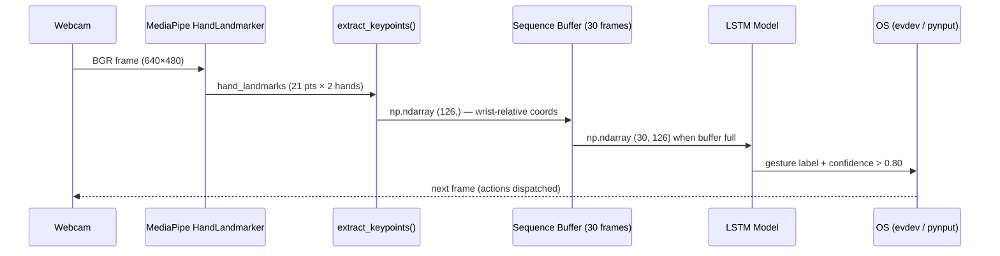

<div align="center">

# 🖐️ GestureFlow

**Real-time hand gesture recognition pipeline for Linux desktop control**

[](https://www.python.org/)
[](https://tensorflow.org/)
[](https://mediapipe.dev/)
[](LICENSE)
[]()

> A full end-to-end pipeline that captures hand landmarks via webcam, trains an LSTM neural network on custom gesture sequences, and translates recognized gestures into real OS actions — cursor movement, click, and workspace switching.

</div>

---

## 📑 Table of Contents

- [Overview](#-overview)
- [Project Structure](#-project-structure)
- [Workflow](#-workflow)
- [Pipeline Steps](#-pipeline-steps)
- [Installation](#-installation)
- [Running the Dashboard](#-running-the-dashboard)
- [Configuration](#-configuration)
- [Tech Stack](#-tech-stack)

---

## 🧠 Overview

GestureFlow is a structured learning project that walks through the full Machine Learning lifecycle applied to computer vision:

| Phase | Description |
|---|---|
| **Exploration** | Raw camera capture and landmark visualization (Steps 1–3) |
| **Rule-based recognition** | Static gesture detection without neural networks (Step 4) |
| **Data pipeline** | Automated sequence collection into `.npy` datasets (Step 5) |
| **Training** | LSTM model training with temporal sequence data (Step 6) |
| **Inference** | Real-time gesture classification via the trained model (Step 7) |
| **System control** | OS-level actions driven by recognized gestures (Step 8) |

The final result is a unified **CustomTkinter dashboard** (`main.py`) that integrates steps 4–8 into a single dark-themed GUI with an embedded live camera viewport.

---

## 📂 Project Structure

```text
GestureFlow/
│
├── main.py                         # Unified dashboard launcher (Steps 4–8)
├── config.py                       # Centralized constants (paths, thresholds, hyperparameters)
├── utils.py                        # Shared helpers: extract_keypoints(), get_gesture_names()
├── pyproject.toml                  # Package metadata and build configuration
├── requirements.txt                # Pinned Python dependencies
├── .gitignore
│
├── assets/
│   ├── models/
│   │   └── hand_landmarker.task   # MediaPipe pre-trained hand landmark binary
│   └── img_prueba/                 # Test images for static step exploration
│
├── modelos/
│   └── lstm_gestos.keras           # Trained LSTM model output (generated by Step 6)
│
├── gestos/                         # Dataset root — one subfolder per gesture class
│   ├── <gesture_name>/
│   │   └── *.npy                  # Sequences of shape (30, 126) per recording
│   └── ...
│
└── pasos/                          # Ordered learning steps (standalone scripts)
    ├── REFERENCIA_COMUN.md         # Shared concepts glossary (OpenCV, MediaPipe, LSTM)
    │
    ├── paso-01-camara/             # Step 1: Raw webcam capture
    ├── paso-02-dibujo/             # Step 2: Hand landmark drawing overlay
    ├── paso-03-tiempo-real/        # Step 3: Real-time landmark visualization
    ├── paso-04-reconocimiento-vocales/  # Step 4: Rule-based vowel recognition
    ├── paso-05-recoleccion/        # Step 5: Automated gesture dataset collection
    ├── paso-06-entrenamiento/      # Step 6: LSTM model training script
    ├── paso-07-deteccion-tiempo-real/   # Step 7: Real-time LSTM inference
    └── paso-08-control-sistema/    # Step 8: OS gesture control (cursor, click, swipe)
```

### Key files at a glance

| File | Purpose |
|---|---|
| `main.py` | `GestureFlowApp` — CustomTkinter dashboard integrating Steps 4–8 |
| `config.py` | Single source of truth for all numeric constants and file paths |
| `utils.py` | `extract_keypoints()` and `get_gesture_names()` used across steps |
| `modelos/lstm_gestos.keras` | Output of Step 6; must exist before running Step 7 or Control |
| `assets/models/hand_landmarker.task` | Required by MediaPipe — download separately (see Installation) |

---

## 🔄 Workflow

The project follows two independent workflows: a **development path** (building the model) and a **runtime path** (using it).

### Full Pipeline Diagram


### Data Flow



### Mode Switching

The dashboard (`main.py`) exposes a **segmented button** to switch between pipeline modes at runtime:

| Mode | MediaPipe | LSTM | Action |
|---|---|---|---|
| **Idle** | Off | — | Standby — no processing |
| **Vowels** | On (VIDEO) | — | Rule-based vowel overlay |
| **Collection** | On (VIDEO) | — | Records `.npy` sequences to `gestos/` |
| **Training** | Off | — | Runs Step 6 script as subprocess |
| **Inference** | On (VIDEO) | On | Predicts gesture label on live feed |
| **Control** | On (VIDEO) | On | Translates gestures to OS events |
