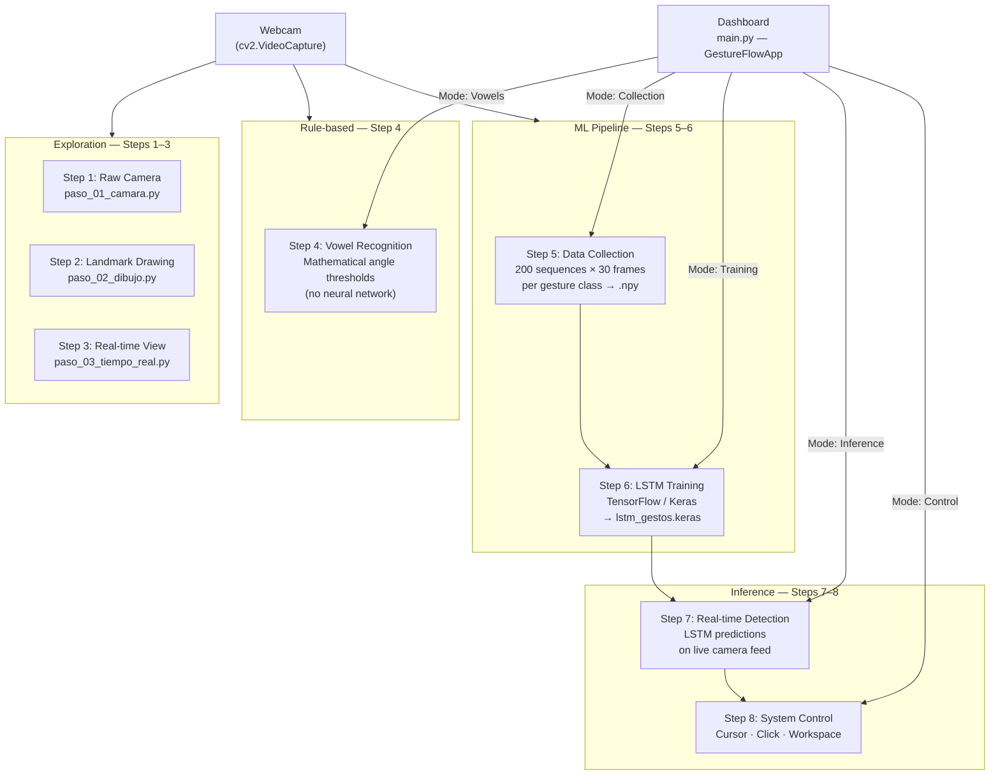
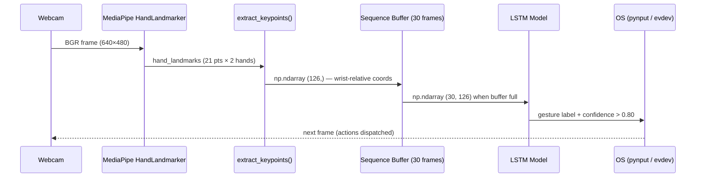

<div align="center">

# GestureFlow

**Real-time hand gesture recognition pipeline for desktop control**

[](https://www.python.org/)
[](https://tensorflow.org/)
[](https://mediapipe.dev/)
[](LICENSE)
[]()

> A full end-to-end pipeline that captures hand landmarks via webcam, trains an LSTM neural network on custom gesture sequences, and translates recognized gestures into real OS actions — cursor movement, click, and workspace switching.

</div>

---

## Table of Contents

- [Overview](#overview)
- [Project Structure](#project-structure)
- [Workflow](#workflow)
- [Pipeline Steps](#pipeline-steps)
- [Installation](#installation)
- [Running the Dashboard](#running-the-dashboard)
- [Configuration](#configuration)
- [Tech Stack](#tech-stack)

---

## Overview

GestureFlow is a structured learning project that walks through the full Machine Learning lifecycle applied to computer vision:

| Phase | Description |
|---|---|
| **Exploration** | Raw camera capture and landmark visualization (Steps 1–3) |
| **Rule-based recognition** | Static gesture detection without neural networks (Step 4) |
| **Data pipeline** | Automated sequence collection into `.npy` datasets (Step 5) |
| **Training** | LSTM model training with temporal sequence data (Step 6) |
| **Inference** | Real-time gesture classification via the trained model (Step 7) |
| **System control** | OS-level actions driven by recognized gestures (Step 8) |

The final result is a unified **CustomTkinter dashboard** (`main.py`) that integrates steps 4–8 into a single dark-themed GUI with an embedded live camera viewport.

### Core Architecture Components

#### MediaPipe HandLandmarker
The **MediaPipe HandLandmarker** solution identifies 21 key hand joints (landmarks) in 3D space from a video frame. It consists of a palm detection model to locate hands, and a hand landmark model that maps coordinates. In GestureFlow, we extract these landmarks and normalize them relative to the wrist landmark (index 0) to obtain features invariant to hands translation. For two hands, this produces 126 coordinate values (21 points × 3 coordinates (x, y, z) × 2 hands) per frame.

#### Long Short-Term Memory (LSTM)
A **Long Short-Term Memory (LSTM)** network is a type of recurrent neural network (RNN) capable of learning order dependence in sequence prediction problems. LSTMs contain feedback connections and specialized gates (forget, input, and output gates) to retain or discard information over long time horizons. In GestureFlow, the model processes a temporal sequence of 30 frames (tensor shape `(30, 126)`) to accurately classify dynamic hand gestures over time.

#### Landmark Point Map
The following reference diagram maps the 21 indices returned by the MediaPipe HandLandmarker:


---

## Project Structure

```text
GestureFlow/
│
├── main.py                         # Unified dashboard launcher (Steps 4–8)
├── config.py                       # Centralized constants (paths, thresholds, hyperparameters)
├── utils.py                        # Shared helpers: extract_keypoints(), get_gesture_names()
├── pyproject.toml                  # Package metadata and build configuration
├── requirements.txt                # Pinned Python dependencies
├── .gitignore
│
├── assets/
│   ├── models/
│   │   └── hand_landmarker.task   # MediaPipe pre-trained hand landmark binary
│   ├── img_prueba/                 # Test images for static step exploration
│   └── hand-landmarks.png          # MediaPipe hand landmarks mapping diagram
│
├── modelos/
│   └── lstm_gestos.keras           # Trained LSTM model output (generated by Step 6)
│
├── gestos/                         # Dataset root — one subfolder per gesture class
│   ├── <gesture_name>/
│   │   └── *.npy                  # Sequences of shape (30, 126) per recording
│   └── ...
│
├── pruebas/                        # Standalone input test scripts
│   ├── test_evdev.py               # Relative mouse movement test
│   ├── test_evdev_abs.py           # Absolute mouse coordinates test
│   └── test_mouse.py               # pynput mouse positioning test
│
└── pasos/                          # Ordered learning steps (standalone scripts)
    ├── [pasos/REFERENCIA_COMUN.md](file:///home/thewest/proyectos/GestureFlow/pasos/REFERENCIA_COMUN.md)         # Shared concepts glossary (OpenCV, MediaPipe, LSTM)
    │
    ├── [paso-01-camara/](file:///home/thewest/proyectos/GestureFlow/pasos/paso-01-camara/)             # Step 1: Raw webcam capture
    ├── [paso-02-dibujo/](file:///home/thewest/proyectos/GestureFlow/pasos/paso-02-dibujo/)             # Step 2: Hand landmark drawing overlay
    ├── [paso-03-tiempo-real/](file:///home/thewest/proyectos/GestureFlow/pasos/paso-03-tiempo-real/)        # Step 3: Real-time landmark visualization
    ├── [paso-04-reconocimiento-vocales/](file:///home/thewest/proyectos/GestureFlow/pasos/paso-04-reconocimiento-vocales/)  # Step 4: Rule-based vowel recognition
    ├── [paso-05-recoleccion/](file:///home/thewest/proyectos/GestureFlow/pasos/paso-05-recoleccion/)        # Step 5: Automated gesture dataset collection
    ├── [paso-06-entrenamiento/](file:///home/thewest/proyectos/GestureFlow/pasos/paso-06-entrenamiento/)      # Step 6: LSTM model training script
    ├── [paso-07-deteccion-tiempo-real/](file:///home/thewest/proyectos/GestureFlow/pasos/paso-07-deteccion-tiempo-real/)   # Step 7: Real-time LSTM inference
    └── [paso-08-control-sistema/](file:///home/thewest/proyectos/GestureFlow/pasos/paso-08-control-sistema/)    # Step 8: OS gesture control (cursor, click, swipe)
```

> Each step folder contains its own documentation file (`paso_0X_doc.md`) with detailed implementation notes, concept explanations, and common errors. The file [pasos/REFERENCIA_COMUN.md](file:///home/thewest/proyectos/GestureFlow/pasos/REFERENCIA_COMUN.md) documents all shared concepts (OpenCV, MediaPipe, LSTM) used across steps.

### Key files at a glance

| File | Purpose |
|---|---|
| `main.py` | `GestureFlowApp` — CustomTkinter dashboard integrating Steps 4–8 |
| `config.py` | Single source of truth for all numeric constants and file paths |
| `utils.py` | `extract_keypoints()` and `get_gesture_names()` used across steps |
| `modelos/lstm_gestos.keras` | Output of Step 6; must exist before running Step 7 or Control |
| `assets/models/hand_landmarker.task` | Required by MediaPipe — download separately (see Installation) |

---

## Workflow

The project follows two independent workflows: a **development path** (building the model) and a **runtime path** (using it).

### Full Pipeline Diagram



### Data Flow



### Mode Switching

The dashboard (`main.py`) exposes a **segmented button** to switch between pipeline modes at runtime:

| Mode | MediaPipe | LSTM | Action |
|---|---|---|---|
| **Idle** | Off | — | Standby — no processing |
| **Vowels** | On (VIDEO) | — | Rule-based vowel overlay |
| **Collection** | On (VIDEO) | — | Records `.npy` sequences to `gestos/` |
| **Training** | Off | — | Runs Step 6 script as subprocess |
| **Inference** | On (VIDEO) | On | Predicts gesture label on live feed |
| **Control** | On (VIDEO) | On | Translates gestures to OS events |

---

## Pipeline Steps

Each step is self-contained and has its own documentation inside its folder. The descriptions below are intentional summaries — read the per-step `*_doc.md` for full implementation details.

### [Step 1 — Raw Camera Capture](file:///home/thewest/proyectos/GestureFlow/pasos/paso-01-camara/)
**File**: [paso_01_camara.py](file:///home/thewest/proyectos/GestureFlow/pasos/paso-01-camara/paso_01_camara.py) | **Documentation**: [paso_01_doc.md](file:///home/thewest/proyectos/GestureFlow/pasos/paso-01-camara/paso_01_doc.md)

Foundational webcam loop using `cv2.VideoCapture`. Establishes the read-flip-display pattern that all subsequent steps build on.

---

### [Step 2 — Hand Landmark Drawing](file:///home/thewest/proyectos/GestureFlow/pasos/paso-02-dibujo/)
**File**: [paso_02_dibujo.py](file:///home/thewest/proyectos/GestureFlow/pasos/paso-02-dibujo/paso_02_dibujo.py) | **Documentation**: [paso_02_doc.md](file:///home/thewest/proyectos/GestureFlow/pasos/paso-02-dibujo/paso_02_doc.md)

Introduces MediaPipe `HandLandmarker` in synchronous `IMAGE` mode. Draws the 21-point hand skeleton over each frame.

---

### [Step 3 — Real-time Landmark Visualization](file:///home/thewest/proyectos/GestureFlow/pasos/paso-03-tiempo-real/)
**File**: [paso_03_tiempo_real.py](file:///home/thewest/proyectos/GestureFlow/pasos/paso-03-tiempo-real/paso_03_tiempo_real.py) | **Documentation**: [paso_03_doc.md](file:///home/thewest/proyectos/GestureFlow/pasos/paso-03-tiempo-real/paso_03_doc.md)

Upgrades to `LIVE_STREAM` async mode with a readiness flag to prevent frame queue buildup. Optimizes inference by resizing frames before detection.

---

### [Step 4 — Vowel Recognition (Rule-based)](file:///home/thewest/proyectos/GestureFlow/pasos/paso-04-reconocimiento-vocales/)
**File**: [paso_04_vocales.py](file:///home/thewest/proyectos/GestureFlow/pasos/paso-04-reconocimiento-vocales/paso_04_vocales.py) | **Documentation**: [paso_04_doc.md](file:///home/thewest/proyectos/GestureFlow/pasos/paso-04-reconocimiento-vocales/paso_04_doc.md)

Classifies the five Spanish vowels using geometric rules on landmark angles — no model required. Demonstrates the limitations of rule-based approaches and motivates the need for LSTM.

---

### [Step 5 — Dataset Collection](file:///home/thewest/proyectos/GestureFlow/pasos/paso-05-recoleccion/)
**File**: [paso_05_recoleccion.py](file:///home/thewest/proyectos/GestureFlow/pasos/paso-05-recoleccion/paso_05_recoleccion.py) | **Documentation**: [paso_05_doc.md](file:///home/thewest/proyectos/GestureFlow/pasos/paso-05-recoleccion/paso_05_doc.md)

Spacebar-driven recording loop that captures 200 sequences of 30 frames per gesture class and saves them as `.npy` arrays of shape `(30, 126)` to `gestos/`.

---

### [Step 6 — LSTM Model Training](file:///home/thewest/proyectos/GestureFlow/pasos/paso-06-entrenamiento/)
**File**: [paso_06_entrenamiento.py](file:///home/thewest/proyectos/GestureFlow/pasos/paso-06-entrenamiento/paso_06_entrenamiento.py) | **Documentation**: [paso_06_doc.md](file:///home/thewest/proyectos/GestureFlow/pasos/paso-06-entrenamiento/paso_06_doc.md)

Loads the collected `.npy` dataset, builds a stacked LSTM network in Keras, trains it for up to 100 epochs, and exports the model to `modelos/lstm_gestos.keras`.

---

### [Step 7 — Real-time LSTM Inference](file:///home/thewest/proyectos/GestureFlow/pasos/paso-07-deteccion-tiempo-real/)
**File**: [paso_07_deteccion.py](file:///home/thewest/proyectos/GestureFlow/pasos/paso-07-deteccion-tiempo-real/paso_07_deteccion.py) | **Documentation**: [paso_07_doc.md](file:///home/thewest/proyectos/GestureFlow/pasos/paso-07-deteccion-tiempo-real/paso_07_doc.md)

Feeds a 30-frame rolling buffer into the trained LSTM on a background thread. Accepts a prediction only when confidence exceeds 0.80.

---

### [Step 8 — System Gesture Control](file:///home/thewest/proyectos/GestureFlow/pasos/paso-08-control-sistema/)
**File**: [paso_08_control.py](file:///home/thewest/proyectos/GestureFlow/pasos/paso-08-control-sistema/paso_08_control.py) | **Documentation**: [paso_08_doc.md](file:///home/thewest/proyectos/GestureFlow/pasos/paso-08-control-sistema/paso_08_doc.md)

Translates gesture output into OS actions. Uses `pynput` on all platforms and `evdev` on Linux Wayland for lower-level mouse control:

| Gesture | Action |
|---|---|
| **Two-finger pose** | Move mouse cursor (relative, EMA-smoothed) |
| **Pinch** (thumb + index) | Left click |
| **Swipe left / right** | Switch virtual workspace |

---

## Installation

### Platform support

| Feature | Linux | Windows | macOS |
|---|---|---|---|
| Camera capture | Yes | Yes | Yes |
| Hand landmark detection | Yes | Yes | Yes |
| LSTM training & inference | Yes | Yes | Yes |
| Mouse control | Yes (evdev + pynput) | Yes (pynput) | Yes (pynput) |
| Workspace switching | Yes (hyprctl) | Yes (Win+Ctrl+Arrow) | Yes (Ctrl+Arrow) |

> **Windows note**: The code automatically detects the OS at runtime (`platform.system()`). On Windows, `evdev` is never imported — mouse control uses `pynput` directly, and workspace switching uses `Ctrl+Win+Arrow`. All Steps 1–7 work identically across platforms. The only difference is in Step 8 system control behavior described below.

> **Linux — workspace switching**: This feature is implemented via `hyprctl dispatch workspace` and only works on **Hyprland**. On other compositors (GNOME, KDE, i3, Sway, etc.) the swipe gesture is silently ignored — no error is thrown, but no workspace switch happens. Mouse control and all other gestures are unaffected.


---

### Prerequisites

| Requirement | Version |
|---|---|
| Python | 3.10 or higher |
| pip | Latest |
| Git | Any |
| Webcam | USB or built-in |

---

### 1. Clone the repository

```bash
git clone https://github.com/<your-user>/GestureFlow.git
cd GestureFlow
```

---

### 2. Create and activate the virtual environment

**Linux / macOS**
```bash
python -m venv venv
source venv/bin/activate
```

**Windows (Command Prompt)**
```cmd
python -m venv venv
venv\Scripts\activate.bat
```

**Windows (PowerShell)**
```powershell
python -m venv venv
venv\Scripts\Activate.ps1
```

> If PowerShell blocks the script, run `Set-ExecutionPolicy -Scope CurrentUser RemoteSigned` once.

---

### 3. Install dependencies

```bash
pip install -r requirements.txt
```

> **Important**: `mediapipe==0.10.35` already pulls in `opencv-contrib-python`. Do **not** add `opencv-python` separately — it creates a conflicting double-install that breaks `import cv2`.

> **Windows**: `evdev` is a Linux-only package and is **not** in `requirements.txt`. It is only imported lazily inside `EvdevMouseController`, which is never instantiated on Windows. No changes to `requirements.txt` are needed.

---

### 4. Download the MediaPipe hand landmark model

The `.task` binary (~25 MB) is not tracked in this repository. Download it manually:

**Linux / macOS**
```bash
mkdir -p assets/models
curl -L \
  "https://storage.googleapis.com/mediapipe-models/hand_landmarker/hand_landmarker/float16/latest/hand_landmarker.task" \
  -o assets/models/hand_landmarker.task
```

**Windows (PowerShell)**
```powershell
New-Item -ItemType Directory -Force -Path assets\models
Invoke-WebRequest `
  -Uri "https://storage.googleapis.com/mediapipe-models/hand_landmarker/hand_landmarker/float16/latest/hand_landmarker.task" `
  -OutFile "assets\models\hand_landmarker.task"
```

Alternatively, download from [MediaPipe Models](https://developers.google.com/mediapipe/solutions/vision/hand_landmarker#models) and place the file at `assets/models/hand_landmarker.task`.

---

### 5. Verify the installation

```bash
python -c "import mediapipe, cv2, tensorflow; print('All dependencies OK')"
```

Expected output:
```
All dependencies OK
```

---

### Windows-specific considerations

The project is designed to run on Windows with no code changes required. The following is a summary of what differs:

| Area | Linux behavior | Windows behavior |
|---|---|---|
| **Mouse control** | `evdev` UInput device (Wayland) with `pynput` fallback | `pynput` only — works out of the box |
| **Workspace switching** | `hyprctl dispatch workspace` (Hyprland) | `Ctrl + Win + Left/Right Arrow` via `pynput` keyboard |
| **`evdev` package** | Required for Wayland sessions | Never imported — no install needed |
| **Camera index** | Typically `0` | Typically `0`; try `1` if camera not detected |
| **Python version** | `python3` command | `python` command (check with `python --version`) |

> **Workspace switching on Windows**: The shortcut `Ctrl+Win+Arrow` switches between virtual desktops in Windows 10 and Windows 11. This works automatically with no additional configuration.

> **TensorFlow on Windows**: TensorFlow 2.16 supports Windows via pip. GPU acceleration requires the CUDA toolkit and cuDNN — for CPU-only training (the default in this project), no additional setup is needed.

---

### Quick-start (Linux)

```bash
git clone https://github.com/<your-user>/GestureFlow.git
cd GestureFlow
python -m venv venv && source venv/bin/activate
pip install -r requirements.txt
mkdir -p assets/models
curl -L "https://storage.googleapis.com/mediapipe-models/hand_landmarker/hand_landmarker/float16/latest/hand_landmarker.task" \
     -o assets/models/hand_landmarker.task
python main.py
```

### Quick-start (Windows PowerShell)

```powershell
git clone https://github.com/<your-user>/GestureFlow.git
cd GestureFlow
python -m venv venv; venv\Scripts\Activate.ps1
pip install -r requirements.txt
New-Item -ItemType Directory -Force -Path assets\models
Invoke-WebRequest -Uri "https://storage.googleapis.com/mediapipe-models/hand_landmarker/hand_landmarker/float16/latest/hand_landmarker.task" -OutFile "assets\models\hand_landmarker.task"
python main.py
```

---

## Running the Dashboard

The unified dashboard (`main.py`) is the primary entry point for Steps 4–8.

```bash
python main.py
```

The GUI will open at **1100×700** (minimum 1000×650) with:

- **Left panel**: Mode selector, step-specific controls, and action log console
- **Right panel**: Embedded live webcam viewport

### Mode workflow

```
Idle → [Select "Collection"] → Enter gesture name → Press Start → SPACE to record
     → [Select "Training"]   → Click "Train Model (LSTM)"
     → [Select "Inference"]  → Live LSTM predictions appear on the camera feed
     → [Select "Control"]    → Hand gestures control your mouse and workspaces
```

> **Training** runs the Step 6 script as a **subprocess** — the GUI stays responsive but logs the training output to the console panel. Do not close the app while training.

---

## Configuration

All tunable parameters are centralized in [`config.py`](config.py). No magic numbers live in the step scripts.

| Section | Constant | Default | Description |
|---|---|---|---|
| **Paths** | `MP_TASK_PATH` | `assets/models/hand_landmarker.task` | MediaPipe model binary |
| **Paths** | `MODEL_PATH` | `modelos/lstm_gestos.keras` | Trained LSTM model |
| **Paths** | `GESTOS_DIR` | `gestos/` | Root of gesture dataset |
| **Collection** | `SEQUENCE_LENGTH` | 30 | Frames per gesture sequence |
| **Collection** | `NUM_FEATURES` | 126 | Keypoints per frame (21 × 3 × 2 hands) |
| **Collection** | `NUM_SEQUENCES` | 200 | Sequences collected per class |
| **Collection** | `SAVE_EVERY` | 5 | Sliding window step (overlap) |
| **Collection** | `COUNTDOWN_SECS` | 5 | Countdown before each recording |
| **Training** | `TEST_SIZE` | 0.20 | Fraction for validation split |
| **Training** | `EPOCHS` | 100 | Max training epochs |
| **Training** | `BATCH_SIZE` | 32 | Samples per gradient update |
| **Inference** | `CONFIDENCE_THRESHOLD` | 0.80 | Minimum confidence to accept prediction |
| **Control** | `PINCH_THRESHOLD` | 0.06 | Normalized distance for click trigger |
| **Control** | `SWIPE_VELOCITY` | 0.035 | Min wrist velocity for swipe detection |
| **Control** | `CURSOR_SMOOTHING` | 0.4 | EMA alpha for pointer smoothing |
| **Control** | `MOUSE_SENSITIVITY` | 6.0 | Cursor speed multiplier |

---

## Tech Stack

| Library | Version | Role |
|---|---|---|
| [MediaPipe](https://developers.google.com/mediapipe) | 0.10.35 | Hand landmark detection (21 pts per hand) |
| [TensorFlow / Keras](https://tensorflow.org) | 2.16.1 | LSTM model definition, training, and inference |
| [OpenCV](https://opencv.org) | via mediapipe | Camera capture, frame processing, overlay drawing |
| [NumPy](https://numpy.org) | 1.26.4 | Keypoint arrays, sequence tensors, one-hot encoding |
| [scikit-learn](https://scikit-learn.org) | 1.9.0 | Train/test split, label encoding utilities |
| [CustomTkinter](https://github.com/TomSchimansky/CustomTkinter) | Latest | Dark-themed desktop GUI |
| [Pillow](https://python-pillow.org) | Latest | Converting OpenCV frames to Tkinter-compatible format |
| [pynput](https://pynput.readthedocs.io) | >= 1.7.7 | Cross-platform mouse and keyboard control |
| [evdev](https://python-evdev.readthedocs.io) | Latest | Low-level Linux input device control (Wayland only) |

---

<div align="center">

Made as a learning project — from raw webcam frames to OS gesture control.

</div>
