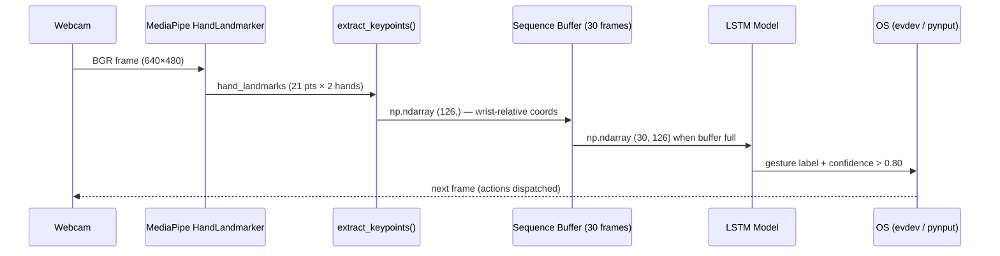

<div align="center">

# 🖐️ GestureFlow

**Real-time hand gesture recognition pipeline for Linux desktop control**

[](https://www.python.org/)
[](https://tensorflow.org/)
[](https://mediapipe.dev/)
[](LICENSE)
[]()

> A full end-to-end pipeline that captures hand landmarks via webcam, trains an LSTM neural network on custom gesture sequences, and translates recognized gestures into real OS actions — cursor movement, click, and workspace switching.

</div>

---

## 📑 Table of Contents

- [Overview](#-overview)
- [Project Structure](#-project-structure)
- [Workflow](#-workflow)
- [Pipeline Steps](#-pipeline-steps)
- [Installation](#-installation)
- [Running the Dashboard](#-running-the-dashboard)
- [Configuration](#-configuration)
- [Tech Stack](#-tech-stack)

---

## 🧠 Overview

GestureFlow is a structured learning project that walks through the full Machine Learning lifecycle applied to computer vision:

| Phase | Description |
|---|---|
| **Exploration** | Raw camera capture and landmark visualization (Steps 1–3) |
| **Rule-based recognition** | Static gesture detection without neural networks (Step 4) |
| **Data pipeline** | Automated sequence collection into `.npy` datasets (Step 5) |
| **Training** | LSTM model training with temporal sequence data (Step 6) |
| **Inference** | Real-time gesture classification via the trained model (Step 7) |
| **System control** | OS-level actions driven by recognized gestures (Step 8) |

The final result is a unified **CustomTkinter dashboard** (`main.py`) that integrates steps 4–8 into a single dark-themed GUI with an embedded live camera viewport.

---

## 📂 Project Structure

```text
GestureFlow/
│
├── main.py                         # Unified dashboard launcher (Steps 4–8)
├── config.py                       # Centralized constants (paths, thresholds, hyperparameters)
├── utils.py                        # Shared helpers: extract_keypoints(), get_gesture_names()
├── pyproject.toml                  # Package metadata and build configuration
├── requirements.txt                # Pinned Python dependencies
├── .gitignore
│
├── assets/
│   ├── models/
│   │   └── hand_landmarker.task   # MediaPipe pre-trained hand landmark binary
│   └── img_prueba/                 # Test images for static step exploration
│
├── modelos/
│   └── lstm_gestos.keras           # Trained LSTM model output (generated by Step 6)
│
├── gestos/                         # Dataset root — one subfolder per gesture class
│   ├── <gesture_name>/
│   │   └── *.npy                  # Sequences of shape (30, 126) per recording
│   └── ...
│
└── pasos/                          # Ordered learning steps (standalone scripts)
    ├── REFERENCIA_COMUN.md         # Shared concepts glossary (OpenCV, MediaPipe, LSTM)
    │
    ├── paso-01-camara/             # Step 1: Raw webcam capture
    ├── paso-02-dibujo/             # Step 2: Hand landmark drawing overlay
    ├── paso-03-tiempo-real/        # Step 3: Real-time landmark visualization
    ├── paso-04-reconocimiento-vocales/  # Step 4: Rule-based vowel recognition
    ├── paso-05-recoleccion/        # Step 5: Automated gesture dataset collection
    ├── paso-06-entrenamiento/      # Step 6: LSTM model training script
    ├── paso-07-deteccion-tiempo-real/   # Step 7: Real-time LSTM inference
    └── paso-08-control-sistema/    # Step 8: OS gesture control (cursor, click, swipe)
```

### Key files at a glance

| File | Purpose |
|---|---|
| `main.py` | `GestureFlowApp` — CustomTkinter dashboard integrating Steps 4–8 |
| `config.py` | Single source of truth for all numeric constants and file paths |
| `utils.py` | `extract_keypoints()` and `get_gesture_names()` used across steps |
| `modelos/lstm_gestos.keras` | Output of Step 6; must exist before running Step 7 or Control |
| `assets/models/hand_landmarker.task` | Required by MediaPipe — download separately (see Installation) |

---

## 🔄 Workflow

The project follows two independent workflows: a **development path** (building the model) and a **runtime path** (using it).

### Full Pipeline Diagram


### Data Flow



### Mode Switching

The dashboard (`main.py`) exposes a **segmented button** to switch between pipeline modes at runtime:

| Mode | MediaPipe | LSTM | Action |
|---|---|---|---|
| **Idle** | Off | — | Standby — no processing |
| **Vowels** | On (VIDEO) | — | Rule-based vowel overlay |
| **Collection** | On (VIDEO) | — | Records `.npy` sequences to `gestos/` |
| **Training** | Off | — | Runs Step 6 script as subprocess |
| **Inference** | On (VIDEO) | On | Predicts gesture label on live feed |
| **Control** | On (VIDEO) | On | Translates gestures to OS events |

---

## 🪜 Pipeline Steps

Each step lives in its own folder under `pasos/` and is self-contained. Steps 1–3 are exploratory scripts run directly; Steps 4–8 are orchestrated by the dashboard.

### Step 1 — Raw Camera Capture
**File**: `pasos/paso-01-camara/paso_01_camara.py`

Opens the webcam with `cv2.VideoCapture(0)`, mirrors the feed horizontally (`cv2.flip`), and displays it in a named OpenCV window. The foundational loop used by all subsequent steps.

---

### Step 2 — Hand Landmark Drawing
**File**: `pasos/paso-02-dibujo/paso_02_dibujo.py`

Loads the MediaPipe `HandLandmarker` model (`.task` binary, `IMAGE` mode). For each frame, it converts BGR→RGB, runs synchronous detection, and draws the 21-point skeleton using `mp.solutions.drawing_utils` on top of the live feed.

---

### Step 3 — Real-time Landmark Visualization
**File**: `pasos/paso-03-tiempo-real/paso_03_tiempo_real.py`

Switches MediaPipe to `LIVE_STREAM` mode (asynchronous callback) and adds a readiness flag to prevent frame queue buildup on slower hardware. Introduces landmark inference at a reduced frame width for performance.

---

### Step 4 — Vowel Recognition (Rule-based)
**File**: `pasos/paso-04-reconocimiento-vocales/paso_04_vocales.py`

Detects the five Spanish vowels (A, E, I, O, U) using **geometric threshold rules** on landmark angles and distances — no machine learning. Includes a `VowelValidator` class with a configurable confirmation time (default 1 second) before confirming a detected vowel.

> 💡 This step demonstrates why rule-based systems are brittle and motivates the LSTM approach.

---

### Step 5 — Dataset Collection
**File**: `pasos/paso-05-recoleccion/paso_05_recoleccion.py`

Runs a phased collection loop controlled by **spacebar**:

| Phase | Description |
|---|---|
| **Waiting** | Idle until spacebar pressed |
| **Countdown** | 5-second timer before recording begins |
| **Recording** | Captures 30 frames → saves as `.npy` to `gestos/<name>/` |
| **Paused** | Brief rest between sequences |

Collects **200 sequences × 30 frames** per gesture class. Uses sliding-window overlap (`SAVE_EVERY=5`) as a data augmentation technique.

**Output shape per file**: `(30, 126)` — 30 timesteps × 126 wrist-relative coordinates.

---

### Step 6 — LSTM Model Training
**File**: `pasos/paso-06-entrenamiento/`

Loads all `.npy` files from `gestos/`, builds a 3D tensor `(N, 30, 126)`, one-hot encodes the labels, and trains a TensorFlow/Keras LSTM network:

```
Input  → LSTM(64, return_sequences=True)
       → LSTM(128, return_sequences=True)
       → LSTM(64)
       → Dense(64, relu)
       → Dense(num_classes, softmax)
```

**Hyperparameters** (from `config.py`):

| Parameter | Value |
|---|---|
| `EPOCHS` | 100 |
| `BATCH_SIZE` | 32 |
| `TEST_SIZE` | 20% |
| `RANDOM_STATE` | 42 |

Saves the trained model to `modelos/lstm_gestos.keras`.

---

### Step 7 — Real-time LSTM Inference
**File**: `pasos/paso-07-deteccion-tiempo-real/paso_07_deteccion.py`

Maintains a rolling `deque` buffer of 30 keypoint frames. When full, runs `model.predict()` on a background thread to avoid blocking the camera loop. A prediction is accepted only when confidence >= `CONFIDENCE_THRESHOLD` (0.80).

---

### Step 8 — System Gesture Control
**File**: `pasos/paso-08-control-sistema/paso_08_control.py`

Translates recognized gestures into OS-level events via `pynput` (cross-platform) and `evdev` (Linux Wayland):

| Gesture | Action |
|---|---|
| **Two-finger pose** | Move mouse cursor (relative, smoothed) |
| **Pinch** (thumb + index) | Left click |
| **Swipe left / right** | Switch virtual workspace |

Key parameters (from `config.py`):

| Constant | Value | Description |
|---|---|---|
| `PINCH_THRESHOLD` | 0.06 | Normalized distance to trigger click |
| `SWIPE_VELOCITY` | 0.035 | Minimum wrist velocity for swipe |
| `CURSOR_SMOOTHING` | 0.4 | EMA factor for pointer smoothing |
| `MOUSE_SENSITIVITY` | 6.0 | Cursor speed multiplier |

---

## 🛠️ Installation

### Prerequisites

| Requirement | Version |
|---|---|
| Python | 3.10 or higher |
| pip | Latest |
| Git | Any |
| Webcam | USB or built-in |
| OS | Linux (Wayland/X11) — Step 8 uses `evdev` |

> ⚠️ **Wayland note**: Step 8 system control uses `evdev` for mouse and keyboard events. On X11 sessions, `pynput` is used as fallback. Make sure your user belongs to the `input` group: `sudo usermod -aG input $USER`.

---

### 1. Clone the repository

```bash
git clone https://github.com/<your-user>/GestureFlow.git
cd GestureFlow
```

---

### 2. Create and activate the virtual environment

```bash
python -m venv venv
source venv/bin/activate   # Windows: venv\Scripts\activate
```

---

### 3. Install dependencies

```bash
pip install -r requirements.txt
```

> **Note**: `mediapipe==0.10.35` installs `opencv-contrib-python` as a dependency. Do **not** add `opencv-python` separately — it will create a conflicting double-install that breaks `import cv2`.

---

### 4. Download the MediaPipe hand landmark model

The `.task` binary is not tracked in this repository due to its size (~25 MB). Download it manually:

```bash
mkdir -p assets/models
curl -L \
  "https://storage.googleapis.com/mediapipe-models/hand_landmarker/hand_landmarker/float16/latest/hand_landmarker.task" \
  -o assets/models/hand_landmarker.task
```

Or download directly from [MediaPipe Models](https://developers.google.com/mediapipe/solutions/vision/hand_landmarker#models) and place the file at `assets/models/hand_landmarker.task`.

---

### 5. Verify the installation

```bash
python -c "import mediapipe, cv2, tensorflow; print('All dependencies OK')"
```

Expected output:
```
All dependencies OK
```

---

### Quick-start summary

```bash
git clone https://github.com/<your-user>/GestureFlow.git
cd GestureFlow
python -m venv venv && source venv/bin/activate
pip install -r requirements.txt
mkdir -p assets/models
curl -L "https://storage.googleapis.com/mediapipe-models/hand_landmarker/hand_landmarker/float16/latest/hand_landmarker.task" \
     -o assets/models/hand_landmarker.task
python main.py
```

---

## 🚀 Running the Dashboard

The unified dashboard (`main.py`) is the primary entry point for Steps 4–8.

```bash
source venv/bin/activate
python main.py
```

The GUI will open at **1100×700** (minimum 1000×650) with:

- **Left panel**: Mode selector, step-specific controls, and action log console
- **Right panel**: Embedded live webcam viewport

### Mode workflow

```
Idle → [Select "Collection"] → Enter gesture name → Press Start → SPACE to record
     → [Select "Training"]   → Click "Train Model (LSTM)"
     → [Select "Inference"]  → Live LSTM predictions appear on the camera feed
     → [Select "Control"]    → Hand gestures control your mouse and workspaces
```

> **⚠️ Training** runs the Step 6 script as a **subprocess** — the GUI stays responsive but logs the training output to the console panel. Do not close the app while training.

---

## ⚙️ Configuration

All tunable parameters are centralized in [`config.py`](config.py). No magic numbers in the step scripts.

| Section | Constant | Default | Description |
|---|---|---|---|
| **Paths** | `MP_TASK_PATH` | `assets/models/hand_landmarker.task` | MediaPipe model binary |
| **Paths** | `MODEL_PATH` | `modelos/lstm_gestos.keras` | Trained LSTM model |
| **Paths** | `GESTOS_DIR` | `gestos/` | Root of gesture dataset |
| **Collection** | `SEQUENCE_LENGTH` | 30 | Frames per gesture sequence |
| **Collection** | `NUM_FEATURES` | 126 | Keypoints per frame (21 × 3 × 2 hands) |
| **Collection** | `NUM_SEQUENCES` | 200 | Sequences collected per class |
| **Collection** | `SAVE_EVERY` | 5 | Sliding window step (overlap) |
| **Collection** | `COUNTDOWN_SECS` | 5 | Countdown before each recording |
| **Training** | `TEST_SIZE` | 0.20 | Fraction for validation split |
| **Training** | `EPOCHS` | 100 | Max training epochs |
| **Training** | `BATCH_SIZE` | 32 | Samples per gradient update |
| **Inference** | `CONFIDENCE_THRESHOLD` | 0.80 | Minimum confidence to accept prediction |
| **Control** | `PINCH_THRESHOLD` | 0.06 | Normalized distance for click trigger |
| **Control** | `SWIPE_VELOCITY` | 0.035 | Min wrist velocity for swipe detection |
| **Control** | `CURSOR_SMOOTHING` | 0.4 | EMA alpha for pointer smoothing |
| **Control** | `MOUSE_SENSITIVITY` | 6.0 | Cursor speed multiplier |

---

## 🧰 Tech Stack

| Library | Version | Role |
|---|---|---|
| [MediaPipe](https://developers.google.com/mediapipe) | 0.10.35 | Hand landmark detection (21 pts per hand) |
| [TensorFlow / Keras](https://tensorflow.org) | 2.16.1 | LSTM model definition, training, and inference |
| [OpenCV](https://opencv.org) | via mediapipe | Camera capture, frame processing, overlay drawing |
| [NumPy](https://numpy.org) | 1.26.4 | Keypoint arrays, sequence tensors, one-hot encoding |
| [scikit-learn](https://scikit-learn.org) | 1.9.0 | Train/test split, label encoding utilities |
| [CustomTkinter](https://github.com/TomSchimansky/CustomTkinter) | Latest | Premium dark-themed desktop GUI |
| [Pillow](https://python-pillow.org) | Latest | Converting OpenCV frames to Tkinter-compatible format |
| [pynput](https://pynput.readthedocs.io) | ≥ 1.7.7 | Cross-platform mouse and keyboard control |
| [evdev](https://python-evdev.readthedocs.io) | Latest | Low-level Linux input device control (Wayland) |

---

<div align="center">

Made with ❤️ as a learning project — from raw webcam frames to OS gesture control.

</div>
