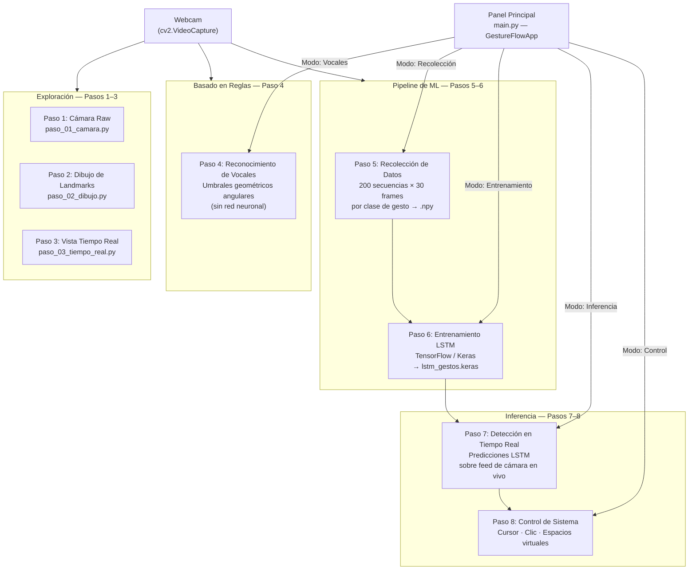
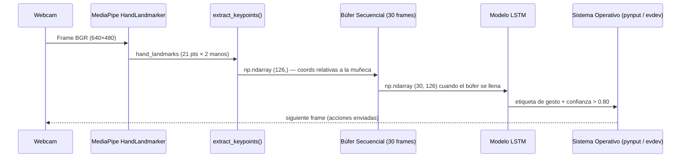

<div align="center">

# GestureFlow

**Pipeline de reconocimiento de gestos de mano en tiempo real para control de escritorio**

[](https://www.python.org/)
[](https://tensorflow.org/)
[](https://mediapipe.dev/)
[](LICENSE)
[]()

> Un pipeline completo de extremo a extremo que captura landmarks de mano a través de webcam, entrena una red neuronal LSTM en secuencias de gestos personalizadas y traduce los gestos reconocidos en acciones reales del sistema operativo — movimiento del cursor, clic y cambio de espacio de trabajo.

</div>

---

## Tabla de Contenidos

- [Vista General](#vista-general)
- [Estructura del Proyecto](#estructura-del-proyecto)
- [Flujo de Trabajo](#flujo-de-trabajo)
- [Pasos del Pipeline](#pasos-del-pipeline)
- [Instalación](#instalación)
- [Ejecutar el Panel de Control](#ejecutar-el-panel-de-control)
- [Configuración](#configuración)
- [Tecnologías Utilizadas](#tecnologías-utilizadas)

---

## Vista General

GestureFlow es un proyecto de aprendizaje estructurado que recorre el ciclo de vida completo de un desarrollo de Machine Learning aplicado a visión artificial:

| Fase | Descripción |
|---|---|
| **Exploración** | Captura de cámara raw y visualización de landmarks ([Pasos 1–3](pasos/paso-01-camara/)) |
| **Reconocimiento basado en reglas** | Detección estática de gestos sin redes neuronales ([Step 4](pasos/paso-04-reconocimiento-vocales/)) |
| **Pipeline de datos** | Recolección automatizada de secuencias en datasets `.npy` ([Step 5](pasos/paso-05-recoleccion/)) |
| **Entrenamiento** | Entrenamiento del modelo LSTM con datos de secuencias temporales ([Step 6](pasos/paso-06-entrenamiento/)) |
| **Inferencia** | Clasificación de gestos en tiempo real con el modelo entrenado ([Step 7](pasos/paso-07-deteccion-tiempo-real/)) |
| **Control del sistema** | Acciones del sistema operativo impulsadas por gestos reconocidos ([Step 8](pasos/paso-08-control-sistema/)) |

El resultado final es un panel de control unificado con **CustomTkinter** (`main.py`) que integra los pasos 4 a 8 en una interfaz gráfica oscura con un visor de cámara en vivo incrustado.

### Componentes Clave de la Arquitectura

#### MediaPipe HandLandmarker
La solución **MediaPipe HandLandmarker** identifica 21 puntos clave (landmarks) en el espacio 3D para cada mano a partir de un frame de video. En GestureFlow, extraemos estos landmarks y los normalizamos con respecto a la muñeca (índice 0) para obtener características invariables a traslaciones. Para dos manos, esto produce 126 valores de coordenadas (21 puntos × 3 coordenadas (x, y, z) × 2 manos) por frame.

#### Long Short-Term Memory (LSTM)
Una red **Long Short-Term Memory (LSTM)** es un tipo de red neuronal recurrente (RNN) capaz de aprender dependencias de orden en problemas de predicción de secuencias. En GestureFlow, el modelo procesa una secuencia temporal de 30 frames (forma de tensor `(30, 126)`) para clasificar de manera precisa gestos dinámicos en el tiempo.

#### Mapa de Puntos de Landmark
El siguiente diagrama de referencia muestra los 21 índices que devuelve MediaPipe HandLandmarker:


---

## Estructura del Proyecto

```text
GestureFlow/
│
├── main.py                         # Lanzador unificado de la aplicación (Pasos 4–8)
├── config.py                       # Constantes centralizadas (rutas, umbrales, hiperparámetros)
├── utils.py                        # Helpers compartidos: extract_keypoints(), get_gesture_names()
├── pyproject.toml                  # Metadatos del paquete y configuración de build
├── requirements.txt                # Dependencias de Python fijadas
├── .gitignore
│
├── assets/
│   ├── models/
│   │   └── hand_landmarker.task   # Binario preentrenado de landmarks de mano de MediaPipe
│   ├── img_prueba/                 # Imágenes de prueba para exploración estática
│   └── hand-landmarks.png          # Diagrama de mapeo de landmarks de mano de MediaPipe
│
├── modelos/
│   └── lstm_gestos.keras           # Modelo LSTM entrenado final (generado por el Paso 6)
│
├── gestos/                         # Raíz del dataset — una subcarpeta por clase de gesto
│   ├── <gesture_name>/
│   │   └── *.npy                  # Secuencias de forma (30, 126) por grabación
│   └── ...
│
├── pruebas/                        # Scripts de pruebas de entrada independientes
│   ├── test_evdev.py               # Prueba de movimiento relativo del ratón
│   ├── test_evdev_abs.py           # Prueba de coordenadas absolutas del ratón
│   └── test_mouse.py               # Prueba de posicionamiento del ratón pynput
│
└── pasos/                          # Pasos de aprendizaje ordenados (scripts independientes)
    ├── REFERENCIA_COMUN.md         # Glosario común de conceptos (OpenCV, MediaPipe, LSTM)
    │
    ├── paso-01-camara/             # Paso 1: Captura de cámara raw
    ├── paso-02-dibujo/             # Paso 2: Dibujo de esqueleto sobre el frame
    ├── paso-03-tiempo-real/        # Paso 3: Visualización de landmarks en tiempo real
    ├── paso-04-reconocimiento-vocales/  # Paso 4: Reconocimiento de vocales basado en reglas
    ├── paso-05-recoleccion/        # Paso 5: Recolección automatizada de dataset de gestos
    ├── paso-06-entrenamiento/      # Paso 6: Script de entrenamiento de red LSTM
    ├── paso-07-deteccion-tiempo-real/   # Paso 7: Inferencia LSTM en tiempo real
    └── paso-08-control-sistema/    # Paso 8: Control de SO mediante gestos (cursor, clic, swipe)
```

> Cada carpeta de paso contiene su propio archivo de documentación (`paso_0X_doc.md`) con notas detalladas de implementación, conceptos y solución a errores comunes. El archivo [pasos/REFERENCIA_COMUN.md](pasos/REFERENCIA_COMUN.md) documenta los conceptos compartidos (OpenCV, MediaPipe, LSTM).

### Archivos clave de un vistazo

| Archivo | Propósito |
|---|---|
| `main.py` | `GestureFlowApp` — Panel CustomTkinter que integra los pasos 4–8 |
| `config.py` | Fuente única de verdad para constantes numéricas y rutas de archivos |
| `utils.py` | `extract_keypoints()` y `get_gesture_names()` utilizados en varios pasos |
| `modelos/lstm_gestos.keras` | Output del Paso 6; debe existir antes de poder ejecutar el Paso 7 o Control |
| `assets/models/hand_landmarker.task` | Requerido por MediaPipe — descarga por separado (ver Instalación) |

---

## Flujo de Trabajo

El proyecto sigue dos flujos de trabajo independientes: la **fase de desarrollo** (construcción y entrenamiento del modelo) y la **fase de ejecución** (inferencia y uso).

### Diagrama del Pipeline Completo



### Flujo de Datos



### Modos del Panel de Control

El panel (`main.py`) expone un **botón segmentado** para alternar entre los modos del pipeline en tiempo de ejecución:

| Modo | MediaPipe | LSTM | Acción |
|---|---|---|---|
| **Idle** | Apagado | — | Espera — sin procesamiento |
| **Vowels** | Encendido (VIDEO) | — | Overlay de vocales basado en reglas |
| **Collection** | Encendido (VIDEO) | — | Graba secuencias `.npy` en `gestos/` |
| **Training** | Apagado | — | Ejecuta el script del Paso 6 como subproceso |
| **Inference** | Encendido (VIDEO) | Encendido | Predice etiquetas de gestos en el feed en vivo |
| **Control** | Encendido (VIDEO) | Encendido | Traduce gestos en eventos de control del SO |

---

## Pasos del Pipeline

### [Paso 1 — Captura de Cámara Raw](pasos/paso-01-camara/)
**Folder**: [paso-01-camara/](pasos/paso-01-camara/) | **File**: [paso_01_camara.py](pasos/paso-01-camara/paso_01_camara.py) | **Documentation**: [paso_01_doc.md](pasos/paso-01-camara/paso_01_doc.md)

Bucle de cámara básico utilizando `cv2.VideoCapture`. Establece el patrón de lectura-volteo-visualización sobre el cual se construyen los siguientes pasos.

---

### [Paso 2 — Dibujo de Landmarks en Mano](pasos/paso-02-dibujo/)
**Folder**: [paso-02-dibujo/](pasos/paso-02-dibujo/) | **File**: [paso_02_dibujo.py](pasos/paso-02-dibujo/paso_02_dibujo.py) | **Documentation**: [paso_02_doc.md](pasos/paso-02-dibujo/paso_02_doc.md)

Introduce MediaPipe `HandLandmarker` en modo síncrono `IMAGE`. Dibuja el esqueleto de 21 puntos clave sobre cada frame.

---

### [Paso 3 — Visualización de Landmarks en Tiempo Real](pasos/paso-03-tiempo-real/)
**Folder**: [paso-03-tiempo-real/](pasos/paso-03-tiempo-real/) | **File**: [paso_03_tiempo_real.py](pasos/paso-03-tiempo-real/paso_03_tiempo_real.py) | **Documentation**: [paso_03_doc.md](pasos/paso-03-tiempo-real/paso_03_doc.md)

Actualiza la detección al modo asíncrono `LIVE_STREAM` con una bandera de disponibilidad para evitar que los frames se acumulen en cola. Optimiza la inferencia reduciendo el tamaño del frame.

---

### [Paso 4 — Reconocimiento de Vocales (Basado en Reglas)](pasos/paso-04-reconocimiento-vocales/)
**Folder**: [paso-04-reconocimiento-vocales/](pasos/paso-04-reconocimiento-vocales/) | **File**: [paso_04_vocales.py](pasos/paso-04-reconocimiento-vocales/paso_04_vocales.py) | **Documentation**: [paso_04_doc.md](pasos/paso-04-reconocimiento-vocales/paso_04_doc.md)

Clasifica las cinco vocales en español utilizando reglas geométricas basadas en los ángulos de las articulaciones de la mano, sin modelos de red neuronal. Muestra las limitaciones de este enfoque y motiva el uso de la LSTM.

---

### [Paso 5 — Recolección de Datos](pasos/paso-05-recoleccion/)
**Folder**: [paso-05-recoleccion/](pasos/paso-05-recoleccion/) | **File**: [paso_05_recoleccion.py](pasos/paso-05-recoleccion/paso_05_recoleccion.py) | **Documentation**: [paso_05_doc.md](pasos/paso-05-recoleccion/paso_05_doc.md)

Bucle de grabación accionado por la tecla **ESPACIO** que captura 200 secuencias de 30 frames por clase de gesto y las almacena en la carpeta `gestos/` en archivos con formato `.npy` y forma `(30, 126)`.

---

### [Paso 6 — Entrenamiento de Modelo LSTM](pasos/paso-06-entrenamiento/)
**Folder**: [paso-06-entrenamiento/](pasos/paso-06-entrenamiento/) | **File**: [paso_06_entrenamiento.py](pasos/paso-06-entrenamiento/paso_06_entrenamiento.py) | **Documentation**: [paso_06_doc.md](pasos/paso-06-entrenamiento/paso_06_doc.md)

Carga el dataset recolectado en archivos `.npy`, construye una red neuronal LSTM profunda en Keras, la entrena durante 100 épocas y exporta el modelo entrenado a `modelos/lstm_gestos.keras`.

---

### [Paso 7 — Inferencia LSTM en Tiempo Real](pasos/paso-07-deteccion-tiempo-real/)
**Folder**: [paso-07-deteccion-tiempo-real/](pasos/paso-07-deteccion-tiempo-real/) | **File**: [paso_07_deteccion.py](pasos/paso-07-deteccion-tiempo-real/paso_07_deteccion.py) | **Documentation**: [paso_07_doc.md](pasos/paso-07-deteccion-tiempo-real/paso_07_doc.md)

Introduce un búfer circular de 30 frames en un hilo secundario asíncrono para ejecutar la inferencia del modelo LSTM sobre la cámara en vivo. Solo acepta predicciones si la certeza supera el 80%.

---

### [Paso 8 — Control del Sistema mediante Gestos](pasos/paso-08-control-sistema/)
**Folder**: [paso-08-control-sistema/](pasos/paso-08-control-sistema/) | **File**: [paso_08_control.py](pasos/paso-08-control-sistema/paso_08_control.py) | **Documentation**: [paso_08_doc.md](pasos/paso-08-control-sistema/paso_08_doc.md)

Traduce los gestos detectados en acciones del SO. Utiliza `pynput` para control genérico y `evdev` en Linux con Wayland para un control del ratón más fluido a bajo nivel:

| Gesto | Acción |
|---|---|
| **Pose de dos dedos** | Mueve el cursor (suavizado relativo por EMA) |
| **Pinza** (pulgar + índice) | Clic izquierdo |
| **Deslizar mano (swipe)** | Cambiar de espacio de trabajo virtual |

---

## Instalación

### Soporte de Plataformas

| Característica | Linux | Windows | macOS |
|---|---|---|---|
| Captura de cámara | Sí | Sí | Sí |
| Detección de mano | Sí | Sí | Sí |
| Entrenamiento e inferencia | Sí | Sí | Sí |
| Control del ratón | Sí (evdev + pynput) | Sí (pynput) | Sí (pynput) |
| Espacios de trabajo | Sí (hyprctl) | Sí (Win+Ctrl+Flechas) | Sí (Ctrl+Flechas) |

---

### Requisitos Previos

| Requisito | Versión |
|---|---|
| Python | 3.10 o superior |
| pip | Reciente |
| Git | Cualquiera |
| Webcam | Integrada o USB |

---

### 1. Clonar el repositorio

```bash
git clone https://github.com/ItsTheWest/GestureFlow.git
cd GestureFlow
```

---

### 2. Crear y activar el entorno virtual

**Linux / macOS**
```bash
python -m venv venv
source venv/bin/activate
```

**Windows (Símbolo del sistema)**
```cmd
python -m venv venv
venv\Scripts\activate.bat
```

**Windows (PowerShell)**
```powershell
python -m venv venv
venv\Scripts\Activate.ps1
```

---

### 3. Instalar dependencias

```bash
pip install -r requirements.txt
```

---

### 4. Descargar el modelo HandLandmarker de MediaPipe

El archivo `.task` del modelo (~25 MB) no se incluye en el repositorio. Descárgalo manualmente:

**Linux / macOS**
```bash
mkdir -p assets/models
curl -L \
  "https://storage.googleapis.com/mediapipe-models/hand_landmarker/hand_landmarker/float16/latest/hand_landmarker.task" \
  -o assets/models/hand_landmarker.task
```

**Windows (PowerShell)**
```powershell
New-Item -ItemType Directory -Force -Path assets\models
Invoke-WebRequest `
  -Uri "https://storage.googleapis.com/mediapipe-models/hand_landmarker/hand_landmarker/float16/latest/hand_landmarker.task" `
  -OutFile "assets\models\hand_landmarker.task"
```

---

### 5. Verificar la instalación

```bash
python -c "import mediapipe, cv2, tensorflow; print('Instalación correcta')"
```

---

## Ejecutar el Panel de Control

El panel CustomTkinter (`main.py`) es la interfaz principal del proyecto:

```bash
python main.py
```

La ventana se abrirá en un tamaño de **1100×700** con el panel de opciones a la izquierda y el visor de video a la derecha.

---

## Configuración

Todos los parámetros se encuentran centralizados en [`config.py`](config.py).

| Variable | Valor | Descripción |
|---|---|---|
| `MP_TASK_PATH` | `assets/models/hand_landmarker.task` | Modelo de MediaPipe |
| `MODEL_PATH` | `modelos/lstm_gestos.keras` | Modelo LSTM guardado |
| `SEQUENCE_LENGTH` | `30` | Tamaño de la ventana temporal |
| `CONFIDENCE_THRESHOLD` | `0.80` | Confianza mínima de predicción |
| `PINCH_THRESHOLD` | `0.06` | Distancia para detectar pinza |
| `SWIPE_VELOCITY` | `0.035` | Umbral de velocidad para swipe |
| `CURSOR_SMOOTHING` | `0.4` | Suavizado EMA del puntero |
| `MOUSE_SENSITIVITY` | `6.0` | Multiplicador de velocidad del cursor |

---

## Tecnologías Utilizadas

- **MediaPipe**: Extracción de landmarks de mano en 3D en tiempo real.
- **TensorFlow / Keras**: Creación, entrenamiento y ejecución de la red LSTM.
- **OpenCV**: Captura y procesamiento gráfico en vivo.
- **CustomTkinter**: GUI para el panel del usuario.
- **pynput / evdev**: Emisión de eventos de ratón y teclado al SO.

