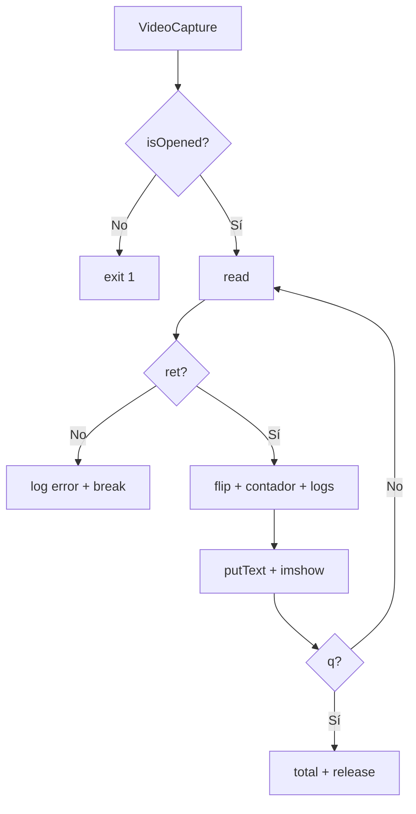

# Documentación: Paso 01 — Cámara en vivo (`paso_01_camara.py`)

Abre la webcam, muestra vídeo en **color** con **espejo**, contador de frames y logs en consola. Solo OpenCV; sin MediaPipe.

**Patrones de pasos 2 y 3** (rutas, modelo, BGR→RGB): [REFERENCIA_COMUN.md](../REFERENCIA_COMUN.md).

---

## Índice

- [1. Objetivo del paso](#1-objetivo-del-paso)
- [2. Archivos de esta carpeta](#2-archivos-de-esta-carpeta)
- [3. Pipeline](#3-pipeline)
- [4. Importaciones y variables](#4-importaciones-y-variables)
- [5. Bloques del código](#5-bloques-del-código)
- [6. OpenCV, teclas y ventana](#6-opencv-teclas-y-ventana)
- [7. Consola: qué logs verás](#7-consola-qué-logs-verás)
- [8. Cómo ejecutar](#8-cómo-ejecutar)
- [9. Errores frecuentes](#9-errores-frecuentes)
- [10. ¿Puedo ir al siguiente paso?](#10-puedo-ir-al-siguiente-paso)
- [11. Referencia del código fuente](#11-referencia-del-código-fuente)

---

## 1. Objetivo del paso

**Objetivo:** abrir la webcam, leer frames en bucle, mostrarlos en color con orientación tipo espejo, ver el número de frame en pantalla, registrar información en consola y salir con `q` liberando la cámara.

| Incluido en este script | No incluido (pasos 2 y 3) |
|-------------------------|---------------------------|
| `VideoCapture`, bucle `read()` | `HandLandmarker` / MediaPipe |
| Espejo `cv2.flip(frame, 1)` | Landmarks, círculos y líneas |
| Logs en consola + `putText` | Modo `LIVE_STREAM` |
| Salida con `q` | Detección de gestos |

**Criterio de éxito:**

- Ventana `Paso 01 - Camara` con vídeo en color y espejo.
- Contador de frame visible y subiendo.
- Consola: mensaje del primer frame, logs cada 100 frames, total al salir.
- `q` cierra sin dejar la cámara bloqueada.

---

## 2. Archivos de esta carpeta

| Archivo | Rol |
|---------|-----|
| `paso_01_camara.py` | Script del paso |
| `paso_01_doc.md` | Esta documentación |

**También en `pasos/`:** [REFERENCIA_COMUN.md](../REFERENCIA_COMUN.md).

**Dependencias (raíz del proyecto):** `opencv-python` en `requirements.txt`, entorno `venv/`.

**No necesitas:** `prueba/hand_landmarker.task`, imágenes en `assets/`.

---

## 3. Pipeline

```text
1. import cv2
2. VideoCapture(0) → cap
3. isOpened() → si falla: print + exit(1)
4. frame_count = 0, primer_frame_logeado = False
5. while True:
     read() → ret, frame
     si not ret → log con frame_count + break
     flip(frame, 1)        → espejo
     frame_count += 1
     logs consola (1.er frame / cada 100)
     putText (contador + "Pulsa Q")
     imshow (color)
     waitKey(1) → si 'q', break
6. print total frames
7. release() + destroyAllWindows()
```



---

## 4. Importaciones y variables

### `import cv2`

OpenCV: captura, `flip`, `putText`, `imshow`, `waitKey`, liberación de recursos. Los frames están en **BGR** (3 canales). En los pasos 2 y 3 convertirás a **RGB** para MediaPipe — ver [REFERENCIA_COMUN.md §5](../REFERENCIA_COMUN.md#5-bgr--rgb-y-mpimage).

### Tabla de variables

| Nombre | Significado |
|--------|-------------|
| `cap` | Objeto de captura de la cámara. |
| `ret` | `True` si `read()` devolvió un frame válido. |
| `frame` | Imagen BGR `(alto, ancho, 3)`, p. ej. `(480, 640, 3)`. |
| `frame_count` | Frames leídos con éxito desde el inicio del bucle. |
| `primer_frame_logeado` | Evita repetir el log detallado del primer frame. |

---

## 5. Bloques del código

### Líneas 1–7 — Apertura y error fatal

```python
cap = cv2.VideoCapture(0)
if not cap.isOpened():
    print("Error: No se pudo abrir la camara")
    exit(1)
```

Abre el dispositivo `0` (primera cámara). `exit(1)` indica error al sistema/terminal.

---

### Líneas 9–10 — Inicialización antes del bucle

```python
frame_count = 0
primer_frame_logeado = False
```

Sin `frame_count = 0`, la línea `frame_count += 1` lanzaría `NameError`.

---

### Líneas 12–17 — Lectura y validación

```python
ret, frame = cap.read()
if not ret:
    print(f"Error: No se pudo leer el frame (tras {frame_count} frames OK)")
    break
```

**Orden importante:** primero `read()`, luego comprobar `ret`. Solo después se modifica `frame` (flip, texto).

---

### Líneas 19–20 — Espejo y contador

```python
frame = cv2.flip(frame, 1)
frame_count += 1
```

| `flip(..., 1)` | Volteo **horizontal** (efecto espejo). |
| `0` | Volteo vertical. |
| `-1` | Ambos ejes. |

---

### Líneas 22–26 — Logs en consola

```python
if not primer_frame_logeado:
    print(f"Primer frame OK: shape={frame.shape}, dtype={frame.dtype}")
    primer_frame_logeado = True
elif frame_count % 100 == 0:
    print(f"Frames OK: {frame_count}")
```

| Momento | Qué imprime |
|---------|-------------|
| Primer frame OK | `shape` y `dtype` (comprueba que hay imagen real). |
| Cada 100 frames | Progreso sin llenar la terminal (a ~30 FPS ≈ cada 3 s). |
| Tras el bucle (l. 37) | `Total frames leidos: N` |

No se hace `print` en cada frame a propósito (demasiado ruido).

---

### Líneas 28–32 — Texto y ventana (color)

```python
cv2.putText(frame, f"Frame: {frame_count}", ...)
cv2.putText(frame, "Pulsa Q para salir", ...)
cv2.imshow("Paso 01 - Camara", frame)
```

Dibuja en el **mismo** `frame` en BGR y muestra una sola ventana. Color verde en BGR: `(0, 255, 0)`.

**No hay** `cvtColor` a gris: el vídeo se ve a color.

---

### Líneas 34–35 — Salida con Q

```python
if cv2.waitKey(1) & 0xFF == ord("q"):
    break
```

`waitKey(1)` refresca la ventana (~1 ms). `& 0xFF` evita lecturas erróneas de tecla en Windows.

---

### Líneas 37–39 — Cierre

```python
print(f"Total frames leidos: {frame_count}")
cap.release()
cv2.destroyAllWindows()
```

Siempre se ejecuta tras salir del `while` (por `q` o por error de `read()`).

---

## 6. OpenCV, teclas y ventana

| Función / tecla | Uso en este paso |
|-----------------|------------------|
| `VideoCapture(0)` | Abrir cámara. |
| `isOpened()` | Comprobar apertura. |
| `read()` | Siguiente frame → `(ret, frame)`. |
| `flip(image, 1)` | Espejo horizontal. |
| `putText(...)` | Contador y ayuda en pantalla. |
| `imshow("Paso 01 - Camara", frame)` | Mostrar BGR en vivo. |
| `waitKey(1)` | Eventos de ventana + teclado. |
| **`q`** | Salir del bucle. |
| `release()` / `destroyAllWindows()` | Liberar cámara y ventanas. |

Enlace: [Tutorial vídeo OpenCV](https://docs.opencv.org/4.x/dd/d43/tutorial_py_video_display.html)

---

## 7. Consola: qué logs verás

Ejemplo típico al ejecutar y pulsar `q` tras unos segundos:

```text
Primer frame OK: shape=(480, 640, 3), dtype=uint8
Frames OK: 100
Frames OK: 200
Total frames leidos: 247
```

| Log | Significado |
|-----|-------------|
| `Primer frame OK` | Al menos un frame válido; `shape` con 3 canales = color BGR. |
| `Frames OK: N` | El bucle sigue leyendo bien cada 100 iteraciones. |
| `Total frames leidos` | Cuántos frames procesaste antes de salir. |
| `Error: No se pudo abrir...` | Índice de cámara o permisos. |
| `Error: No se pudo leer el frame (tras X frames OK)` | Fallo a mitad de sesión. |

---

## 8. Cómo ejecutar

Desde la raíz del proyecto, con `venv` activado:

```powershell
python pasos/paso-01-camara/paso_01_camara.py
```

| En pantalla | En consola |
|-------------|------------|
| Vídeo color, espejo | Primer `shape` / `dtype` |
| `Frame: N` en verde | Cada 100 frames |
| `Pulsa Q para salir` | Total al cerrar con `q` |

---

## 9. Errores frecuentes

| Síntoma | Qué revisar |
|---------|-------------|
| Ventana negra / congelada | `waitKey(1)` presente; probar `VideoCapture(1)`. |
| Sin logs salvo error | ¿Llegaste a leer al menos un frame? ¿Saliste antes del frame 100? |
| Imagen sin espejo | ¿`flip(frame, 1)` está **después** de `if not ret`? |
| `NameError: frame_count` | Falta inicialización antes del `while`. |
| Cámara ocupada tras crash | Falta `release()`; en pasos futuros usar `try/finally`. |

Más síntomas compartidos (pasos 2–3): [REFERENCIA_COMUN.md §9](../REFERENCIA_COMUN.md#9-errores-frecuentes-todos-los-pasos).

---

## 10. ¿Puedo ir al siguiente paso?

**Sí**, si al ejecutar este script se cumple todo esto:

- [ ] La ventana muestra vídeo **en color** y orientación **espejo** aceptable.
- [ ] El número de frame en pantalla **sube** de forma continua.
- [ ] En consola aparece **`Primer frame OK`** con `shape` de 3 dimensiones.
- [ ] Al pulsar **`q`**, ves **`Total frames leidos`** y el programa termina sin colgar.
- [ ] (Opcional) Tras ~3 s de vídeo, aparece al menos un **`Frames OK: 100`** si no sales antes.

**Siguiente:** [Paso 02 — Dibujo](../paso-02-dibujo/paso_02_doc.md) — cámara + MediaPipe modo `IMAGE` al pulsar **ESPACIO**.

---

## 11. Referencia del código fuente

```1:39:pasos/paso-01-camara/paso_01_camara.py
import cv2

cap = cv2.VideoCapture(0)  # 0 = cámara por defecto; prueba 1 si no abre

if not cap.isOpened():
    print("Error: No se pudo abrir la camara")
    exit(1)

frame_count = 0
primer_frame_logeado = False

while True:
    ret, frame = cap.read()

    if not ret:
        print(f"Error: No se pudo leer el frame (tras {frame_count} frames OK)") # Log de error
        break # Salir del bucle si no se pudo leer el frame

    frame = cv2.flip(frame, 1)  # espejo horizontal (orientación natural)
    frame_count += 1 # Incrementar el contador de frames

    if not primer_frame_logeado:
        print(f"Primer frame OK: shape={frame.shape}, dtype={frame.dtype}") # Log de primer frame OK
        primer_frame_logeado = True
    elif frame_count % 100 == 0: # Log de frames OK cada 100 frames
        print(f"Frames OK: {frame_count}") # Log de frames OK

    cv2.putText(frame, f"Frame: {frame_count}", (10, 30), cv2.FONT_HERSHEY_SIMPLEX, 0.8, (0, 255, 0), 2) # Texto de frames OK
    cv2.putText(frame,
        "Pulsa Q para salir", (10, 60), cv2.FONT_HERSHEY_SIMPLEX, 0.6, (0, 255, 0), 2) # Texto de salida

    cv2.imshow("Paso 01 - Camara", frame) # Mostrar el frame en la ventana

    if cv2.waitKey(1) & 0xFF == ord("q"):
        break # Salir del bucle si se presiona la tecla 'q'

print(f"Total frames leidos: {frame_count}") # Log de total frames leidos
cap.release()
cv2.destroyAllWindows()
```

*Fuente de verdad: el archivo `.py` en disco. La documentación coincide línea a línea con `paso_01_camara.py`.*
