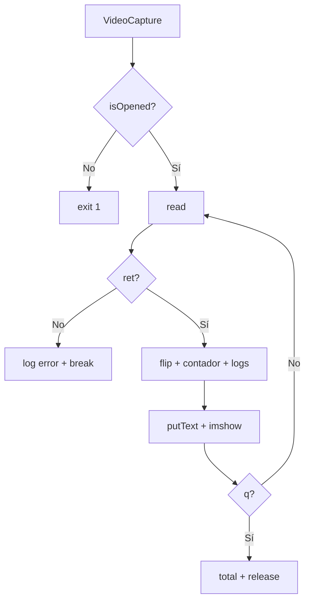

# Documentación: Paso 01 — Cámara en vivo (`paso_01_camara.py`)

Abre la webcam, muestra vídeo en **color** con **espejo**, contador de frames y logs en consola. Solo OpenCV; sin MediaPipe.

Para conocer en detalle los conceptos de cámara, volteo horizontal, refresco de ventanas y liberación de recursos, consulta la [REFERENCIA_COMUN.md](file:///home/thewest/proyectos/GestureFlow/pasos/REFERENCIA_COMUN.md).

---

## Índice

- [1. Objetivo del paso](#1-objetivo-del-paso)
- [2. Archivos de esta carpeta](#2-archivos-de-esta-carpeta)
- [3. Pipeline](#3-pipeline)
- [4. Importaciones y variables](#4-importaciones-y-variables)
- [5. Bloques del código](#5-bloques-del-código)
- [6. OpenCV, teclas y ventana](#6-opencv-teclas-y-ventana)
- [7. Consola: qué logs verás](#7-consola-qué-logs-verás)
- [8. Cómo ejecutar](#8-cómo-ejecutar)
- [9. Errores frecuentes](#9-errores-frecuentes)
- [10. ¿Puedo ir al siguiente paso?](#10-puedo-ir-al-siguiente-paso)
- [11. Referencia del código fuente](#11-referencia-del-código-fuente)

---

## 1. Objetivo del paso

**Objetivo:** abrir la webcam, leer frames en bucle, mostrarlos en color con orientación tipo espejo, ver el número de frame en pantalla, registrar información en consola y salir con `q` liberando la cámara.

| Incluido en este script | No incluido (pasos 2 y 3) |
|-------------------------|---------------------------|
| `VideoCapture`, bucle `read()` | `HandLandmarker` / MediaPipe |
| Espejo `cv2.flip(frame, 1)` | Landmarks, círculos y líneas |
| Logs en consola + `putText` | Modo `LIVE_STREAM` |
| Salida con `q` | Detección de gestos |

**Criterio de éxito:**
- Ventana `Paso 01 - Camara` con vídeo en color y espejo.
- Contador de frame visible y subiendo.
- Consola: mensaje del primer frame, logs cada 100 frames, total al salir.
- `q` cierra sin dejar la cámara bloqueada.

---

## 2. Archivos de esta carpeta

| Archivo | Rol |
|---------|-----|
| [paso_01_camara.py](file:///home/thewest/proyectos/GestureFlow/pasos/paso-01-camara/paso_01_camara.py) | Script del paso |
| [paso_01_doc.md](file:///home/thewest/proyectos/GestureFlow/pasos/paso-01-camara/paso_01_doc.md) | Esta documentación |

**Glosario y conceptos comunes:** [REFERENCIA_COMUN.md](file:///home/thewest/proyectos/GestureFlow/pasos/REFERENCIA_COMUN.md).

---

## 3. Pipeline

```text
1. import cv2
2. VideoCapture(0) → cap
3. isOpened() → si falla: print + exit(1)
4. frame_count = 0, primer_frame_logeado = False
5. while True:
6.      read() → ret, frame
7.      si not ret → log con frame_count + break
8.      flip(frame, 1)        → espejo
9.      frame_count += 1
10.     logs consola (1.er frame / cada 100)
11.     putText (contador + "Pulsa Q")
12.     imshow (color)
13.     waitKey(1) → si 'q', break
14. print total frames
15. release() + destroyAllWindows()
```


```mermaid
flowchart TD
    A[VideoCapture] --> B{isOpened?}
    B -->|No| C[exit 1]
    B -->|Sí| D[read]
    D --> E{ret?}
    E -->|No| F[log error + break]
    E -->|Sí| G[flip + contador + logs]
    G --> H[putText + imshow]
    H --> I{q?}
    I -->|No| D
    I -->|Sí| J[total + release]
```

---

## 4. Importaciones y variables

### `import cv2`
OpenCV: captura, volteo espejo, texto, visualización y liberación de recursos.
Para detalles sobre espacios de color (BGR a RGB) y por qué OpenCV lee por defecto en BGR, consulta la [Sección 3.2 de REFERENCIA_COMUN.md](file:///home/thewest/proyectos/GestureFlow/pasos/REFERENCIA_COMUN.md#32-espacio-de-color-bgr-a-rgb-mpimage).

### Tabla de variables

| Nombre | Significado | Concepto General |
|--------|-------------|------------------|
| `cap` | Objeto de captura de la cámara. | [REF §2.1](file:///home/thewest/proyectos/GestureFlow/pasos/REFERENCIA_COMUN.md#21-captura-de-cámara-cv2videocapture) |
| `ret` | `True` si `read()` devolvió un frame válido. | [REF §2.1](file:///home/thewest/proyectos/GestureFlow/pasos/REFERENCIA_COMUN.md#21-captura-de-cámara-cv2videocapture) |
| `frame` | Imagen BGR `(alto, ancho, 3)`, p. ej. `(480, 640, 3)`. | [REF §2.1](file:///home/thewest/proyectos/GestureFlow/pasos/REFERENCIA_COMUN.md#21-captura-de-cámara-cv2videocapture) |
| `frame_count` | Frames leídos con éxito desde el inicio del bucle. | Específico de este paso (estadísticas) |
| `primer_frame_logeado` | Evita repetir el log detallado del primer frame. | Control de flujo local |

---

## 5. Bloques del código

### Apertura y error fatal
Abre el dispositivo `0` (primera cámara). Si no se puede abrir, el script termina.
Ver concepto detallado de inicialización en [REF §2.1](file:///home/thewest/proyectos/GestureFlow/pasos/REFERENCIA_COMUN.md#21-captura-de-cámara-cv2videocapture).

### Espejo y contador
Aplica el volteo horizontal para crear una vista en modo espejo.
Ver concepto en [REF §2.2](file:///home/thewest/proyectos/GestureFlow/pasos/REFERENCIA_COMUN.md#22-volteo-horizontal-cv2flip).

### Textos y visualización (HUD)
Muestra el contador en pantalla y la ayuda de comandos.
Ver funciones de dibujo en [REF §2.4](file:///home/thewest/proyectos/GestureFlow/pasos/REFERENCIA_COMUN.md#24-elementos-gráficos-e-interfaz-hud).

### Control de teclado (`q`)
Termina el bucle al presionar la tecla `q` en la ventana enfocada.
Ver mecanismo de teclas en [REF §2.3](file:///home/thewest/proyectos/GestureFlow/pasos/REFERENCIA_COMUN.md#23-refresco-y-detección-de-teclado-cv2waitkey).

---

## 6. OpenCV, teclas y ventana

Para una referencia completa de las funciones de captura, volteo, dibujo de textos y terminación, consulta la [Sección 2 de REFERENCIA_COMUN.md](file:///home/thewest/proyectos/GestureFlow/pasos/REFERENCIA_COMUN.md#2-opencv-y-captura-de-vídeo).

---

## 7. Consola: qué logs verás

Ejemplo típico al ejecutar y pulsar `q` tras unos segundos:

```text
Primer frame OK: shape=(480, 640, 3), dtype=uint8
Frames OK: 100
Frames OK: 200
Total frames leidos: 247
```

- **Primer frame OK**: Se imprime al obtener el primer fotograma correcto, mostrando la resolución (`shape`) de 3 canales (color BGR) y el tipo de datos (`uint8`).
- **Frames OK**: Progreso silencioso impreso en terminal cada 100 frames (~3 segundos a 30 FPS).
- **Total frames leidos**: Log final impreso al salir del bucle.

---

## 8. Cómo ejecutar

Desde la raíz del proyecto, con `venv` activado:

```bash
python pasos/paso-01-camara/paso_01_camara.py
```

---

## 9. Errores frecuentes

Para resolver problemas como ventanas negras, fallas al abrir la cámara, imágenes invertidas o bloqueos al cerrar el script, consulta la **Tabla de Errores Frecuentes Unificada** en la [Sección 6 de REFERENCIA_COMUN.md](file:///home/thewest/proyectos/GestureFlow/pasos/REFERENCIA_COMUN.md#6-tabla-de-errores-frecuentes-unificada).

---

## 10. ¿Puedo ir al siguiente paso?

**Sí**, si al ejecutar este script se cumple todo esto:
- [ ] La ventana muestra vídeo **en color** y orientación **espejo**.
- [ ] El número de frame en pantalla **sube** de forma continua.
- [ ] En consola aparece **`Primer frame OK`** con `shape` de 3 dimensiones.
- [ ] Al pulsar **`q`**, ves **`Total frames leidos`** y el programa termina sin colgarse.

**Siguiente:** [Paso 02 — Dibujo](file:///home/thewest/proyectos/GestureFlow/pasos/paso-02-dibujo/paso_02_doc.md) — cámara + MediaPipe modo `IMAGE` al pulsar **ESPACIO**.

---

## 11. Referencia del código fuente

El script completo vive en [paso_01_camara.py](file:///home/thewest/proyectos/GestureFlow/pasos/paso-01-camara/paso_01_camara.py).
