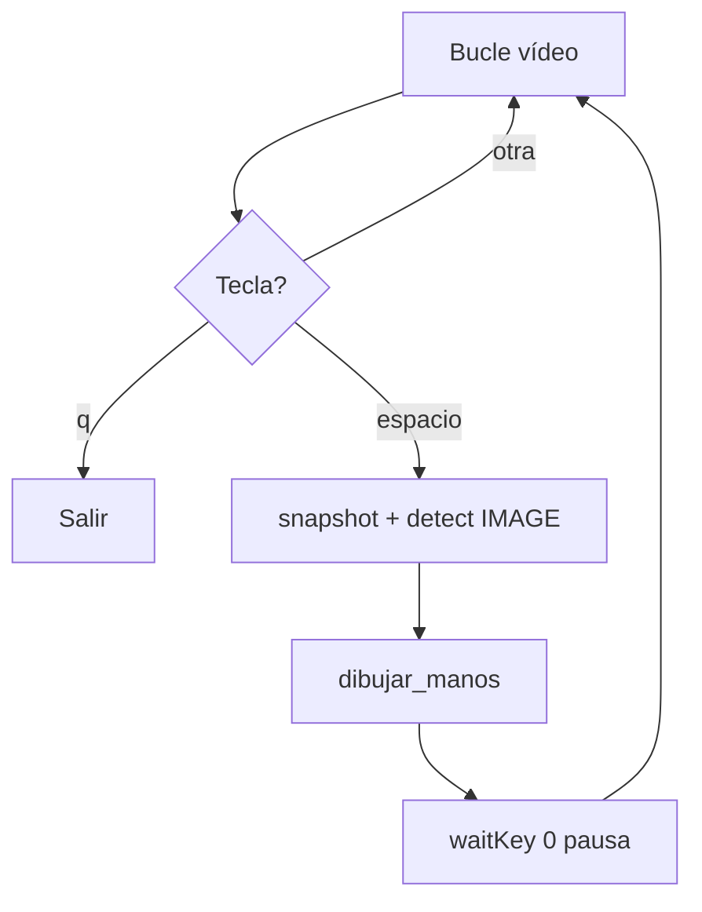

# Documentación: Paso 02 — Dibujo con ESPACIO (`paso_02_dibujo.py`)

Puente entre **cámara en vivo** (paso 1) y **detección continua** (paso 3): al pulsar **ESPACIO** congelas un frame, lo procesas con MediaPipe en modo **IMAGE** (como `prueba.py`) y dibujas el esqueleto de la mano.

**Patrones compartidos** (rutas, BGR→RGB, dibujo, modelo): [REFERENCIA_COMUN.md](../REFERENCIA_COMUN.md).

---

## Índice

- [1. Objetivo del paso](#1-objetivo-del-paso)
- [2. Archivos de esta carpeta](#2-archivos-de-esta-carpeta)
- [3. Pipeline](#3-pipeline)
- [4. Importaciones y variables](#4-importaciones-y-variables)
- [5. Bloques del código](#5-bloques-del-código)
- [6. OpenCV, teclas y ventana](#6-opencv-teclas-y-ventana)
- [7. Consola: qué logs verás](#7-consola-qué-logs-verás)
- [8. Cómo ejecutar](#8-cómo-ejecutar)
- [9. Errores frecuentes](#9-errores-frecuentes)
- [10. ¿Puedo ir al siguiente paso?](#10-puedo-ir-al-siguiente-paso)
- [11. Referencia del código fuente](#11-referencia-del-código-fuente)

---

## 1. Objetivo del paso

**Objetivo:** mantener el vídeo en vivo del paso 1 y, al pulsar **ESPACIO**, congelar un frame, detectar hasta 2 manos con `HandLandmarker` en modo `IMAGE`, dibujar landmarks y pausar hasta otra tecla.

| Incluido | No incluido (paso 3) |
|----------|----------------------|
| MediaPipe + modelo `.task` | `RunningMode.LIVE_STREAM` |
| `detect()` síncrono | `detect_async()` |
| Dibujo con ESPACIO | Dibujo en cada frame sin tecla |
| Espejo + bucle + `q` | Callback `on_result` |

**Criterio de éxito:**

- Vídeo fluido con texto de ayuda.
- Con la mano visible, **ESPACIO** muestra círculos y líneas del esqueleto.
- Consola: `Manos detectadas: N` o `No se detectaron manos`.
- **Q** cierra sin colgar.

**Requisito previo:** [Paso 01](../paso-01-camara/paso_01_doc.md) funcionando (cámara + espejo + `q`).

---

## 2. Archivos de esta carpeta

| Archivo | Rol |
|---------|-----|
| `paso_02_dibujo.py` | Script del paso |
| `paso_02_doc.md` | Esta documentación |

**También en `pasos/`:** [REFERENCIA_COMUN.md](../REFERENCIA_COMUN.md).

**Dependencias:** `opencv-python`, `mediapipe` (ver `requirements.txt`).

**Necesitas:** `prueba/hand_landmarker.task` (mismo que Fase 0).

---

## 3. Pipeline

```text
1. Comprobar MODEL_PATH
2. VideoCapture(0)
3. HandLandmarker (RunningMode.IMAGE)
4. while True:
     read → flip
     preview = copia del frame (sin dibujo)
     imshow(preview) + waitKey(1)
     si 'q' → break
     si ESPACIO:
         snapshot = copia
         BGR → RGB → mp.Image
         results = detect(snapshot)
         dibujar_manos(snapshot, results)
         imshow(snapshot) + waitKey(0)   ← pausa
5. release + destroyAllWindows
```



---

## 4. Importaciones y variables

| Import / símbolo | Rol |
|------------------|-----|
| `cv2` | Cámara, flip, ventanas, BGR→RGB |
| `mediapipe` / `vision` | `HandLandmarker`, `RunningMode.IMAGE` |
| `landmark_pb2` | Formato para `draw_landmarks` |
| `Path` | Rutas absolutas al modelo |

| Variable | Valor / uso |
|----------|-------------|
| `SCRIPT_DIR` | Carpeta `paso-02-dibujo/` |
| `PROJECT_ROOT` | Raíz `GestureFlow/` (dos niveles arriba) |
| `MODEL_PATH` | `prueba/hand_landmarker.task` |
| `preview` | Copia para vídeo en vivo sin landmarks |
| `snapshot` | Frame congelado al pulsar ESPACIO |

Detalle de rutas, modelo y dibujo: [REFERENCIA_COMUN.md §2–6](../REFERENCIA_COMUN.md#2-rutas-con-path).

---

## 5. Bloques del código

### `dibujar_manos(frame, results)`

Convierte cada mano a protobuf y llama a `draw_landmarks` **in-place** sobre `frame`. Devuelve `False` si no hay `hand_landmarks`. Ver [REF §6](../REFERENCIA_COMUN.md#6-dibujar-landmarks).

### Comprobación del modelo y cámara

Igual patrón que paso 1: `MODEL_PATH.is_file()` antes de abrir la cámara; `VideoCapture(0)` + `isOpened()`.

### `HandLandmarker` con `IMAGE`

```python
options = vision.HandLandmarkerOptions(
    base_options=base_options,
    running_mode=vision.RunningMode.IMAGE,
    num_hands=2,
)
```

Modo síncrono: un frame por llamada a `detect()`. Tabla IMAGE vs LIVE_STREAM: [REF §7](../REFERENCIA_COMUN.md#7-modos-image-vs-live_stream).

### Bucle — `preview` vs `snapshot`

- `preview = frame.copy()` → vídeo en vivo sin dibujo.
- Al pulsar espacio: `snapshot = frame.copy()` → inferencia y dibujo solo ahí.

### Bloque ESPACIO

```python
mp_image = mp.Image(
    image_format=mp.ImageFormat.SRGB,
    data=cv2.cvtColor(snapshot, cv2.COLOR_BGR2RGB),
)
results = landmarker.detect(mp_image)
dibujar_manos(snapshot, results)
cv2.imshow("Paso 02 - Dibujo", snapshot)
cv2.waitKey(0)
```

- `detect()` es **bloqueante**.
- `waitKey(0)` pausa hasta otra tecla (como `prueba.py` tras mostrar resultado).

---

## 6. OpenCV, teclas y ventana

| Tecla | Acción |
|-------|--------|
| **ESPACIO** | Detectar y dibujar en el frame actual |
| **Q** | Salir del programa (solo en bucle en vivo, no durante `waitKey(0)`) |
| Cualquier tecla | Tras ESPACIO, sale de la pausa |

| OpenCV | Uso |
|--------|-----|
| `flip(frame, 1)` | Espejo (igual que paso 1) |
| `imshow("Paso 02 - Dibujo", ...)` | Preview o snapshot |
| `waitKey(1)` | Bucle fluido |
| `waitKey(0)` | Pausa tras detectar |

---

## 7. Consola: qué logs verás

| Momento | Mensaje |
|---------|---------|
| Al iniciar | `ESPACIO = detectar y dibujar manos \| Q = salir` |
| Tras ESPACIO con mano(s) | `Manos detectadas: N` |
| Tras ESPACIO sin mano | `No se detectaron manos` |
| Error de lectura | `Error: No se pudo leer el frame` |
| Modelo ausente | `FileNotFoundError` con ruta a `MODEL_PATH` |

---

## 8. Cómo ejecutar

Desde la raíz del proyecto, con `venv` activado:

```powershell
python pasos/paso-02-dibujo/paso_02_dibujo.py
```

| En pantalla | En consola |
|-------------|------------|
| Vídeo en vivo + ayuda verde | Mensaje inicial ESPACIO / Q |
| Tras ESPACIO: manos dibujadas | `Manos detectadas: N` o aviso sin manos |

---

## 9. Errores frecuentes

| Síntoma | Qué revisar |
|---------|-------------|
| `FileNotFoundError` del modelo | ¿Existe `prueba/hand_landmarker.task`? |
| ESPACIO no hace nada | ¿Ventana con foco? |
| No se dibuja | Mano en cuadro, luz, BGR→RGB |
| Vídeo se congela tras ESPACIO | Normal: `waitKey(0)` hasta tecla |
| Programa no cierra con Q | Solo en bucle en vivo, no en pausa |

Más: [REFERENCIA_COMUN.md §9](../REFERENCIA_COMUN.md#9-errores-frecuentes-todos-los-pasos).

---

## 10. ¿Puedo ir al siguiente paso?

**Sí**, si:

- [ ] ESPACIO dibuja el esqueleto cuando hay mano.
- [ ] Sin mano, consola dice que no se detectaron.
- [ ] Q cierra bien desde el vídeo en vivo.

**Siguiente:** [Paso 03 — Tiempo real](../paso-03-tiempo-real/paso_03_doc.md) — mismo dibujo con `LIVE_STREAM` y `detect_async` en **cada** frame.

---

## 11. Referencia del código fuente

```1:103:pasos/paso-02-dibujo/paso_02_dibujo.py
# --- Librerías de visión y procesamiento ---

import cv2
import mediapipe as mp
from mediapipe.tasks import python
from mediapipe.tasks.python import vision
from mediapipe.framework.formats import landmark_pb2
from pathlib import Path

SCRIPT_DIR = Path(__file__).resolve().parent
PROJECT_ROOT = SCRIPT_DIR.parent.parent
MODEL_PATH = PROJECT_ROOT / "prueba" / "hand_landmarker.task"

def dibujar_manos(frame, results):
    if not results.hand_landmarks:
        return False
    for hand_landmarks in results.hand_landmarks:
        hand_landmarks_proto = landmark_pb2.NormalizedLandmarkList()
        hand_landmarks_proto.landmark.extend([
            landmark_pb2.NormalizedLandmark(x=lm.x, y=lm.y, z=lm.z)
            for lm in hand_landmarks
        ])
        mp.solutions.drawing_utils.draw_landmarks(
            frame,
            hand_landmarks_proto,
            mp.solutions.hands.HAND_CONNECTIONS,
            mp.solutions.drawing_styles.get_default_hand_landmarks_style(),
            mp.solutions.drawing_styles.get_default_hand_connections_style(),
        )
    return True

if not MODEL_PATH.is_file():
    raise FileNotFoundError(f"No se encontro el modelo: {MODEL_PATH}")

cap = cv2.VideoCapture(0)
if not cap.isOpened():
    print("Error: No se pudo abrir la camara")
    exit(1)

base_options = python.BaseOptions(model_asset_path=str(MODEL_PATH))
options = vision.HandLandmarkerOptions(
    base_options=base_options,
    running_mode=vision.RunningMode.IMAGE,
    num_hands=2,
)

with vision.HandLandmarker.create_from_options(options) as landmarker:
    print("ESPACIO = detectar y dibujar manos | Q = salir")
    while True:
        ret, frame = cap.read()
        if not ret:
            print("Error: No se pudo leer el frame")
            break

        frame = cv2.flip(frame, 1)
        preview = frame.copy()

        cv2.putText(
            preview,"ESPACIO: detectar | Q: salir",(10, 30),cv2.FONT_HERSHEY_SIMPLEX,0.7,(0, 255, 0),2,
        )

        cv2.imshow("Paso 02 - Dibujo", preview)
        key = cv2.waitKey(1) & 0xFF
        if key == ord("q"):
            break

        if key == ord(" "):
            snapshot = frame.copy()
            mp_image = mp.Image(
                image_format=mp.ImageFormat.SRGB,
                data=cv2.cvtColor(snapshot, cv2.COLOR_BGR2RGB),
            )

            results = landmarker.detect(mp_image)
            if dibujar_manos(snapshot, results):
                print(f"Manos detectadas: {len(results.hand_landmarks)}")
            else:
                print("No se detectaron manos")

            cv2.imshow("Paso 02 - Dibujo", snapshot)
            cv2.waitKey(0)

cap.release()
cv2.destroyAllWindows()
```

*Fuente de verdad: el archivo `.py` en disco. La documentación resume la lógica; el script incluye comentarios inline adicionales.*
