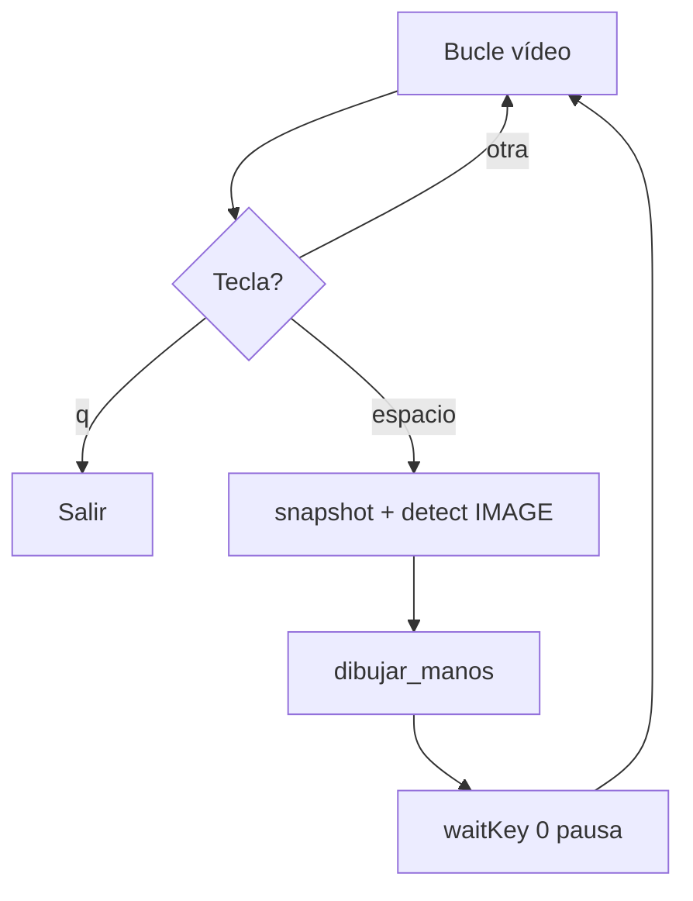

# Documentación: Paso 02 — Dibujo con ESPACIO (`paso_02_dibujo.py`)

Puente entre **cámara en vivo** (paso 1) y **detección continua** (paso 3): al pulsar **ESPACIO** congelas un frame, lo procesas con MediaPipe en modo **IMAGE** (síncrono) y dibujas el esqueleto de la mano.

Para conocer en detalle los conceptos de rutas, configuración del modelo, espacio de color y dibujo de landmarks, consulta la [REFERENCIA_COMUN.md](file:///home/thewest/proyectos/GestureFlow/pasos/REFERENCIA_COMUN.md).

---

## Índice

- [1. Objetivo del paso](#1-objetivo-del-paso)
- [2. Archivos de esta carpeta](#2-archivos-de-esta-carpeta)
- [3. Pipeline](#3-pipeline)
- [4. Importaciones y variables](#4-importaciones-y-variables)
- [5. Bloques del código](#5-bloques-del-código)
- [6. OpenCV, teclas y ventana](#6-opencv-teclas-y-ventana)
- [7. Consola: qué logs verás](#7-consola-qué-logs-verás)
- [8. Cómo ejecutar](#8-cómo-ejecutar)
- [9. Errores frecuentes](#9-errores-frecuentes)
- [10. ¿Puedo ir al siguiente paso?](#10-puedo-ir-al-siguiente-paso)
- [11. Referencia del código fuente](#11-referencia-del-código-fuente)

---

## 1. Objetivo del paso

**Objetivo:** mantener el vídeo en vivo del paso 1 y, al pulsar **ESPACIO**, congelar un frame, detectar hasta 2 manos con `HandLandmarker` en modo `IMAGE`, dibujar landmarks y pausar la pantalla hasta presionar otra tecla.

| Incluido en este script | No incluido (paso 3) |
|-------------------------|----------------------|
| MediaPipe + modelo `.task` | `RunningMode.LIVE_STREAM` |
| `detect()` síncrono | `detect_async()` |
| Dibujo con ESPACIO | Detección en cada frame sin pausar |
| Espejo + bucle + `q` | Callback `on_result` |

**Criterio de éxito:**
- Vídeo fluido con texto de ayuda en vivo.
- Con la mano visible, al pulsar **ESPACIO** se congela el frame y muestra círculos y líneas del esqueleto de la mano.
- Consola: logs detallados `Manos detectadas: N` o `No se detectaron manos`.
- **Q** cierra la aplicación sin colgarse.

---

## 2. Archivos de esta carpeta

| Archivo | Rol |
|---------|-----|
| [paso_02_dibujo.py](file:///home/thewest/proyectos/GestureFlow/pasos/paso-02-dibujo/paso_02_dibujo.py) | Script del paso |
| [paso_02_doc.md](file:///home/thewest/proyectos/GestureFlow/pasos/paso-02-dibujo/paso_02_doc.md) | Esta documentación |

**Glosario y conceptos comunes:** [REFERENCIA_COMUN.md](file:///home/thewest/proyectos/GestureFlow/pasos/REFERENCIA_COMUN.md).

---

## 3. Pipeline

```text
1. Comprobar MODEL_PATH
2. VideoCapture(0)
3. HandLandmarker (RunningMode.IMAGE)
4. while True:
5.      read → flip
6.      preview = copia del frame (sin dibujo)
7.      imshow(preview) + waitKey(1)
8.      si 'q' → break
9.      si ESPACIO:
10.         snapshot = copia
11.         BGR → RGB → mp.Image
12.         results = detect(snapshot)
13.         dibujar_manos(snapshot, results)
14.         imshow(snapshot) + waitKey(0)   ← pausa
15. release + destroyAllWindows
```


```mermaid
flowchart TD
    A[Bucle vídeo] --> B{Tecla?}
    B -->|q| C[Salir]
    B -->|espacio| D[snapshot + detect IMAGE]
    D --> E[dibujar_manos]
    E --> F[waitKey 0 pausa]
    F --> A
    B -->|otra| A
```

---

## 4. Importaciones y variables

Para conocer la descripción y por qué se importa cada biblioteca de visión y procesamiento, consulta la [REFERENCIA_COMUN.md](file:///home/thewest/proyectos/GestureFlow/pasos/REFERENCIA_COMUN.md).

### Tabla de variables específicas

| Variable | Rol | Concepto General |
|----------|-----|------------------|
| `preview` | Copia del frame para vídeo en vivo sin dibujo. | Específico de la UI local |
| `snapshot` | Frame congelado al pulsar ESPACIO sobre el cual se realiza inferencia. | Específico de la lógica de foto-congelada |
| `SCRIPT_DIR`, `PROJECT_ROOT`, `MODEL_PATH` | Resolución de rutas absolutas al modelo. | [REF §1.2](file:///home/thewest/proyectos/GestureFlow/pasos/REFERENCIA_COMUN.md#12-rutas-con-path-pathlibpath) |
| `landmarker` | Detector de marcas de manos de MediaPipe. | [REF §3.1](file:///home/thewest/proyectos/GestureFlow/pasos/REFERENCIA_COMUN.md#31-carga-del-modelo-handlandmarkeroptions-y-baseoptions) |

---

## 5. Bloques del código

### Dibujo de manos (`dibujar_manos`)
Dibuja el esqueleto sobre el lienzo. La conversión de landmarks a protobuf y la función interna de graficado se explican en [REF §4.1](file:///home/thewest/proyectos/GestureFlow/pasos/REFERENCIA_COMUN.md#41-dibujo-de-landmarks-dibujar_manos).

### HandLandmarker con modo `IMAGE`
Configura el modelo en modo síncrono. Puedes ver la tabla comparativa de modos en [REF §3.3](file:///home/thewest/proyectos/GestureFlow/pasos/REFERENCIA_COMUN.md#33-modos-de-inferencia-runningmode).

### Lógica de congelamiento (ESPACIO)
- Se duplica el frame en `snapshot = frame.copy()`.
- Se convierte a RGB y se encapsula en `mp.Image`. Ver [REF §3.2](file:///home/thewest/proyectos/GestureFlow/pasos/REFERENCIA_COMUN.md#32-espacio-de-color-bgr-a-rgb-mpimage).
- Se ejecuta `landmarker.detect(mp_image)` de forma **síncrona y bloqueante**.
- Se dibuja y se muestra `snapshot` llamando a `cv2.waitKey(0)`. Este último bloquea el flujo y actúa como una pausa en pantalla hasta presionar cualquier tecla para reanudar el bucle principal. Ver [REF §2.3](file:///home/thewest/proyectos/GestureFlow/pasos/REFERENCIA_COMUN.md#23-refresco-y-detección-de-teclado-cv2waitkey).

---

## 6. OpenCV, teclas y ventana

- **ESPACIO**: Congela el fotograma actual para realizar la inferencia y dibujar.
- **Q**: Finaliza el script (solo se detecta en modo de vista en vivo).
- **Cualquier otra tecla**: Si se está en estado de pausa, reanuda el vídeo en vivo.

---

## 7. Consola: qué logs verás

```text
ESPACIO = detectar y dibujar manos | Q = salir
Manos detectadas: 1
No se detectaron manos
```

---

## 8. Cómo ejecutar

Desde la raíz del proyecto, con `venv` activado:

```bash
python pasos/paso-02-dibujo/paso_02_dibujo.py
```

---

## 9. Errores frecuentes

Para solucionar fallas del modelo ausente, problemas de foco en ventanas o errores de dibujo, consulta la **Tabla de Errores Frecuentes Unificada** en la [Sección 6 de REFERENCIA_COMUN.md](file:///home/thewest/proyectos/GestureFlow/pasos/REFERENCIA_COMUN.md#6-tabla-de-errores-frecuentes-unificada).

---

## 10. ¿Puedo ir al siguiente paso?

**Sí**, si:
- [ ] ESPACIO congela la imagen y dibuja con éxito el esqueleto al haber manos en el encuadre.
- [ ] En la terminal se imprimen los mensajes correspondientes (`Manos detectadas: N` o `No se detectaron manos`).
- [ ] La ventana y cámara se cierran correctamente al pulsar **q**.

**Siguiente:** [Paso 03 — Tiempo real](file:///home/thewest/proyectos/GestureFlow/pasos/paso-03-tiempo-real/paso_03_doc.md) — detección asíncrona continua (`LIVE_STREAM`) frame a frame.

---

## 11. Referencia del código fuente

El script completo vive en [paso_02_dibujo.py](file:///home/thewest/proyectos/GestureFlow/pasos/paso-02-dibujo/paso_02_dibujo.py).
