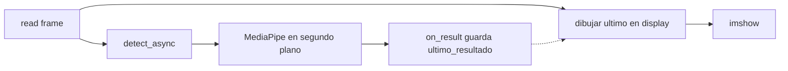

# Documentación: Paso 03 — Tiempo real (`paso_03_tiempo_real.py`)

**Último paso** de la ruta `pasos/`: detección de manos **en cada frame** con MediaPipe en modo `LIVE_STREAM`, sin pulsar ESPACIO.

**Patrones compartidos:** [REFERENCIA_COMUN.md](../REFERENCIA_COMUN.md).

---

## Índice

- [1. Objetivo del paso](#1-objetivo-del-paso)
- [2. Archivos de esta carpeta](#2-archivos-de-esta-carpeta)
- [3. Pipeline](#3-pipeline)
- [4. Importaciones y variables](#4-importaciones-y-variables)
- [5. Bloques del código](#5-bloques-del-código)
- [6. OpenCV, teclas y ventana](#6-opencv-teclas-y-ventana)
- [7. Consola: qué logs verás](#7-consola-qué-logs-verás)
- [8. Cómo ejecutar](#8-cómo-ejecutar)
- [9. Errores frecuentes](#9-errores-frecuentes)
- [10. ¿Qué sigue después?](#10-qué-sigue-después)
- [11. Referencia del código fuente](#11-referencia-del-código-fuente)

---

## 1. Objetivo del paso

**Objetivo:** vídeo en espejo con el esqueleto de la mano **actualizándose mientras mueves la mano**, usando `detect_async` y un `result_callback`.

| Incluido | Ya no hace falta |
|----------|------------------|
| `RunningMode.LIVE_STREAM` | Pulsar ESPACIO por frame |
| `result_callback` → `ultimo_resultado` | `waitKey(0)` tras detectar |
| `detect_async` cada iteración | `detect()` síncrono |
| Espejo, `q`, dibujo landmarks | — |

**Criterio de éxito:**

- Al mover la mano, las líneas y puntos **siguen** el movimiento (pequeño retardo normal).
- **Q** cierra sin error.
- Sin mano en cuadro, el vídeo sigue fluido.

**Requisito previo:** [Paso 02](../paso-02-dibujo/paso_02_doc.md) funcionando al menos una vez (modelo + dibujo).

---

## 2. Archivos de esta carpeta

| Archivo | Rol |
|---------|-----|
| `paso_03_tiempo_real.py` | Script final de la ruta `pasos/` |
| `paso_03_doc.md` | Esta documentación |

**También en `pasos/`:** [REFERENCIA_COMUN.md](../REFERENCIA_COMUN.md).

**Dependencias:** igual que paso 2 + modelo en `prueba/hand_landmarker.task`.

---

## 3. Pipeline

```text
1. MODEL_PATH + VideoCapture
2. HandLandmarker (LIVE_STREAM + result_callback)
3. ultimo_resultado = None
4. while True:
     read → flip
     display = copia
     si ultimo_resultado → dibujar_manos(display, ultimo_resultado)
     putText + imshow(display)
     mp.Image RGB del frame actual
     detect_async(mp_image, timestamp_ms creciente)
     waitKey(1) → si 'q', break
5. release + destroyAllWindows
```



---

## 4. Importaciones y variables

| Import / símbolo | Rol |
|------------------|-----|
| Mismos que paso 2 | `cv2`, MediaPipe Tasks, `Path`, protobuf |
| `ultimo_resultado` | Último `HandLandmarkerResult` del callback |
| `on_result` | Guarda resultado cuando termina la inferencia |
| `frame_index` | Contador para timestamp creciente |
| `display` | Copia donde se dibuja (no alterar `frame` de captura) |
| `frame` | Frame volteado enviado a `detect_async` |

| Paso 2 | Paso 3 |
|--------|--------|
| `RunningMode.IMAGE` | `RunningMode.LIVE_STREAM` |
| `detect()` | `detect_async()` |
| `results` inmediato | `ultimo_resultado` vía callback |

Tabla completa: [REFERENCIA_COMUN.md §7](../REFERENCIA_COMUN.md#7-modos-image-vs-live_stream).

---

## 5. Bloques del código

### `ultimo_resultado` y `on_result`

```python
ultimo_resultado = None

def on_result(result, output_image, timestamp_ms):
    global ultimo_resultado
    ultimo_resultado = result
```

MediaPipe puede ejecutar el callback **después** de mostrar el frame; dibujas el **último** resultado conocido sobre el frame **actual** (patrón simple recomendado).

### `HandLandmarker` con `LIVE_STREAM`

```python
options = vision.HandLandmarkerOptions(
    ...,
    running_mode=vision.RunningMode.LIVE_STREAM,
    result_callback=on_result,
)
```

Sin `result_callback`, LIVE_STREAM no entrega resultados al bucle principal.

### Bucle: `display` vs `frame`

- `frame`: volteado; base para `mp.Image` y `detect_async`.
- `display`: copia donde `dibujar_manos` no pisa el buffer de captura.

### Sin cola de frames (`listo_para_inferir`)

Si envías `detect_async` en **cada** vuelta del bucle y la CPU va más lenta que la cámara, MediaPipe acumula frames viejos: el dibujo va **varios frames detrás** de la mano.

```python
listo_para_inferir = True  # al terminar on_result, vuelve a True

# En el bucle: solo enviar si el callback ya devolvió el resultado anterior
if listo_para_inferir:
    listo_para_inferir = False
    landmarker.detect_async(mp_image, timestamp_ms)
```

Así siempre procesas el frame **más reciente** posible, no una cola de 5–10 frames atrás.

### Timestamp real y resolución baja para inferencia

```python
timestamp_ms = int((time.perf_counter() - inicio) * 1000)
pequeno = frame_para_inferencia(frame)  # p. ej. ancho 320 px
```

- El timestamp debe **subir** con el reloj real, no con `frame_index * 33` fijo (si el bucle va a 60 FPS pero marcas 30 FPS, se desincroniza).
- La inferencia usa un frame **reducido**; los landmarks son normalizados (0–1), así que se dibujan bien en el `display` a tamaño completo.
- La cámara se pide a 640×480 para captura más ligera.

### `dibujar_manos`

Igual que paso 2, con comprobación extra: `if not results or not results.hand_landmarks`.

---

## 6. OpenCV, teclas y ventana

| Tecla | Acción |
|-------|--------|
| **Q** | Salir del programa |

| OpenCV | Uso |
|--------|-----|
| `imshow("Paso 03 - Tiempo real", display)` | Vídeo + esqueleto |
| `waitKey(1)` | Bucle fluido (sin `waitKey(0)`) |
| `putText` | `Tiempo real \| Q: salir` |

---

## 7. Consola: qué logs verás

| Momento | Mensaje |
|---------|---------|
| Al iniciar | `Deteccion en tiempo real \| Q = salir` |
| Error de lectura | `Error: No se pudo leer el frame` |
| Modelo ausente | `FileNotFoundError` con ruta a `MODEL_PATH` |

No hay log por cada detección (evita saturar la terminal). El feedback principal es visual en la ventana.

---

## 8. Cómo ejecutar

Desde la raíz del proyecto, con `venv` activado:

```powershell
python pasos/paso-03-tiempo-real/paso_03_tiempo_real.py
```

| En pantalla | Comportamiento |
|-------------|----------------|
| `Paso 03 - Tiempo real` | Vídeo espejo + esqueleto en movimiento |
| Texto verde | `Tiempo real \| Q: salir` |

---

## 9. Errores frecuentes

| Síntoma | Qué revisar |
|---------|-------------|
| Error al crear landmarker LIVE_STREAM | ¿`result_callback` definido? |
| No dibuja nunca | BGR→RGB, callback, mano en cuadro |
| Dibujo “saltado” o congelado | ¿`timestamp_ms` sube con `time.perf_counter()`? |
| **Mucho retardo** respecto a la mano | ¿Envías `detect_async` cada frame sin esperar callback? Usa `listo_para_inferir` y `ANCHO_INFERENCIA` |
| Muy lento | CPU + resolución; cierra otras apps |
| Crash al salir | `release()` y salir del `with landmarker` |

Más: [REFERENCIA_COMUN.md §9](../REFERENCIA_COMUN.md#9-errores-frecuentes-todos-los-pasos).

---

## 10. ¿Qué sigue después?

Has cerrado la ruta **cámara (01) → foto a foto (02) → tiempo real (03)**.

Mejoras opcionales:

- FPS en pantalla (`putText` + contador de tiempo).
- Elegir índice de cámara con `sys.argv`.
- Mover lógica a `src/` y reconocer **gestos** sobre landmarks.

Para repasar Fase 0 (imagen fija): [DOCUMENTACION_PRUEBA.md](../../prueba/DOCUMENTACION_PRUEBA.md).

---

## 11. Referencia del código fuente

```1:98:pasos/paso-03-tiempo-real/paso_03_tiempo_real.py
import cv2
import mediapipe as mp
from mediapipe.tasks import python
from mediapipe.tasks.python import vision
from mediapipe.framework.formats import landmark_pb2
from pathlib import Path

SCRIPT_DIR = Path(__file__).resolve().parent
PROJECT_ROOT = SCRIPT_DIR.parent.parent
MODEL_PATH = PROJECT_ROOT / "prueba" / "hand_landmarker.task"

ultimo_resultado = None

def on_result(result, output_image, timestamp_ms):
    global ultimo_resultado
    ultimo_resultado = result

def dibujar_manos(frame, results):
    if not results or not results.hand_landmarks:
        return False
    for hand_landmarks in results.hand_landmarks:
        hand_landmarks_proto = landmark_pb2.NormalizedLandmarkList()
        hand_landmarks_proto.landmark.extend([
            landmark_pb2.NormalizedLandmark(x=lm.x, y=lm.y, z=lm.z)
            for lm in hand_landmarks
        ])
        mp.solutions.drawing_utils.draw_landmarks(
            frame,
            hand_landmarks_proto,
            mp.solutions.hands.HAND_CONNECTIONS,
            mp.solutions.drawing_styles.get_default_hand_landmarks_style(),
            mp.solutions.drawing_styles.get_default_hand_connections_style(),
        )
    return True

if not MODEL_PATH.is_file():
    raise FileNotFoundError(f"No se encontro el modelo: {MODEL_PATH}")

cap = cv2.VideoCapture(0)
if not cap.isOpened():
    print("Error: No se pudo abrir la camara")
    exit(1)

base_options = python.BaseOptions(model_asset_path=str(MODEL_PATH))
options = vision.HandLandmarkerOptions(
    base_options=base_options,
    running_mode=vision.RunningMode.LIVE_STREAM,
    num_hands=2,
    result_callback=on_result,
)

with vision.HandLandmarker.create_from_options(options) as landmarker:
    print("Deteccion en tiempo real | Q = salir")
    frame_index = 0

    while True:
        ret, frame = cap.read()
        if not ret:
            print("Error: No se pudo leer el frame")
            break

        frame = cv2.flip(frame, 1)
        display = frame.copy()

        if ultimo_resultado is not None:
            dibujar_manos(display, ultimo_resultado)

        cv2.putText(
            display,
            "Tiempo real | Q: salir",
            (10, 30),
            cv2.FONT_HERSHEY_SIMPLEX,
            0.7,
            (0, 255, 0),
            2,
        )
        cv2.imshow("Paso 03 - Tiempo real", display)

        mp_image = mp.Image(
            image_format=mp.ImageFormat.SRGB,
            data=cv2.cvtColor(frame, cv2.COLOR_BGR2RGB),
        )
        frame_index += 1
        timestamp_ms = frame_index * 33
        landmarker.detect_async(mp_image, timestamp_ms)

        if cv2.waitKey(1) & 0xFF == ord("q"):
            break

cap.release()
cv2.destroyAllWindows()
```

*Fuente de verdad: el archivo `.py` en disco. El script en disco puede tener líneas en blanco extra entre bloques; la lógica coincide con el listado anterior.*
