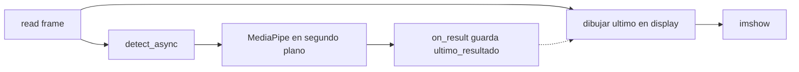

# Documentación: Paso 03 — Tiempo real (`paso_03_tiempo_real.py`)

Detección de manos **en cada frame** con MediaPipe en modo `LIVE_STREAM` de forma asíncrona, eliminando la necesidad de presionar ESPACIO.

Para conocer en detalle los conceptos de ejecución en tiempo real, callbacks, timestamps crecientes y el control de flujo para evitar colas de fotogramas, consulta la [REFERENCIA_COMUN.md](file:///home/thewest/proyectos/GestureFlow/pasos/REFERENCIA_COMUN.md).

---

## Índice

- [1. Objetivo del paso](#1-objetivo-del-paso)
- [2. Archivos de esta carpeta](#2-archivos-de-esta-carpeta)
- [3. Pipeline](#3-pipeline)
- [4. Importaciones y variables](#4-importaciones-y-variables)
- [5. Bloques del código](#5-bloques-del-código)
- [6. OpenCV, teclas y ventana](#6-opencv-teclas-y-ventana)
- [7. Consola: qué logs verás](#7-consola-qué-logs-verás)
- [8. Cómo ejecutar](#8-cómo-ejecutar)
- [9. Errores frecuentes](#9-errores-frecuentes)
- [10. ¿Qué sigue después?](#10-qué-sigue-después)
- [11. Referencia del código fuente](#11-referencia-del-código-fuente)

---

## 1. Objetivo del paso

**Objetivo:** obtener un flujo de vídeo en modo espejo donde el esqueleto de la mano **se actualiza e interactúa en tiempo real**, utilizando `detect_async` y una función callback `on_result` para sincronizar las detecciones.

| Incluido en este script | Ya no hace falta |
|-------------------------|------------------|
| `RunningMode.LIVE_STREAM` | Pulsar ESPACIO para procesar |
| `result_callback` → `ultimo_resultado` | `cv2.waitKey(0)` (pausas) |
| `detect_async` asíncrono cada frame | `detect()` síncrono bloqueante |

**Criterio de éxito:**
- Al mover la mano frente a la cámara, el esqueleto de marcas dibujado **sigue** el movimiento fluido en pantalla.
- La tecla **Q** interrumpe el bucle y cierra las ventanas inmediatamente.
- Sin manos visibles, el vídeo de la cámara sigue reproduciéndose a su tasa normal de FPS.

---

## 2. Archivos de esta carpeta

| Archivo | Rol |
|---------|-----|
| [paso_03_tiempo_real.py](file:///home/thewest/proyectos/GestureFlow/pasos/paso-03-tiempo-real/paso_03_tiempo_real.py) | Script final de la ruta básica `pasos/` |
| [paso_03_doc.md](file:///home/thewest/proyectos/GestureFlow/pasos/paso-03-tiempo-real/paso_03_doc.md) | Esta documentación |

**Glosario y conceptos comunes:** [REFERENCIA_COMUN.md](file:///home/thewest/proyectos/GestureFlow/pasos/REFERENCIA_COMUN.md).

---

## 3. Pipeline

```text
1. MODEL_PATH + VideoCapture
2. HandLandmarker (LIVE_STREAM + result_callback)
3. ultimo_resultado = None
4. while True:
5.      read → flip
6.      display = copia
7.      si ultimo_resultado → dibujar_manos(display, ultimo_resultado)
8.      putText + imshow(display)
9.      mp.Image RGB del frame actual
10.     detect_async(mp_image, timestamp_ms creciente)
11.     waitKey(1) → si 'q', break
12. release + destroyAllWindows
```


```mermaid
flowchart LR
    A[read frame] --> B[detect_async]
    B --> C[MediaPipe en segundo plano]
    C --> D[on_result guarda ultimo_resultado]
    A --> E[dibujar ultimo en display]
    E --> F[imshow]
    D -.-> E
```

---

## 4. Importaciones y variables

Para conocer las dependencias comunes y su rol conceptual en el procesamiento de landmarks, consulta la [REFERENCIA_COMUN.md](file:///home/thewest/proyectos/GestureFlow/pasos/REFERENCIA_COMUN.md).

### Tabla de variables específicas

| Variable | Rol | Concepto General |
|----------|-----|------------------|
| `ultimo_resultado` | Almacena de forma global la última inferencia entregada por el callback. | [REF §3.3](file:///home/thewest/proyectos/GestureFlow/pasos/REFERENCIA_COMUN.md#33-modos-de-inferencia-runningmode) |
| `on_result` | Función callback llamada automáticamente por MediaPipe al terminar una detección. | [REF §3.3](file:///home/thewest/proyectos/GestureFlow/pasos/REFERENCIA_COMUN.md#33-modos-de-inferencia-runningmode) |
| `frame_index` | Contador secuencial utilizado en este paso para calcular el timestamp. | Control temporal local |
| `display` | Copia de visualización sobre la cual se dibujan las marcas. | Aislamiento del buffer local |

---

## 5. Bloques del código

### Callback `on_result`
Guarda de forma asíncrona los resultados en `ultimo_resultado`. Dado que la inferencia corre en un hilo separado de CPU, dibujamos el último resultado disponible sobre el frame actual en pantalla. Ver detalle de esta arquitectura en [REF §3.3](file:///home/thewest/proyectos/GestureFlow/pasos/REFERENCIA_COMUN.md#33-modos-de-inferencia-runningmode).

### Inferencia Asíncrona (`detect_async`)
Convierte a RGB y empaqueta en `mp.Image`. Ver [REF §3.2](file:///home/thewest/proyectos/GestureFlow/pasos/REFERENCIA_COMUN.md#32-espacio-de-color-bgr-a-rgb-mpimage). Llama a `detect_async` pasando un timestamp estrictamente creciente. Ver explicación en [REF §3.3](file:///home/thewest/proyectos/GestureFlow/pasos/REFERENCIA_COMUN.md#33-modos-de-inferencia-runningmode).

### Control de colas y rendimiento (Evitar lag)
Aunque en este script inicial se envía inferencia en cada iteración del bucle, en scripts interactivos avanzados se utilizan variables como `listo_para_inferir` y técnicas de redimensionamiento de imagen (`ANCHO_INFERENCIA`) para evitar retrasos acumulados. Ver detalles de optimización en [REF §3.4](file:///home/thewest/proyectos/GestureFlow/pasos/REFERENCIA_COMUN.md#34-control-de-flujo-de-inferencia-asíncrona).

### Dibujo de Landmarks (`dibujar_manos`)
Pinta in-place sobre `display`. Ver explicación de conversión a Protobuf en [REF §4.1](file:///home/thewest/proyectos/GestureFlow/pasos/REFERENCIA_COMUN.md#41-dibujo-de-landmarks-dibujar_manos).

---

## 6. OpenCV, teclas y ventana

- **Q**: Termina la ejecución y limpia todos los recursos de cámara y visualización.
- **cv2.waitKey(1)**: Es fundamental para garantizar que el bucle de vídeo sea fluido a ~30 FPS sin bloquear la CPU. Ver [REF §2.3](file:///home/thewest/proyectos/GestureFlow/pasos/REFERENCIA_COMUN.md#23-refresco-y-detección-de-teclado-cv2waitkey).

---

## 7. Consola: qué logs verás

```text
Deteccion en tiempo real | Q = salir
```
*(No se imprimen logs por cada frame para no saturar la terminal; el feedback es completamente visual).*

---

## 8. Cómo ejecutar

Desde la raíz del proyecto, con `venv` activado:

```bash
python pasos/paso-03-tiempo-real/paso_03_tiempo_real.py
```

---

## 9. Errores frecuentes

Si experimentas retardo acumulado, parpadeos en el dibujo o fallas al cerrar la ventana, consulta la **Tabla de Errores Frecuentes Unificada** en la [Sección 6 de REFERENCIA_COMUN.md](file:///home/thewest/proyectos/GestureFlow/pasos/REFERENCIA_COMUN.md#6-tabla-de-errores-frecuentes-unificada).

---

## 10. ¿Qué sigue después?

Has completado la ruta inicial de visión interactiva:
1. **Paso 01**: Acceso básico a la cámara.
2. **Paso 02**: Inferencia síncrona en modo `IMAGE` por evento de teclado.
3. **Paso 03**: Inferencia asíncrona continua en tiempo real `LIVE_STREAM`.

**Siguiente etapa del proyecto**:
- **Paso 04**: Procesamiento algebraico / analítico sobre los landmarks detectados para clasificar gestos estáticos simples (reconocimiento de vocales).
- **Paso 05**: Recopilación secuencial de movimiento para entrenar modelos de Inteligencia Artificial para gestos dinámicos.

---

## 11. Referencia del código fuente

El script completo vive en [paso_03_tiempo_real.py](file:///home/thewest/proyectos/GestureFlow/pasos/paso-03-tiempo-real/paso_03_tiempo_real.py).
