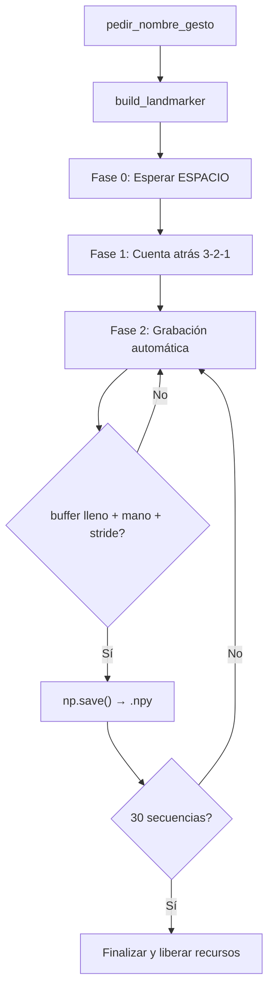

# Documentación: Paso 05 — Recolección de datos (`paso_05_recoleccion.py`)

Pipeline de **recolección de datos para entrenamiento**: abre la cámara, detecta manos con MediaPipe en modo `IMAGE` (síncrono), y guarda secuencias continuas en archivos `.npy` que posteriormente alimentarán una red recurrente LSTM.

Para conocer en detalle los conceptos de extracción de keypoints (126 valores), relleno con ceros, estructuración de secuencias y solapamiento temporal, consulta la [REFERENCIA_COMUN.md](../../pasos/REFERENCIA_COMUN.md).

---

## Índice

- [1. Objetivo del paso](#1-objetivo-del-paso)
- [2. Archivos de esta carpeta](#2-archivos-de-esta-carpeta)
- [3. Pipeline](#3-pipeline)
- [4. Importaciones y variables](#4-importaciones-y-variables)
- [5. Constantes de grabación](#5-constantes-de-grabación)
- [6. Funciones del código](#6-funciones-del-código)
- [7. Las tres fases de grabación](#7-las-tres-fases-de-grabación)
- [8. Estructura de datos de salida](#8-estructura-de-datos-de-salida)
- [9. OpenCV, teclas y ventana](#9-opencv-teclas-y-ventana)
- [10. Consola: qué logs verás](#10-consola-qué-logs-verás)
- [11. Cómo ejecutar](#11-cómo-ejecutar)
- [12. Errores frecuentes](#12-errores-frecuentes)
- [13. ¿Puedo ir al siguiente paso?](#13-puedo-ir-al-siguiente-paso)

---

## 1. Objetivo del paso

**Objetivo:** recopilar datos de gestos dinámicos (trayectorias con movimiento en el tiempo). Cada gesto se graba como una serie de 30 fotogramas consecutivos conteniendo las coordenadas normalizadas de los landmarks, almacenándose en disco en formato `.npy`.

| Incluido en este script | No incluido (paso 6) |
|-------------------------|----------------------|
| `RunningMode.IMAGE` síncrono | Entrenamiento del modelo LSTM |
| Búfer circular `deque(maxlen=30)` | Predicción interactiva en tiempo real |
| Guardado automático por stride (`SAVE_EVERY=15`) | Métricas de precisión y pérdida |
| Tres fases de grabación y HUD gráfico | Reconocimiento final de gestos |

**Criterio de éxito:**
- Al ejecutar, la terminal solicita ingresar el nombre del gesto a grabar.
- Al pulsar **ESPACIO**, se inicia una cuenta atrás visual `3-2-1` en la ventana.
- Se generan automáticamente 30 secuencias `.npy` en el directorio `gestos/<nombre_gesto>/`.
- Cada archivo `.npy` guardado tiene una forma matricial de `(30, 126)`.
- Si se interrumpe y se vuelve a ejecutar con el mismo nombre, el programa cuenta los archivos existentes y reanuda secuencialmente desde el siguiente índice.

---

## 2. Archivos de esta carpeta

| Archivo | Rol |
|---------|-----|
| [paso_05_recoleccion.py](../../pasos/paso-05-recoleccion/paso_05_recoleccion.py) | Script de grabación y almacenamiento de gestos |
| [paso_05_doc.md](../../pasos/paso-05-recoleccion/paso_05_doc.md) | Esta documentación |
| [INSTRUCTIONS_PASO_05.md](../../pasos/paso-05-recoleccion/INSTRUCTIONS_PASO_05.md) | Guía de implementación del script paso a paso |

**Glosario y conceptos comunes:** [REFERENCIA_COMUN.md](../../pasos/REFERENCIA_COMUN.md).

---

## 3. Pipeline

```text
1. pedir_nombre_gesto() → nombre + índice de reanudación
2. build_landmarker() → HandLandmarker (IMAGE mode)
3. grabar_gesto():
4.      Fase 0 — Espera:
5.        read → flip → draw_waiting() → imshow
6.        ESPACIO → pasar a Fase 1
7.      Fase 1 — Cuenta atrás:
8.        for 3, 2, 1:
9.          while < 1s: read → flip → draw_countdown() → imshow
10.     Fase 2 — Grabación automática:
11.       while secuencias < 30:
12.         read → flip → BGR→RGB → detect()
13.         extract_keypoints() → buffer.append()
14.         si buffer lleno + mano visible + frame % 15 == 0:
15.           np.save() → gestos/<nombre>/<N>.npy
16.         draw_hud() → imshow
17. release + destroyAllWindows
```



---

## 4. Importaciones y variables

Para conocer la descripción detallada de las librerías NumPy, OpenCV, colecciones y el manejo de rutas absolutas, consulta la [REFERENCIA_COMUN.md](../../pasos/REFERENCIA_COMUN.md).

---

## 5. Constantes de grabación

Las constantes configuran el tamaño, duración e intervalos de muestreo:

| Constante | Valor | Significado Conceptual | Referencia Común |
|-----------|-------|-----------------------|------------------|
| `SEQUENCE_LENGTH` | `30` | Cantidad de fotogramas (pasos de tiempo) por gesto. | [REF §4.4](../../pasos/REFERENCIA_COMUN.md#44-formato-npy-y-secuencias-temporales) |
| `NUM_FEATURES` | `126` | 21 landmarks × 3 coordenadas (x, y, z) × 2 manos. | [REF §4.3](../../pasos/REFERENCIA_COMUN.md#43-extracción-y-relleno-de-características-extract_keypoints) |
| `NUM_SEQUENCES` | `30` | Número de archivos `.npy` de entrenamiento por cada gesto. | Parámetro de recolección local |
| `SAVE_EVERY` | `15` | Intervalo de guardado automático (produce un 50% de solapamiento). | [REF §4.5](../../pasos/REFERENCIA_COMUN.md#45-solapamiento-temporal-aumento-de-datos) |
| `COUNTDOWN_SECS` | `3` | Segundos que dura la cuenta atrás en pantalla antes de grabar. | Parámetro visual de UI |
| `FLASH_DURATION` | `15` | Frames que dura la notificación verde "¡GUARDADO!" en pantalla. | Parámetro visual de UI |

---

## 6. Funciones del código

### Funciones Comunes del Sistema
- `build_landmarker()`: Configura el detector en modo `IMAGE`. Ver [REF §3.1](../../pasos/REFERENCIA_COMUN.md#31-carga-del-modelo-handlandmarkeroptions-y-baseoptions).
- `extract_keypoints(results)`: Aplana las marcas a un array unidimensional `(126,)` rellenando con ceros si hay manos ausentes. Ver detalle en [REF §4.3](../../pasos/REFERENCIA_COMUN.md#43-extracción-y-relleno-de-características-extract_keypoints).
- `pedir_nombre_gesto()`: Gestiona la entrada por consola, crea la carpeta en el disco y calcula el índice de reanudación leyendo los archivos existentes. Ver concepto en [REF §4.4](../../pasos/REFERENCIA_COMUN.md#44-formato-npy-y-secuencias-temporales).

### Funciones Específicas de Interfaz Gráfica (HUD)
- `draw_waiting(frame, gesture, saved)`: Dibuja la pantalla de espera (Fase 0) solicitando pulsar **ESPACIO** para comenzar.
- `draw_countdown(frame, gesture, seconds_left)`: Crea una máscara oscura semitransparente usando `cv2.addWeighted` y muestra un contador gigante centrado.
- `draw_hud(...)`: Dibuja el HUD durante la grabación activa (Fase 2) con:
  1. Indicador rojo `REC: GESTO` y contador de avance.
  2. Estado de la mano (`MANO: DETECTADA` en verde o `MANO: NO DETECTADA` en rojo).
  3. Barra de progreso que representa el llenado del búfer circular `deque`.
  4. Indicador vertical de guardado automático (`SAVE_EVERY`).
  5. Flash verde intermitente indicando `"¡SECUENCIA GUARDADA!"`.

---

## 7. Las tres fases de grabación

- **Fase 0 — Espera**: El sistema activa la cámara en vivo pero no procesa datos. El usuario tiene tiempo de acomodar la mano y presiona **ESPACIO** al estar listo.
- **Fase 1 — Cuenta atrás**: Muestra un contador `3`, `2`, `1` de forma fluida. Para evitar congelar el vídeo, el script no usa `time.sleep()`, sino que calcula un tiempo límite (`deadline`) y sigue leyendo frames continuamente.
- **Fase 2 — Grabación**: Inferencia continua. Los keypoints de cada fotograma se añaden al búfer. Cuando se cumplen las tres condiciones simultáneamente:
  1. El búfer circular está lleno (30 frames).
  2. Hay una mano visible en el fotograma actual (evita guardar ruidos vacíos).
  3. El contador de frames es múltiplo de `SAVE_EVERY` (solapamiento).
  Se guarda el contenido del búfer como `np.array` y se avanza el contador de secuencias.

---

## 8. Estructura de datos de salida

Los datos se estructuran y almacenan de la siguiente manera:

```text
gestos/
└── saludar/
    ├── 0.npy   → shape (30, 126)
    ├── 1.npy   → shape (30, 126)
    └── 29.npy  → shape (30, 126)
```
Cada archivo `.npy` almacena un array binario de precisión `float32`. Para la verificación conceptual del guardado, consulta la [Sección 4.4 de REFERENCIA_COMUN.md](../../pasos/REFERENCIA_COMUN.md#44-formato-npy-y-secuencias-temporales).

---

## 9. OpenCV, teclas y ventana

- **ESPACIO**: Utilizado únicamente en la **Fase 0** para avanzar a la cuenta atrás e iniciar la sesión de grabación.
- **Q**: Permite abortar la ejecución de forma segura en cualquiera de las fases, garantizando que el hardware de la webcam se libere de forma correcta.

---

## 10. Consola: qué logs verás

```text
Ingrese el nombre del gesto a registrar: saludar
Carpeta creada. Iniciando desde la secuencia 0.
Fase 0: Esperando por ESPACIO para comenzar a grabar...
Fase 1: Iniciando cuenta atrás...
Fase 2: Grabando secuencias automáticamente...
Secuencia 0 guardada exitosamente.
Secuencia 1 guardada exitosamente.
Grabación terminada. Total de secuencias guardadas: 30/30
```

---

## 11. Cómo ejecutar

Desde la raíz del proyecto, con `venv` activado:

```bash
python pasos/paso-05-recoleccion/paso_05_recoleccion.py
```

---

## 12. Errores frecuentes

Para diagnosticar fallas como que no se guarde ningún archivo `.npy` (debido a la visibilidad de la mano), congelamientos en la cuenta atrás o errores de dimensiones del array, consulta la **Tabla de Errores Frecuentes Unificada** en la [Sección 6 de REFERENCIA_COMUN.md](../../pasos/REFERENCIA_COMUN.md#6-tabla-de-errores-frecuentes-unificada).

---

## 13. ¿Puedo ir al siguiente paso?

**Sí**, si al finalizar:
- [ ] Se crea la carpeta correspondiente dentro de `gestos/`.
- [ ] Se graban exactamente 30 archivos con formato `.npy` y dimensiones `(30, 126)`.
- [ ] Ejecutar el script nuevamente con el mismo nombre de gesto detecta los archivos previos y reanuda el conteo sin sobreescribir.
- [ ] Presionar **Q** cierra la webcam sin dejar colgado el proceso en segundo plano.

**Siguiente:** [Paso 06 — Entrenamiento LSTM](../../pasos/paso-06-entrenamiento/paso_06_doc.md) — entrenamiento del modelo clasificador a partir de los datos guardados.
