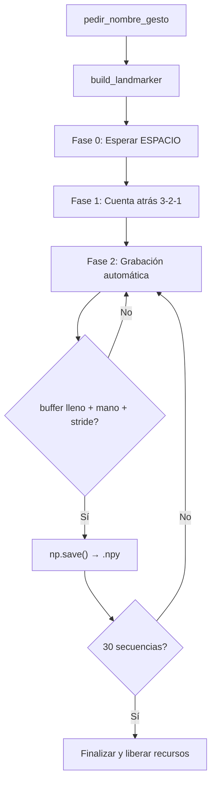

# Documentación: Paso 05 — Recolección de datos (`paso_05_recoleccion.py`)

Pipeline de **recolección de datos para entrenamiento**: abre la cámara, detecta manos con MediaPipe en modo `IMAGE` (síncrono), y guarda secuencias de 30 frames como archivos `.npy` que alimentarán una red LSTM.

**Patrones compartidos:** [REFERENCIA_COMUN.md](../REFERENCIA_COMUN.md).

---

## Índice

- [1. Objetivo del paso](#1-objetivo-del-paso)
- [2. Archivos de esta carpeta](#2-archivos-de-esta-carpeta)
- [3. Pipeline](#3-pipeline)
- [4. Importaciones y variables](#4-importaciones-y-variables)
- [5. Constantes de grabación](#5-constantes-de-grabación)
- [6. Funciones del código](#6-funciones-del-código)
- [7. Las tres fases de grabación](#7-las-tres-fases-de-grabación)
- [8. Estructura de datos de salida](#8-estructura-de-datos-de-salida)
- [9. OpenCV, teclas y ventana](#9-opencv-teclas-y-ventana)
- [10. Consola: qué logs verás](#10-consola-qué-logs-verás)
- [11. Cómo ejecutar](#11-cómo-ejecutar)
- [12. Errores frecuentes](#12-errores-frecuentes)
- [13. ¿Puedo ir al siguiente paso?](#13-puedo-ir-al-siguiente-paso)

---

## 1. Objetivo del paso

**Objetivo:** recopilar datos de gestos dinámicos para entrenar un modelo LSTM. Cada gesto se graba como secuencias temporales de landmarks normalizados almacenados en archivos `.npy`.

| Incluido | No incluido (paso 6) |
|----------|----------------------|
| `RunningMode.IMAGE` síncrono | Entrenamiento del modelo LSTM |
| Búfer circular `deque(maxlen=30)` | Predicción en tiempo real |
| Guardado automático cada `SAVE_EVERY` frames | Evaluación de accuracy |
| HUD con barra de progreso | Reconocimiento de gestos nuevos |
| Reanudación desde archivos existentes | — |

**Criterio de éxito:**

- Al ejecutar, la terminal solicita el nombre del gesto.
- ESPACIO inicia una cuenta atrás 3-2-1.
- Se generan 30 archivos `.npy` en `gestos/<nombre>/`.
- Cada archivo tiene forma `(30, 126)`.
- Al re-ejecutar con el mismo nombre, reanuda desde el índice correcto.

**Requisito previo:** Pasos 01–03 funcionando (cámara + detección de manos).

---

## 2. Archivos de esta carpeta

| Archivo | Rol |
|---------|-----|
| `paso_05_recoleccion.py` | Script de recolección de datos |
| `paso_05_doc.md` | Esta documentación |
| `INSTRUCTIONS_PASO_05.md` | Guía de implementación paso a paso |

**También en `pasos/`:** [REFERENCIA_COMUN.md](../REFERENCIA_COMUN.md).

**Dependencias:** `opencv-python`, `mediapipe`, `numpy` (ver `requirements.txt`).

**Necesitas:** `prueba/hand_landmarker.task` (mismo modelo de pasos anteriores).

---

## 3. Pipeline

```text
1. pedir_nombre_gesto() → nombre + índice de reanudación
2. build_landmarker() → HandLandmarker (IMAGE mode)
3. grabar_gesto():
     Fase 0 — Espera:
       read → flip → draw_waiting() → imshow
       ESPACIO → pasar a Fase 1
     Fase 1 — Cuenta atrás:
       for 3, 2, 1:
         while < 1s: read → flip → draw_countdown() → imshow
     Fase 2 — Grabación automática:
       while secuencias < 30:
         read → flip → BGR→RGB → detect()
         extract_keypoints() → buffer.append()
         si buffer lleno + mano visible + frame % 15 == 0:
           np.save() → gestos/<nombre>/<N>.npy
         draw_hud() → imshow
4. release + destroyAllWindows
```



---

## 4. Importaciones y variables

| Import / símbolo | Rol |
|------------------|-----|
| `cv2` | Cámara, flip, ventanas, BGR→RGB, dibujo HUD |
| `mediapipe` / `vision` | `HandLandmarker`, `RunningMode.IMAGE` |
| `numpy` | Arrays de keypoints, guardado `.npy` |
| `deque` (collections) | Búfer circular de longitud fija |
| `time` | Medición de deadlines para la cuenta atrás |
| `Path` (pathlib) | Rutas absolutas al modelo y carpetas de salida |

| Variable | Valor / uso |
|----------|-------------|
| `SCRIPT_DIR` | Carpeta `paso-05-recoleccion/` |
| `PROJECT_ROOT` | Raíz `GestureFlow/` (dos niveles arriba) |
| `MODEL_PATH` | `prueba/hand_landmarker.task` |
| `output_dir` | `gestos/<nombre_gesto>/` — carpeta donde se guardan los `.npy` |
| `buffer` | `deque(maxlen=30)` — búfer circular de keypoints |
| `sequences_saved` | Contador de secuencias guardadas (inicia desde `start_index`) |
| `flash_timer` | Contador de frames para la notificación visual "¡GUARDADO!" |

---

## 5. Constantes de grabación

| Constante | Valor | Significado |
|-----------|-------|-------------|
| `SEQUENCE_LENGTH` | `30` | Frames por secuencia (~1 segundo a 30 FPS) |
| `NUM_FEATURES` | `126` | 21 landmarks × 3 coordenadas × 2 manos |
| `NUM_SEQUENCES` | `30` | Secuencias a recolectar por gesto |
| `SAVE_EVERY` | `15` | Cada cuántos frames se auto-guarda (50% solapamiento) |
| `COUNTDOWN_SECS` | `3` | Segundos de cuenta atrás antes de grabar |
| `FLASH_DURATION` | `15` | Frames que dura el flash de confirmación (~0.5s) |

### ¿Por qué 126 valores por frame?

- 1 mano → 21 landmarks × 3 coordenadas (x, y, z) = **63 valores**
- 2 manos → 63 × 2 = **126 valores**
- Si una mano no es visible, sus 63 valores se rellenan con **ceros**.

### Ventanas solapadas (`SAVE_EVERY < SEQUENCE_LENGTH`)

Con `SEQUENCE_LENGTH=30` y `SAVE_EVERY=15`, cada guardado comparte 15 frames con el anterior. Esto es una técnica de **aumento de datos temporal** que genera más ejemplos de entrenamiento sin necesidad de grabar más tiempo.

---

## 6. Funciones del código

### `build_landmarker()` → `vision.HandLandmarker`

Crea el detector de manos MediaPipe en modo `IMAGE` (síncrono). Verifica que el modelo `.task` exista antes de cargarlo. Devuelve un objeto que soporta context manager (`with`).

### `extract_keypoints(results)` → `np.ndarray` de forma `(126,)`

Convierte la salida de MediaPipe en un array plano de 126 floats. Usa `results.handedness` para asignar cada mano al slot correcto (izquierda: índices 0–62, derecha: 63–125). Las manos no detectadas se rellenan con ceros.

### `draw_waiting(frame, gesture, saved)` → `None`

Dibuja la interfaz de espera sobre el frame de la cámara:
- Nombre del gesto (arriba izquierda, verde)
- Progreso `guardadas/total` (blanco)
- `"Q: Salir"` (blanco)
- `"PRESIONA ESPACIO PARA EMPEZAR"` (centrado horizontalmente, verde)

### `draw_countdown(frame, gesture, seconds_left)` → `None`

Dibuja la cuenta atrás con overlay semitransparente:
1. Copia el frame → llena de negro → mezcla con `addWeighted(0.5, 0.5)`.
2. Nombre del gesto (arriba izquierda).
3. Número gigante centrado (`fontScale=6.0`, `thickness=12`).
4. `"PREPARA TU GESTO..."` centrado en la parte inferior.

### `draw_hud(frame, gesture, saved, buffer_len, frame_counter, hand_detected, flash_timer)` → `None`

HUD de grabación activa con 5 elementos:
1. **Indicador REC** rojo (arriba izquierda) + contador de guardados (arriba derecha).
2. **Estado de mano**: verde si detectada, rojo si no.
3. **Barra de progreso** del búfer: fondo gris, relleno verde, borde blanco.
4. **Marcador de guardado**: línea vertical en la posición `SAVE_EVERY/SEQUENCE_LENGTH` cuando el búfer está lleno.
5. **Flash de confirmación**: `"¡SECUENCIA GUARDADA!"` en verde o mensaje de instrucción.

### `pedir_nombre_gesto()` → `tuple[str | None, int | None]`

Solicita el nombre del gesto por terminal, normaliza (`strip` + `lower`), crea la carpeta `gestos/<nombre>/`, cuenta archivos `.npy` existentes para calcular el índice de reanudación.

### `grabar_gesto(gesture_name, start_index, landmarker)` → `None`

Función principal que orquesta las tres fases de grabación (espera, cuenta atrás, grabación automática). Gestiona la cámara, el búfer circular, la lógica de auto-guardado y la liberación de recursos.

---

## 7. Las tres fases de grabación

### Fase 0 — Espera

La cámara muestra el vídeo en vivo con el HUD de espera. El usuario posiciona la mano y presiona **ESPACIO** para continuar. Presionar **Q** cancela y libera la cámara.

### Fase 1 — Cuenta atrás 3-2-1

Un bucle descendente muestra cada número durante exactamente 1 segundo. **No usa `time.sleep()`** — en su lugar, lee frames continuamente hasta que `time.time()` supere el `deadline`, manteniendo el vídeo fluido.

### Fase 2 — Grabación automática

1. **Detección por frame**: BGR→RGB → `mp.Image` → `landmarker.detect()`.
2. **Extracción**: `extract_keypoints()` devuelve 126 floats → se añade al `deque`.
3. **Auto-guardado**: cuando se cumplen **tres condiciones simultáneamente**:
   - Búfer lleno (30 frames)
   - Mano visible en el frame actual
   - `frame_counter % SAVE_EVERY == 0`
4. **Formato de salida**: `np.array(buffer, dtype=np.float32)` → `np.save()`.
5. El bucle termina cuando `sequences_saved >= NUM_SEQUENCES` o el usuario presiona **Q**.

---

## 8. Estructura de datos de salida

```text
gestos/
└── <nombre_gesto>/
    ├── 0.npy   → shape (30, 126)
    ├── 1.npy   → shape (30, 126)
    ├── ...
    └── 29.npy  → shape (30, 126)
```

Cada `.npy` contiene:
- **30 filas** → 30 frames temporales consecutivos.
- **126 columnas** → [left_x₀, left_y₀, left_z₀, ..., left_z₂₀, right_x₀, ..., right_z₂₀].
- **dtype**: `float32`.

Para verificar en Python:
```python
import numpy as np
data = np.load("gestos/test/0.npy")
print(data.shape)  # Debe ser (30, 126)
```

---

## 9. OpenCV, teclas y ventana

| Tecla | Fase | Acción |
|-------|------|--------|
| **ESPACIO** | Fase 0 | Iniciar cuenta atrás |
| **Q** | Todas | Cancelar y liberar recursos |

| OpenCV | Uso |
|--------|-----|
| `flip(frame, 1)` | Espejo horizontal |
| `putText` | Texto del HUD (nombre, progreso, instrucciones) |
| `getTextSize` | Medir texto para centrado horizontal |
| `rectangle` | Barra de progreso (fondo, relleno, borde) |
| `addWeighted` | Overlay semitransparente en la cuenta atrás |
| `line` | Marcador vertical de auto-guardado |
| `cvtColor(BGR2RGB)` | Conversión de color para MediaPipe |
| `waitKey(1)` | Bucle fluido sin bloqueo |

---

## 10. Consola: qué logs verás

| Momento | Mensaje |
|---------|---------|
| Al iniciar | `Ingrese el nombre del gesto a registrar:` |
| Carpeta nueva | `Carpeta creada. Iniciando desde la secuencia 0.` |
| Carpeta existente | `Carpeta existente detectada. Reanudando desde la secuencia N.` |
| Fase 0 | `Fase 0: Esperando por ESPACIO para comenzar a grabar...` |
| Fase 1 | `Fase 1: Iniciando cuenta atrás...` |
| Fase 2 | `Fase 2: Grabando secuencias automáticamente...` |
| Cada guardado | `Secuencia N guardada exitosamente.` |
| Al terminar | `Grabación terminada. Total de secuencias guardadas: 30/30` |
| Cancelar (Q) | `Grabación cancelada en fase de espera.` |
| Error de cámara | `Error: No se pudo abrir la cámara.` |
| Modelo ausente | `FileNotFoundError` con ruta a `MODEL_PATH` |

---

## 11. Cómo ejecutar

Desde la raíz del proyecto, con `venv` activado:

```bash
source venv/bin/activate
python pasos/paso-05-recoleccion/paso_05_recoleccion.py
```

| En pantalla | Comportamiento |
|-------------|----------------|
| `GestureFlow - Recolección de Datos` | Vídeo espejo con HUD |
| Fase 0: HUD verde | Gesto, progreso, instrucciones de teclas |
| Fase 1: Overlay oscuro + número grande | Cuenta atrás 3-2-1 |
| Fase 2: Barra de progreso + indicador | Grabación automática con flash de confirmación |

---

## 12. Errores frecuentes

| Síntoma | Qué revisar |
|---------|-------------|
| `FileNotFoundError` del modelo | ¿Existe `prueba/hand_landmarker.task`? |
| No guarda ningún `.npy` | ¿La mano es visible durante la grabación? Sin mano, la condición de guardado falla. |
| Array con forma incorrecta | Verificar que `extract_keypoints` siempre retorne 126 valores. |
| Se sobreescriben archivos | Verificar que `pedir_nombre_gesto` cuenta correctamente los `.npy` existentes. |
| Vídeo congelado en cuenta atrás | ¿Usaste `time.sleep()` en vez de `deadline` con lectura activa? |
| Cámara bloqueada tras cerrar | ¿Falta `cap.release()` en alguna rama de salida? |
| `ValueError: too many values to unpack` | Usar `frame.shape[:2]` en lugar de `frame.shape`. |
| Flash de confirmación no aparece | Verificar que `flash_timer` se decrementa **después** de `draw_hud()`. |

Más: [REFERENCIA_COMUN.md §9](../REFERENCIA_COMUN.md#9-errores-frecuentes-todos-los-pasos).

---

## 13. ¿Puedo ir al siguiente paso?

**Sí**, si:

- [ ] El script solicita el nombre del gesto y crea la carpeta.
- [ ] ESPACIO inicia la cuenta atrás 3-2-1 con overlay oscuro.
- [ ] Se generan 30 archivos `.npy` en `gestos/<nombre>/`.
- [ ] Cada archivo tiene forma `(30, 126)`.
- [ ] Re-ejecutar con el mismo nombre reanuda sin sobreescribir.
- [ ] Q cierra correctamente en cualquier fase.

**Siguiente:** [Paso 06 — Entrenamiento](../paso-06-entrenamiento/paso_06_doc.md) — entrenar un modelo LSTM con los datos recolectados.

---

*Fuente de verdad: el archivo `.py` en disco. Esta documentación resume la lógica; el script incluye comentarios inline adicionales.*
