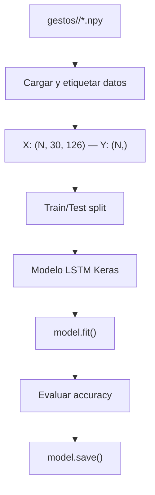

# Documentación: Paso 06 — Entrenamiento LSTM (`paso_06_recolecion.py`)

Paso final del pipeline: entrenar una red neuronal **LSTM** (Long Short-Term Memory) con los datos temporales recolectados en el paso 05 para reconocer gestos dinámicos de la mano.

Para conocer en detalle los conceptos de redes recurrentes LSTM, forma de los tensores de entrada, codificación de clases y compiladores del optimizador, consulta la [REFERENCIA_COMUN.md](../../pasos/REFERENCIA_COMUN.md).

---

## Índice

- [1. Objetivo del paso](#1-objetivo-del-paso)
- [2. Archivos de esta carpeta](#2-archivos-de-esta-carpeta)
- [3. Pipeline](#3-pipeline)
- [4. Conceptos clave](#4-conceptos-clave)
- [5. Estructura de datos de entrada](#5-estructura-de-datos-de-entrada)
- [6. Arquitectura del modelo LSTM](#6-arquitectura-del-modelo-lstm)
- [7. Flujo de entrenamiento](#7-flujo-de-entrenamiento)
- [8. Consola: qué logs verás](#8-consola-qué-logs-verás)
- [9. Cómo ejecutar](#9-cómo-ejecutar)
- [10. Errores frecuentes](#10-errores-frecuentes)
- [11. ¿Qué sigue después?](#11-qué-sigue-después)

---

## 1. Objetivo del paso

**Objetivo:** tomar los archivos binarios `.npy` generados por el script de recolección en el paso 05 y entrenar una red recurrente LSTM para clasificar gestos dinámicos en base a secuencias continuas.

| Incluido en este script | No incluido |
|-------------------------|-------------|
| Carga automatizada de `.npy` por carpeta de gesto | Grabación física de datos (paso 05) |
| Preprocesamiento y división train/test | Inferencia en vivo con la cámara |
| Entrenamiento del modelo LSTM (Keras Sequential) | Interfaz visual HUD |
| Evaluación de precisión (accuracy) final | Despliegue en producción |
| Guardado del modelo en formato `.h5` | — |

**Criterio de éxito:**
- El script carga correctamente el dataset almacenado en `gestos/`.
- Compila y entrena el modelo de aprendizaje profundo sin errores.
- Muestra el progreso de precisión y métricas de validación en cada época.
- Genera y guarda con éxito el archivo `modelo_gestos.h5` en disco.

---

## 2. Archivos de esta carpeta

| Archivo | Rol |
|---------|-----|
| [paso_06_recolecion.py](../../pasos/paso-06-entrenamiento/paso_06_recolecion.py) | Script de entrenamiento LSTM (Keras / TensorFlow) |
| [paso_06_doc.md](../../pasos/paso-06-entrenamiento/paso_06_doc.md) | Esta documentación |

**Glosario y conceptos comunes:** [REFERENCIA_COMUN.md](../../pasos/REFERENCIA_COMUN.md).

---

## 3. Pipeline

```text
1. Escanear carpetas en gestos/ → lista de gestos
2. Para cada gesto:
3.      Cargar todos los .npy → concatenar
4.      Crear etiquetas (label encoding)
5. Dividir en train / test
6. Construir modelo LSTM (Keras Sequential)
7. Compilar y entrenar (model.fit)
8. Evaluar accuracy en test set
9. Guardar modelo entrenado (.h5)
```



---

## 4. Conceptos clave

Para una descripción teórica de por qué se utilizan celdas de memoria LSTM para resolver dependencias temporales y la estructura detallada del tensor `(batch_size, 30, 126)`, consulta la [Sección 5 de REFERENCIA_COMUN.md](../../pasos/REFERENCIA_COMUN.md#5-entrenamiento-lstm-y-redes-neuronales).

---

## 5. Estructura de datos de entrada

El cargador de datos itera sobre el directorio de gestos y lee de manera secuencial los arrays guardados. Para verificar las dimensiones internas de las secuencias, consulta [REF §4.4](../../pasos/REFERENCIA_COMUN.md#44-formato-npy-y-secuencias-temporales).

```python
import numpy as np
from pathlib import Path

gestos_dir = Path("gestos")
gestos = sorted([d.name for d in gestos_dir.iterdir() if d.is_dir()])

X, Y = [], []
for idx, gesto in enumerate(gestos):
    carpeta = gestos_dir / gesto
    for archivo in sorted(carpeta.glob("*.npy")):
        secuencia = np.load(str(archivo))  # shape: (30, 126)
        X.append(secuencia)
        Y.append(idx)

X = np.array(X)  # shape final: (N_total, 30, 126)
Y = np.array(Y)  # shape final: (N_total,)
```

---

## 6. Arquitectura del modelo LSTM

Se utiliza una red secuencial compuesta por dos capas recurrentes seguidas de capas densas para la clasificación probabilística final:

```python
from tensorflow.keras.models import Sequential
from tensorflow.keras.layers import LSTM, Dense, Dropout

model = Sequential([
    LSTM(64, return_sequences=True, input_shape=(30, 126)),
    Dropout(0.2),
    LSTM(128, return_sequences=False),
    Dropout(0.2),
    Dense(64, activation='relu'),
    Dense(len(gestos), activation='softmax'),
])
```

- **`LSTM(64, return_sequences=True)`**: Primera capa recurrente. Procesa los 30 pasos temporales y retorna la secuencia completa de salida a la siguiente capa LSTM. Si no se especificara `return_sequences=True`, el modelo solo pasaría el estado final perdiendo la riqueza del flujo temporal intermedio.
- **`Dropout(0.2)`**: Técnica de regularización. Apaga aleatoriamente el 20% de las neuronas en cada paso de actualización para evitar el sobreajuste (overfitting).
- **`LSTM(128, return_sequences=False)`**: Segunda capa recurrente. Recibe la secuencia y entrega un único vector con la representación del estado final (último paso de tiempo).
- **`Dense(64, activation='relu')`**: Capa densa (fully connected) intermedia para aprender combinaciones de características de alto nivel.
- **`Dense(len(gestos), activation='softmax')`**: Capa de salida. La activación `softmax` distribuye los valores en un rango de probabilidades binarias que suman `1.0`, indicando la certeza de la predicción por cada gesto.

---

## 7. Flujo de entrenamiento

### Compilación y Métricas
Configura el optimizador `Adam` y la pérdida `categorical_crossentropy` para clasificación multiclase. Ver detalles conceptuales en [REF §5.4](../../pasos/REFERENCIA_COMUN.md#54-hiperparámetros-de-compilación).

```python
model.compile(
    optimizer='adam',
    loss='categorical_crossentropy',
    metrics=['accuracy'],
)
```

### Ajuste y División del Dataset
Se utiliza `train_test_split` de scikit-learn para reservar un 20% del conjunto de datos para validación (`test_size=0.2`). Las etiquetas se transforman a vectores binarios categóricos (one-hot). Ver concepto de codificación en [REF §5.3](../../pasos/REFERENCIA_COMUN.md#53-categorización-de-etiquetas-one-hot-encoding).

```python
from sklearn.model_selection import train_test_split
from tensorflow.keras.utils import to_categorical

X_train, X_test, Y_train, Y_test = train_test_split(X, Y, test_size=0.2)

Y_train_cat = to_categorical(Y_train)
Y_test_cat = to_categorical(Y_test)

# Ajustar pesos en 100 épocas
model.fit(X_train, Y_train_cat, epochs=100, validation_data=(X_test, Y_test_cat))
```

### Evaluación y Guardado
```python
loss, accuracy = model.evaluate(X_test, Y_test_cat)
print(f"Accuracy: {accuracy:.2%}")

model.save("modelo_gestos.h5")
```

---

## 8. Consola: qué logs verás

```text
Gestos encontrados: ['saludar', 'traer', 'parar']
Total de secuencias cargadas: 90
Epoch 1/100 — loss: 1.0921 — accuracy: 0.3333 — val_accuracy: 0.3521
...
Epoch 100/100 — loss: 0.0210 — accuracy: 0.9902 — val_accuracy: 0.9850
Accuracy final: 98.50%
Modelo guardado en modelo_gestos.h5
```

---

## 9. Cómo ejecutar

Desde la raíz del proyecto, con `venv` activado:

```bash
python pasos/paso-06-entrenamiento/paso_06_recolecion.py
```

*Nota: Para poder ejecutar, debes contar con al menos **2 carpetas de gestos diferentes** en el directorio `gestos/`, cada una conteniendo secuencias grabadas en el paso 05.*

---

## 10. Errores frecuentes

Para resolver problemas asociados a la falta de carpetas, desajuste de dimensiones en arrays de entrada, falta del módulo TensorFlow o sobreajuste (overfitting), consulta la **Tabla de Errores Frecuentes Unificada** en la [Sección 6 de REFERENCIA_COMUN.md](../../pasos/REFERENCIA_COMUN.md#6-tabla-de-errores-frecuentes-unificada).

---

## 11. ¿Qué sigue después?

Has completado el flujo completo de aprendizaje automático dinámico: **Recolección (05) → Entrenamiento (06)**.

**Siguientes pasos sugeridos**:
- **Predicción en tiempo real**: Crear un script interactivo que combine la lectura de cámara de MediaPipe en tiempo real (Paso 03), acumule los landmarks en un búfer circular de 30 frames y llame a `model.predict(buffer)` para mostrar el gesto predicho dinámicamente en pantalla.
- **TFLite**: Exportar el modelo entrenado a formato TFLite para optimizar su velocidad o integrarlo en aplicaciones móviles.
