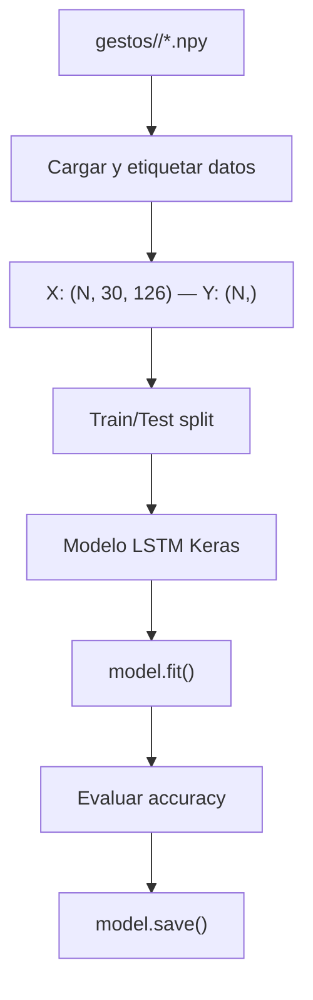

# Documentación: Paso 06 — Entrenamiento LSTM (`paso_06_recolecion.py`)

Paso final del pipeline: entrenar una red neuronal **LSTM** (Long Short-Term Memory) con los datos temporales recolectados en el paso 05 para reconocer gestos dinámicos de la mano.

**Patrones compartidos:** [REFERENCIA_COMUN.md](../REFERENCIA_COMUN.md).

---

## Índice

- [1. Objetivo del paso](#1-objetivo-del-paso)
- [2. Archivos de esta carpeta](#2-archivos-de-esta-carpeta)
- [3. Pipeline](#3-pipeline)
- [4. Conceptos clave](#4-conceptos-clave)
- [5. Estructura de datos de entrada](#5-estructura-de-datos-de-entrada)
- [6. Arquitectura del modelo LSTM](#6-arquitectura-del-modelo-lstm)
- [7. Flujo de entrenamiento](#7-flujo-de-entrenamiento)
- [8. Consola: qué logs verás](#8-consola-qué-logs-verás)
- [9. Cómo ejecutar](#9-cómo-ejecutar)
- [10. Errores frecuentes](#10-errores-frecuentes)
- [11. ¿Qué sigue después?](#11-qué-sigue-después)

---

## 1. Objetivo del paso

**Objetivo:** tomar los archivos `.npy` generados por `paso_05_recoleccion.py` y entrenar un modelo LSTM capaz de clasificar gestos dinámicos basándose en secuencias temporales de 30 frames × 126 coordenadas.

| Incluido | No incluido |
|----------|-------------|
| Carga de datos `.npy` por gesto | Recolección de datos (paso 05) |
| Preprocesamiento y etiquetado | Predicción en tiempo real con cámara |
| Entrenamiento del modelo LSTM | Interfaz gráfica de usuario |
| Evaluación de accuracy | Despliegue en producción |
| Guardado del modelo entrenado | — |

**Criterio de éxito:**

- El script carga correctamente los `.npy` de `gestos/`.
- Entrena un modelo LSTM sin errores.
- Muestra métricas de accuracy en consola.
- Guarda el modelo entrenado en disco.

**Requisito previo:** [Paso 05](../paso-05-recoleccion/paso_05_doc.md) ejecutado al menos una vez con datos recolectados en `gestos/`.

---

## 2. Archivos de esta carpeta

| Archivo | Rol |
|---------|-----|
| `paso_06_recolecion.py` | Script de entrenamiento LSTM |
| `paso_06_doc.md` | Esta documentación |

**También en `pasos/`:** [REFERENCIA_COMUN.md](../REFERENCIA_COMUN.md).

**Dependencias:** `numpy`, `tensorflow` / `keras` (ver `requirements.txt`).

---

## 3. Pipeline

```text
1. Escanear carpetas en gestos/ → lista de gestos
2. Para cada gesto:
     Cargar todos los .npy → concatenar
     Crear etiquetas (label encoding)
3. Dividir en train / test
4. Construir modelo LSTM (Keras Sequential)
5. Compilar y entrenar (model.fit)
6. Evaluar accuracy en test set
7. Guardar modelo entrenado (.h5 o SavedModel)
```



---

## 4. Conceptos clave

### 4.1 ¿Por qué LSTM?

Los gestos son **secuencias temporales** — la posición de la mano en el frame 1 influye en el significado del frame 30. Las redes densas (fully connected) no capturan esta dependencia temporal. Las LSTM (Long Short-Term Memory) son un tipo de red recurrente diseñada específicamente para aprender patrones en secuencias ordenadas.

### 4.2 Forma del tensor de entrada

El modelo espera tensores con forma `(batch_size, SEQUENCE_LENGTH, NUM_FEATURES)`:

- **batch_size**: número de secuencias en el lote de entrenamiento.
- **SEQUENCE_LENGTH** = 30: frames por secuencia.
- **NUM_FEATURES** = 126: coordenadas normalizadas por frame.

### 4.3 Label Encoding

Cada gesto se convierte en un número entero:
- `"saludar"` → `0`
- `"traer"` → `1`
- `"parar"` → `2`
- etc.

Para clasificación multiclase, las etiquetas se convierten a **one-hot encoding** con `tf.keras.utils.to_categorical()`.

### 4.4 Solapamiento de datos (Data Augmentation temporal)

Gracias a `SAVE_EVERY=15` del paso 05, cada secuencia comparte 15 frames con la anterior. Esto aumenta artificialmente la cantidad de ejemplos de entrenamiento, mejorando la capacidad de generalización del modelo.

---

## 5. Estructura de datos de entrada

```text
gestos/
├── saludar/
│   ├── 0.npy   → (30, 126)
│   ├── 1.npy   → (30, 126)
│   └── ...
├── traer/
│   ├── 0.npy   → (30, 126)
│   └── ...
└── parar/
    ├── 0.npy   → (30, 126)
    └── ...
```

**Carga de datos:**

```python
import numpy as np
from pathlib import Path

gestos_dir = Path("gestos")
gestos = sorted([d.name for d in gestos_dir.iterdir() if d.is_dir()])

X, Y = [], []
for idx, gesto in enumerate(gestos):
    carpeta = gestos_dir / gesto
    for archivo in sorted(carpeta.glob("*.npy")):
        secuencia = np.load(str(archivo))  # (30, 126)
        X.append(secuencia)
        Y.append(idx)

X = np.array(X)  # (N_total, 30, 126)
Y = np.array(Y)  # (N_total,)
```

---

## 6. Arquitectura del modelo LSTM

Una arquitectura típica para este tipo de clasificación de gestos:

```python
from tensorflow.keras.models import Sequential
from tensorflow.keras.layers import LSTM, Dense, Dropout

model = Sequential([
    LSTM(64, return_sequences=True, input_shape=(30, 126)),
    Dropout(0.2),
    LSTM(128, return_sequences=False),
    Dropout(0.2),
    Dense(64, activation='relu'),
    Dense(len(gestos), activation='softmax'),
])
```

| Capa | Salida | Rol |
|------|--------|-----|
| LSTM(64, return_sequences=True) | (batch, 30, 64) | Captura patrones temporales, pasa secuencia completa |
| Dropout(0.2) | — | Regularización: evita sobreajuste |
| LSTM(128) | (batch, 128) | Segunda capa recurrente, solo salida del último paso |
| Dropout(0.2) | — | Regularización |
| Dense(64, relu) | (batch, 64) | Capa de clasificación intermedia |
| Dense(N, softmax) | (batch, N_gestos) | Probabilidad por gesto |

### ¿Por qué `return_sequences=True` en la primera LSTM?

La primera LSTM pasa la **secuencia completa** (30 pasos) a la segunda LSTM. Sin `return_sequences=True`, solo pasaría el último paso temporal, perdiendo contexto. La segunda LSTM recibe toda la secuencia y devuelve solo la representación final.

---

## 7. Flujo de entrenamiento

### Compilación

```python
model.compile(
    optimizer='adam',
    loss='categorical_crossentropy',
    metrics=['accuracy'],
)
```

| Parámetro | Valor | Razón |
|-----------|-------|-------|
| optimizer | `adam` | Convergencia rápida y estable |
| loss | `categorical_crossentropy` | Clasificación multiclase con one-hot |
| metrics | `accuracy` | Porcentaje de gestos correctamente clasificados |

### Entrenamiento

```python
from sklearn.model_selection import train_test_split
from tensorflow.keras.utils import to_categorical

X_train, X_test, Y_train, Y_test = train_test_split(X, Y, test_size=0.2)

Y_train_cat = to_categorical(Y_train)
Y_test_cat = to_categorical(Y_test)

model.fit(X_train, Y_train_cat, epochs=100, validation_data=(X_test, Y_test_cat))
```

### Evaluación y guardado

```python
loss, accuracy = model.evaluate(X_test, Y_test_cat)
print(f"Accuracy: {accuracy:.2%}")

model.save("modelo_gestos.h5")
```

---

## 8. Consola: qué logs verás

| Momento | Mensaje |
|---------|---------|
| Al iniciar | `Gestos encontrados: ['saludar', 'traer', 'parar']` |
| Carga de datos | `Total de secuencias cargadas: N` |
| Entrenamiento | `Epoch 1/100 — loss: X.XXX — accuracy: X.XX — val_accuracy: X.XX` |
| Al terminar | `Accuracy final: XX.XX%` |
| Guardado | `Modelo guardado en modelo_gestos.h5` |

---

## 9. Cómo ejecutar

Desde la raíz del proyecto, con `venv` activado:

```bash
source venv/bin/activate
python pasos/paso-06-entrenamiento/paso_06_recolecion.py
```

**Prerequisitos antes de ejecutar:**

1. Haber ejecutado el paso 05 al menos una vez para cada gesto que desees clasificar.
2. Tener al menos **2 gestos distintos** en `gestos/` (el modelo necesita más de una clase).
3. Cada gesto debe tener suficientes secuencias (mínimo recomendado: 30).

---

## 10. Errores frecuentes

| Síntoma | Qué revisar |
|---------|-------------|
| `FileNotFoundError` en gestos/ | ¿Ejecutaste el paso 05 al menos una vez? |
| `ValueError` en `model.fit()` | ¿Todos los `.npy` tienen forma `(30, 126)`? |
| Accuracy muy baja (~50%) | ¿Los gestos son suficientemente distintos? ¿Suficientes secuencias? |
| `ModuleNotFoundError: tensorflow` | Instalar TensorFlow: `pip install tensorflow` |
| Overfitting (train 100%, test bajo) | Aumentar datos, añadir Dropout, reducir epochs |
| Solo 1 clase detectada | Necesitas al menos 2 carpetas de gestos con datos |

---

## 11. ¿Qué sigue después?

Has completado el pipeline completo **recolección → entrenamiento**. Posibles extensiones:

- **Predicción en tiempo real**: cargar el modelo `.h5` y usar `model.predict()` sobre un búfer de 30 frames desde la cámara.
- **Más gestos**: repetir paso 05 con nuevos nombres y re-entrenar.
- **Transfer learning**: usar un modelo pre-entrenado y ajustarlo.
- **Interfaz gráfica**: mostrar la predicción del gesto en la ventana de OpenCV en tiempo real.
- **Exportación**: convertir el modelo a TensorFlow Lite para dispositivos móviles.

---

*Fuente de verdad: el archivo `.py` en disco. Esta documentación describe la arquitectura y flujo esperados del entrenamiento.*
