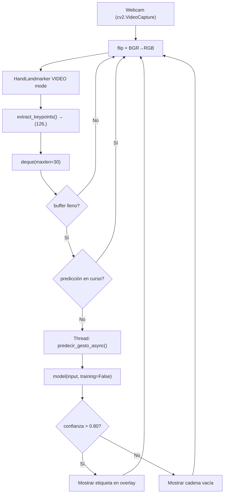

# Documentación: Paso 07 — Detección en Tiempo Real (`paso_07_deteccion.py`)

Pipeline de **inferencia en tiempo real**: carga el modelo LSTM entrenado en el paso 06, abre la cámara, acumula los landmarks en un búfer circular de 30 frames y clasifica el gesto en curso, mostrando la etiqueta y la confianza sobre el video en vivo.

Para conocer en detalle los conceptos de extracción de keypoints, modo `VIDEO` de MediaPipe, y cómo funciona la inferencia con un tensor `(1, 30, 126)`, consulta la [REFERENCIA_COMUN.md](../../pasos/REFERENCIA_COMUN.md).

---

## Índice

- [1. Objetivo del paso](#1-objetivo-del-paso)
- [2. Archivos de esta carpeta](#2-archivos-de-esta-carpeta)
- [3. Pipeline](#3-pipeline)
- [4. Conceptos clave](#4-conceptos-clave)
- [5. Modo VIDEO vs. LIVE_STREAM](#5-modo-video-vs-live_stream)
- [6. Búfer circular y ventana deslizante](#6-búfer-circular-y-ventana-deslizante)
- [7. Predicción asíncrona en hilo separado](#7-predicción-asíncrona-en-hilo-separado)
- [8. Umbral de confianza](#8-umbral-de-confianza)
- [9. Funciones del código](#9-funciones-del-código)
- [10. Consola: qué logs verás](#10-consola-qué-logs-verás)
- [11. Cómo ejecutar](#11-cómo-ejecutar)
- [12. Errores frecuentes](#12-errores-frecuentes)
- [13. ¿Qué sigue después?](#13-qué-sigue-después)

---

## 1. Objetivo del paso

**Objetivo:** conectar el modelo LSTM entrenado con una cámara en vivo para reconocer gestos dinámicos en tiempo real, sin interrumpir el flujo de video.

| Incluido en este script | No incluido |
|-------------------------|-------------|
| Carga del modelo `.keras` | Entrenamiento del modelo (paso 06) |
| Modo `VIDEO` síncrono de MediaPipe | Acciones del sistema operativo (paso 08) |
| Búfer circular `deque(maxlen=30)` | Interfaz gráfica con CustomTkinter |
| Predicción LSTM en hilo secundario | Guardado de nuevas secuencias |
| Overlay con etiqueta y confianza | — |

**Criterio de éxito:**
- El script carga el modelo desde `modelos/lstm_gestos.keras` sin errores.
- La ventana de OpenCV muestra el esqueleto de la mano en vivo.
- Al realizar un gesto conocido durante ~1 segundo, aparece su etiqueta y confianza en verde.
- Si no hay mano visible, se muestra `No hand detected` en rojo.
- Presionar **ESC** cierra la ventana correctamente.

---

## 2. Archivos de esta carpeta

| Archivo | Rol |
|---------|-----|
| [paso_07_deteccion.py](../../pasos/paso-07-deteccion-tiempo-real/paso_07_deteccion.py) | Script principal de inferencia en tiempo real |
| [paso_07_doc.md](../../pasos/paso-07-deteccion-tiempo-real/paso_07_doc.md) | Esta documentación |
| [steps_detection_realtime.md](../../pasos/paso-07-deteccion-tiempo-real/steps_detection_realtime.md) | Guía de implementación paso a paso |

**Glosario y conceptos comunes:** [REFERENCIA_COMUN.md](../../pasos/REFERENCIA_COMUN.md).

---

## 3. Pipeline

```text
1. cargar_modelo()           → LSTM desde modelos/lstm_gestos.keras
2. get_gesture_names()       → lista de clases desde gestos/
3. cv2.VideoCapture(0)       → abrir cámara
4. setup_landmarker()        → HandLandmarker en modo VIDEO
5. Bucle principal:
6.   read → flip → BGR→RGB → mp.Image
7.   landmarker.detect_for_video(mp_image, timestamp_ms)
8.   dibujar_landmarks()     → esqueleto verde sobre el frame
9.   extract_keypoints()     → array (126,) → sequence.append()
10.  si len(sequence)==30 y no hay predicción en curso:
11.    threading.Thread(predecir_gesto_async).start()
12.  mostrar etiqueta o "No hand detected"
13.  imshow → waitKey(1)
14. release + destroyAllWindows
```



---

## 4. Conceptos clave

Para la descripción teórica de las celdas LSTM, la estructura del tensor de entrada `(1, 30, 126)` y el argumento `training=False` durante la inferencia, consulta la [Sección 5 de REFERENCIA_COMUN.md](../../pasos/REFERENCIA_COMUN.md#5-entrenamiento-lstm-y-redes-neuronales).

---

## 5. Modo VIDEO vs. LIVE_STREAM

El paso 03 usó `LIVE_STREAM` (asíncrono con callback). Este paso cambia a **`VIDEO`** (síncrono), que es más adecuado cuando el hilo principal ya controla el tiempo de los frames:

| Característica | `LIVE_STREAM` | `VIDEO` |
|---|---|---|
| Llamada de detección | No bloqueante (callback) | Bloqueante, devuelve resultado inmediato |
| Argumento requerido | `timestamp_ms` + callback | `timestamp_ms` |
| Idóneo para | Streams independientes sin control de tiempo | Bucles `while` donde controlamos el tiempo manualmente |
| Riesgo de cola | Sí — puede acumular frames | No — se procesa uno a uno |

```python
# VIDEO mode: blocking call, returns results directly
timestamp_ms = int((time.time() - start_time) * 1000)
results = landmarker.detect_for_video(mp_image, timestamp_ms)
```

> **Importante:** El `timestamp_ms` debe ser **estrictamente creciente** en cada llamada. Si dos llamadas reciben el mismo timestamp, MediaPipe lanzará una excepción.

---

## 6. Búfer circular y ventana deslizante

Se utiliza `collections.deque(maxlen=SEQUENCE_LENGTH)` como búfer circular de longitud fija. Cuando el deque está lleno y se añade un nuevo elemento, el más antiguo se descarta automáticamente, simulando una **ventana deslizante** de 30 frames:

```python
from collections import deque
import numpy as np

sequence: deque[np.ndarray] = deque(maxlen=30)

# En cada frame:
keypoints = extract_keypoints(results)  # shape: (126,)
sequence.append(keypoints)

# Cuando esté lleno:
if len(sequence) == 30:
    input_tensor = np.array(sequence, dtype=np.float32)  # shape: (30, 126)
```

Esto permite que la predicción sea **continua**: en lugar de esperar 30 frames fijos, se predice sobre los últimos 30 frames en cada nuevo frame capturado.

> **Importante:** Si se pierde la detección de mano, `sequence.clear()` reinicia el búfer para evitar que frames vacíos (rellenos con ceros) contaminen la predicción.

---

## 7. Predicción asíncrona en hilo separado

La inferencia LSTM puede tardar varios milisegundos. Ejecutarla en el hilo principal bloquearía el loop de video y bajaría el FPS. La solución es lanzar cada predicción en un **hilo secundario** con `threading.Thread`:

```python
import threading

prediction_in_progress: bool = False
prediction_lock = threading.Lock()

def on_prediction_complete(gesture_index: int, confidence: float) -> None:
    nonlocal current_gesture, current_confidence, prediction_in_progress
    if confidence > CONFIDENCE_THRESHOLD:
        current_gesture = gestures[gesture_index]
    else:
        current_gesture = ""
    current_confidence = confidence
    with prediction_lock:
        prediction_in_progress = False

# En el bucle principal:
with prediction_lock:
    can_predict = len(sequence) == SEQUENCE_LENGTH and not prediction_in_progress
    if can_predict:
        prediction_in_progress = True

if can_predict:
    sequence_snapshot = np.array(sequence, dtype=np.float32)
    threading.Thread(
        target=predecir_gesto_async,
        args=(model, sequence_snapshot, gestures, on_prediction_complete, on_prediction_error)
    ).start()
```

El flag `prediction_in_progress` protegido por `prediction_lock` garantiza que **no se lancen dos hilos de predicción simultáneamente**, evitando condiciones de carrera y sobrecarga de CPU.

---

## 8. Umbral de confianza

El modelo `softmax` devuelve un vector de probabilidades que suma `1.0`. Solo se muestra la etiqueta si la probabilidad máxima supera `CONFIDENCE_THRESHOLD = 0.80`:

```python
prediction = model(input_data, training=False).numpy()[0]
gesture_index = int(np.argmax(prediction))
confidence    = float(np.max(prediction))

if confidence > CONFIDENCE_THRESHOLD:
    current_gesture = gestures[gesture_index]
else:
    current_gesture = ""  # Gesto ambiguo — no se muestra
```

Bajar el umbral aumenta la sensibilidad (más falsos positivos). Subirlo hace el sistema más conservador (más falsos negativos). Ver constante en [config.py](../../config.py#L25).

---

## 9. Funciones del código

| Función | Descripción |
|---------|-------------|
| `cargar_modelo(model_path)` | Carga el modelo `.keras` con `keras.models.load_model`. Lanza `FileNotFoundError` si no existe. |
| `setup_landmarker()` | Instancia `HandLandmarker` en modo `VIDEO` con 2 manos y umbrales de confianza del 50%. |
| `dibujar_landmarks(frame, results)` | Dibuja el esqueleto de 21 puntos y sus conexiones sobre el frame BGR usando coordenadas normalizadas escaladas a píxeles. |
| `predecir_gesto_async(...)` | Ejecuta `model(input_data, training=False)` y llama al callback `on_prediction_complete` o `on_prediction_error`. |
| `main()` | Orquesta el bucle principal: captura, detección, predicción y visualización. |

---

## 10. Consola: qué logs verás

```text
Modelo cargado exitosamente desde modelos/lstm_gestos.keras
Loaded 3 gestures: ['parar', 'saludar', 'traer']
System ready. Starting detection loop...
Pred: saludar (0.9821)
Pred: parar (0.9543)
Pred: saludar (0.4102)   ← debajo del umbral, no se muestra en pantalla
```

> La línea de predicción se imprime como máximo **cada 3 segundos** para no saturar la consola.

---

## 11. Cómo ejecutar

Desde la raíz del proyecto, con `venv` activado:

```bash
python pasos/paso-07-deteccion-tiempo-real/paso_07_deteccion.py
```

*Nota: El modelo `modelos/lstm_gestos.keras` debe existir. Si no existe, ejecuta primero el paso 06.*

Presiona **ESC** para cerrar la ventana de forma segura.

---

## 12. Errores frecuentes

Para diagnosticar fallas como modelo no encontrado, timestamps no crecientes, bajo FPS por inferencia bloqueante, o la etiqueta no aparece aunque se reconoce el gesto, consulta la **Tabla de Errores Frecuentes Unificada** en la [Sección 6 de REFERENCIA_COMUN.md](../../pasos/REFERENCIA_COMUN.md#6-tabla-de-errores-frecuentes-unificada).

---

## 13. ¿Qué sigue después?

Has completado la **Inferencia en tiempo real**: el modelo LSTM ya clasifica gestos sobre el video en vivo.

**Siguientes pasos sugeridos:**
- **Control del sistema**: Conectar las etiquetas predichas a acciones reales del OS — mover el cursor, hacer clic y cambiar de espacio de trabajo (Paso 08).
- **Dashboard unificado**: Integrar la detección en el panel de `main.py` seleccionando el modo *Inference* en la barra segmentada.

**Siguiente:** [Paso 08 — Control del Sistema](../../pasos/paso-08-control-sistema/paso_08_doc.md) — traducción de gestos a acciones del sistema operativo.
