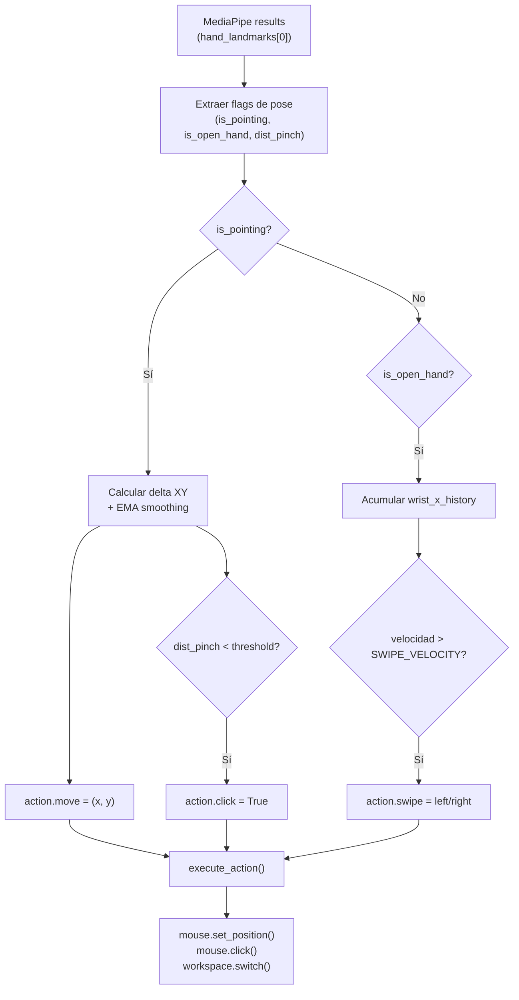
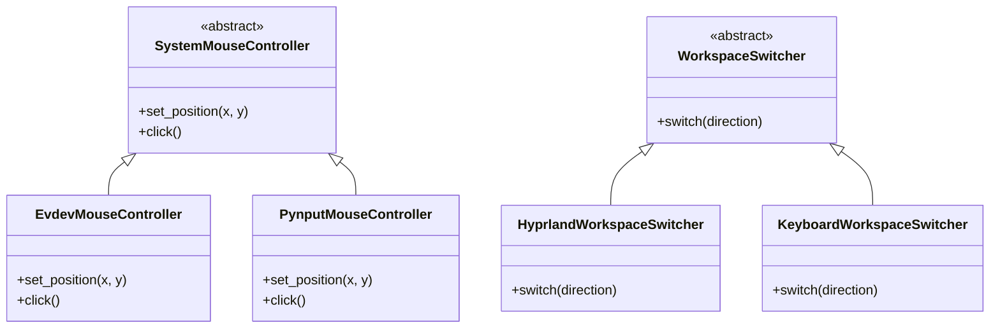

# Documentación: Paso 08 — Control del Sistema (`paso_08_control.py`)

Pipeline de **control del sistema operativo mediante gestos**: traduce las etiquetas predichas por el LSTM en acciones reales del OS — movimiento del cursor, clic izquierdo y cambio de espacio de trabajo virtual — de forma multiplataforma.

Para conocer en detalle los conceptos de extracción de keypoints y el flujo de MediaPipe que alimenta este paso, consulta la [REFERENCIA_COMUN.md](../../pasos/REFERENCIA_COMUN.md).

---

## Índice

- [1. Objetivo del paso](#1-objetivo-del-paso)
- [2. Archivos de esta carpeta](#2-archivos-de-esta-carpeta)
- [3. Pipeline](#3-pipeline)
- [4. Detección de poses de la mano](#4-detección-de-poses-de-la-mano)
- [5. Movimiento del cursor (Two-Finger Pointing)](#5-movimiento-del-cursor-two-finger-pointing)
- [6. Clic por pinza (Pinch to Click)](#6-clic-por-pinza-pinch-to-click)
- [7. Cambio de espacio de trabajo (Open-Hand Swipe)](#7-cambio-de-espacio-de-trabajo-open-hand-swipe)
- [8. Arquitectura multiplataforma](#8-arquitectura-multiplataforma)
- [9. Clases y funciones del código](#9-clases-y-funciones-del-código)
- [10. Constantes de configuración](#10-constantes-de-configuración)
- [11. Cómo ejecutar](#11-cómo-ejecutar)
- [12. Errores frecuentes](#12-errores-frecuentes)
- [13. ¿Qué sigue después?](#13-qué-sigue-después)

---

## 1. Objetivo del paso

**Objetivo:** cerrar el ciclo completo del pipeline — tomar los landmarks detectados por MediaPipe en tiempo real y, a partir de la forma de la mano, emitir eventos reales al sistema operativo: mover el puntero del ratón, hacer clic izquierdo y cambiar de espacio de trabajo virtual.

| Incluido en este script | No incluido |
|-------------------------|-------------|
| Movimiento del cursor con suavizado EMA | Entrenamiento del modelo LSTM (paso 06) |
| Clic izquierdo por pinza | Inferencia de etiquetas de gesto (paso 07) |
| Cambio de espacio de trabajo virtual | Interfaz gráfica (main.py) |
| Abstracción multiplataforma (Linux/Windows/macOS) | Gestos de scroll o clic derecho |
| Detección de poses geométrica (sin LSTM) | — |

**Criterio de éxito:**
- Mostrar dos dedos (índice + medio abiertos, anular + meñique cerrados) mueve el cursor del ratón en tiempo real.
- Cerrar la pinza entre pulgar e índice dispara un clic izquierdo.
- Abrir la mano completamente y deslizarla a la izquierda o derecha cambia el espacio de trabajo virtual.
- El sistema funciona de forma idéntica en Linux (Hyprland + evdev), Windows (pynput) y macOS (pynput).

---

## 2. Archivos de esta carpeta

| Archivo | Rol |
|---------|-----|
| [paso_08_control.py](../../pasos/paso-08-control-sistema/paso_08_control.py) | Módulo principal: controladores de ratón y teclado, lógica de gestos |
| [paso_08_doc.md](../../pasos/paso-08-control-sistema/paso_08_doc.md) | Esta documentación |

**Glosario y conceptos comunes:** [REFERENCIA_COMUN.md](../../pasos/REFERENCIA_COMUN.md).

---

## 3. Pipeline

```text
1. build_mouse_controller()     → EvdevMouseController (Linux) o PynputMouseController
2. build_workspace_switcher()   → HyprlandWorkspaceSwitcher / KeyboardWorkspaceSwitcher
3. GestureController instanciado con resolución de pantalla
4. En cada frame (llamado desde main.py):
5.   process_landmarks(results):
6.     Extraer flags: is_pointing, is_open_hand, dist_pinch
7.     Si is_pointing:
8.       Calcular delta XY → aplicar EMA → action.move
9.       Si dist_pinch < PINCH_THRESHOLD → action.click
10.    Si is_open_hand:
11.      Acumular wrist_x_history
12.      Si velocidad > SWIPE_VELOCITY → action.swipe
13.  execute_action(action):
14.    mouse.set_position() / mouse.click() / workspace_switcher.switch()
```



---

## 4. Detección de poses de la mano

Este paso **no usa el modelo LSTM** para clasificar gestos. En su lugar, aplica reglas geométricas directamente sobre los landmarks normalizados de MediaPipe. Cada dedo se evalúa comparando la coordenada `y` de la punta con la del nudillo intermedio:

```python
# Un dedo está "cerrado" si su punta (tip) está más abajo que su nudillo (pip)
# (en coordenadas de imagen, y=0 es arriba, y=1 es abajo)
is_index_closed  = hand[8].y  > hand[6].y   # Índice: tip[8] vs pip[6]
is_middle_closed = hand[12].y > hand[10].y  # Medio:  tip[12] vs pip[10]
is_ring_closed   = hand[16].y > hand[14].y  # Anular: tip[16] vs pip[14]
is_pinky_closed  = hand[20].y > hand[18].y  # Meñique: tip[20] vs pip[18]
```

| Pose | Condición | Acción |
|------|-----------|--------|
| **Two-Finger Pointing** | índice + medio abiertos, anular + meñique cerrados | Mover cursor |
| **Open Hand** | todos los dedos abiertos | Swipe de espacio de trabajo |
| **Pinch** | distancia pulgar[4]–índice[8] < `PINCH_THRESHOLD` | Clic izquierdo |

> El pulgar **no participa** en la detección de `is_pointing` ni `is_open_hand` — su anatomía hace que la comparación `tip.y > pip.y` sea poco confiable en ciertas orientaciones de la mano.

---

## 5. Movimiento del cursor (Two-Finger Pointing)

El cursor se controla de forma **relativa**: en lugar de mapear la posición de la mano directamente a coordenadas de pantalla (absoluto), se calcula el **delta** de movimiento entre frames y se acumula sobre la posición actual del cursor. Esto evita el efecto de "salto" cuando se cambia la posición de la mano:

```python
# Punto de referencia: punto medio entre índice (8) y medio (12)
current_hand_x = (hand[8].x + hand[12].x) / 2
current_hand_y = (hand[8].y + hand[12].y) / 2

delta_x = current_hand_x - self.last_hand_x
delta_y = current_hand_y - self.last_hand_y

# Convertir a píxeles y aplicar sensibilidad
move_x = delta_x * self.screen_w * MOUSE_SENSITIVITY
move_y = delta_y * self.screen_h * MOUSE_SENSITIVITY

# Target sin suavizar
target_x = self.cursor_x + move_x
target_y = self.cursor_y + move_y

# EMA (Exponential Moving Average) para suavizar la trayectoria
alpha = CURSOR_SMOOTHING  # 0.4
self.cursor_x = alpha * target_x + (1 - alpha) * self.cursor_x
self.cursor_y = alpha * target_y + (1 - alpha) * self.cursor_y
```

**EMA (Exponential Moving Average):** pondera la nueva posición objetivo con `alpha` y la posición anterior con `1 - alpha`. Un `alpha` alto (≈1.0) sigue el movimiento fielmente pero con más ruido; uno bajo (≈0.1) produce un cursor muy suave pero con retardo perceptible.

| Constante | Valor | Efecto |
|-----------|-------|--------|
| `CURSOR_SMOOTHING` | 0.4 | Alpha del EMA — equilibrio entre suavidad y respuesta |
| `MOUSE_SENSITIVITY` | 6.0 | Amplificador de delta normalizado a píxeles |

---

## 6. Clic por pinza (Pinch to Click)

Se mide la distancia euclídea normalizada entre la punta del pulgar (landmark 4) y la punta del índice (landmark 8):

```python
dist_pinch = math.sqrt(
    (hand[4].x - hand[8].x)**2 +
    (hand[4].y - hand[8].y)**2
)
current_pinching = dist_pinch < PINCH_THRESHOLD  # 0.06
```

Para evitar clics repetidos durante una pinza sostenida, se usa un sistema de **estado y frames mínimos**:

```python
if current_pinching:
    self.pinch_frames += 1
    if self.pinch_frames >= PINCH_MIN_FRAMES and not self.is_pinched:
        action.click = True   # Dispara el clic UNA sola vez
        self.is_pinched = True
else:
    self.is_pinched = False
    self.pinch_frames = 0
```

`PINCH_MIN_FRAMES = 1` significa que basta con un frame de pinza para disparar el clic. Subirlo a `3–5` añade un debounce que reduce falsos positivos por temblor de mano.

---

## 7. Cambio de espacio de trabajo (Open-Hand Swipe)

Se acumula la coordenada `x` de la muñeca (landmark 0) en un deque de tamaño `SWIPE_FRAMES = 8`. Cuando el deque está lleno, se compara la posición inicial con la final:

```python
wrist_x = hand[0].x
self.wrist_x_history.append(wrist_x)

if len(self.wrist_x_history) == SWIPE_FRAMES:
    delta_x = self.wrist_x_history[-1] - self.wrist_x_history[0]

    if delta_x > SWIPE_VELOCITY:       # 0.035 — movimiento hacia la derecha
        action.swipe = "right"
    elif delta_x < -SWIPE_VELOCITY:    # movimiento hacia la izquierda
        action.swipe = "left"
```

Un cooldown de `SWIPE_COOLDOWN = 1.5` segundos evita múltiples cambios de espacio de trabajo en un solo gesto.

> **Coordenadas de la cámara:** el frame está volteado horizontalmente (`cv2.flip`) en `main.py`. Mover la mano físicamente hacia la derecha incrementa `wrist_x` → `delta_x > 0` → `swipe = "right"`. El gesto es intuitivo.

---

## 8. Arquitectura multiplataforma

El módulo usa el **patrón Strategy** (clase abstracta + implementaciones concretas) para separar el "qué hacer" del "cómo hacerlo" en cada plataforma:



Las funciones de fábrica `build_mouse_controller()` y `build_workspace_switcher()` instancian la implementación correcta según `platform.system()`:

| Plataforma | Control de ratón | Cambio de workspace |
|------------|-----------------|---------------------|
| **Linux** | `EvdevMouseController` (UInput) con fallback a `pynput` | `hyprctl dispatch workspace +1/-1` (Hyprland) |
| **Windows** | `PynputMouseController` | `Ctrl + Win + Left/Right` |
| **macOS** | `PynputMouseController` | `Ctrl + Left/Right` |

> **evdev y Wayland:** en sesiones Linux con Wayland, los eventos de `pynput` pueden ser ignorados por el compositor. `EvdevMouseController` crea un dispositivo de entrada virtual (`/dev/uinput`) que el kernel reconoce como ratón físico, evitando las restricciones de Wayland.

---

## 9. Clases y funciones del código

| Clase / Función | Descripción |
|-----------------|-------------|
| `SystemMouseController` (ABC) | Interfaz abstracta: `set_position(x, y)` y `click()` |
| `EvdevMouseController` | Implementación Linux via UInput (evdev). Crea un ratón virtual en el kernel. |
| `PynputMouseController` | Implementación cross-platform via `pynput.mouse.Controller`. |
| `build_mouse_controller(w, h)` | Fábrica: intenta evdev en Linux, cae en pynput si falla. |
| `ControlAction` (dataclass) | Agrupa la acción computada: `move`, `click`, `swipe`. |
| `WorkspaceSwitcher` (ABC) | Interfaz abstracta: `switch(direction)`. |
| `HyprlandWorkspaceSwitcher` | Llama a `hyprctl dispatch workspace +1/-1`. Silencia `FileNotFoundError`. |
| `KeyboardWorkspaceSwitcher` | Presiona y suelta una secuencia de teclas via `pynput.keyboard`. |
| `build_workspace_switcher()` | Fábrica según `platform.system()`. |
| `GestureController` | Clase central: mantiene estado (cursor, pinch, swipe history), implementa `process_landmarks()` y `execute_action()`. |

---

## 10. Constantes de configuración

Todas las constantes se definen en [`config.py`](../../config.py):

| Constante | Valor | Significado |
|-----------|-------|-------------|
| `PINCH_THRESHOLD` | `0.06` | Distancia normalizada máxima pulgar–índice para detectar pinza |
| `PINCH_MIN_FRAMES` | `1` | Frames consecutivos de pinza requeridos antes de emitir el clic |
| `SWIPE_VELOCITY` | `0.035` | Delta mínimo de `wrist_x` normalizado para considerar un swipe |
| `SWIPE_FRAMES` | `8` | Tamaño del historial de posiciones de muñeca para detectar swipe |
| `SWIPE_COOLDOWN` | `1.5` | Segundos mínimos entre swipes consecutivos |
| `CURSOR_SMOOTHING` | `0.4` | Alpha del EMA para suavizar la trayectoria del cursor |
| `MOUSE_SENSITIVITY` | `6.0` | Multiplicador de delta normalizado a píxeles de pantalla |

---

## 11. Cómo ejecutar

Este módulo **no tiene un `main()` propio** — es una librería usada por `main.py`. Para probarlo en modo standalone, usa el modo *Control* del dashboard:

```bash
python main.py
```

Selecciona el modo **Control** en la barra segmentada superior y mueve la mano frente a la cámara.

Para pruebas directas sin la GUI, puedes importar el módulo e instanciar `GestureController` manualmente en un script de prueba propio.

---

## 12. Errores frecuentes

| Síntoma | Causa probable | Solución |
|---------|---------------|----------|
| `PermissionError: /dev/uinput` | El usuario no tiene permisos sobre `/dev/uinput` | Ejecutar `sudo chmod 666 /dev/uinput` o añadir el usuario al grupo `input` |
| El cursor no se mueve en Wayland | `pynput` ignorado por el compositor | Verificar que `EvdevMouseController` se inicializó correctamente (ver log de consola) |
| El workspace no cambia en Linux | Compositor no es Hyprland | El swipe se ignora silenciosamente — comportamiento esperado |
| Clics involuntarios frecuentes | `PINCH_THRESHOLD` demasiado alto o `PINCH_MIN_FRAMES` = 1 | Bajar `PINCH_THRESHOLD` a `0.04` o subir `PINCH_MIN_FRAMES` a `3` en `config.py` |
| Cursor tembloroso | `CURSOR_SMOOTHING` demasiado alto | Bajar `CURSOR_SMOOTHING` a `0.2–0.3` |

---

## 13. ¿Qué sigue después?

Has completado el **pipeline completo de GestureFlow**: desde la captura raw de la webcam hasta el control real del sistema operativo mediante gestos de mano.

**Recorrido completo del pipeline:**
```
Paso 01 (cámara) → 02 (landmarks) → 03 (LIVE_STREAM)
→ 04 (reglas geométricas) → 05 (recolección .npy)
→ 06 (entrenamiento LSTM) → 07 (inferencia) → 08 (control OS)
```

**Posibles extensiones:**
- Añadir gestos personalizados reentrenando el modelo con nuevas clases (repetir pasos 05 y 06).
- Reemplazar el control de workspace con acciones de teclado arbitrarias (volumen, brillo, reproducción multimedia).
- Exportar el modelo a TFLite para reducir la latencia de inferencia.
- Integrar reconocimiento de dos manos simultáneas para gestos más ricos.

**Anterior:** [Paso 07 — Detección en Tiempo Real](../../pasos/paso-07-deteccion-tiempo-real/paso_07_doc.md).
