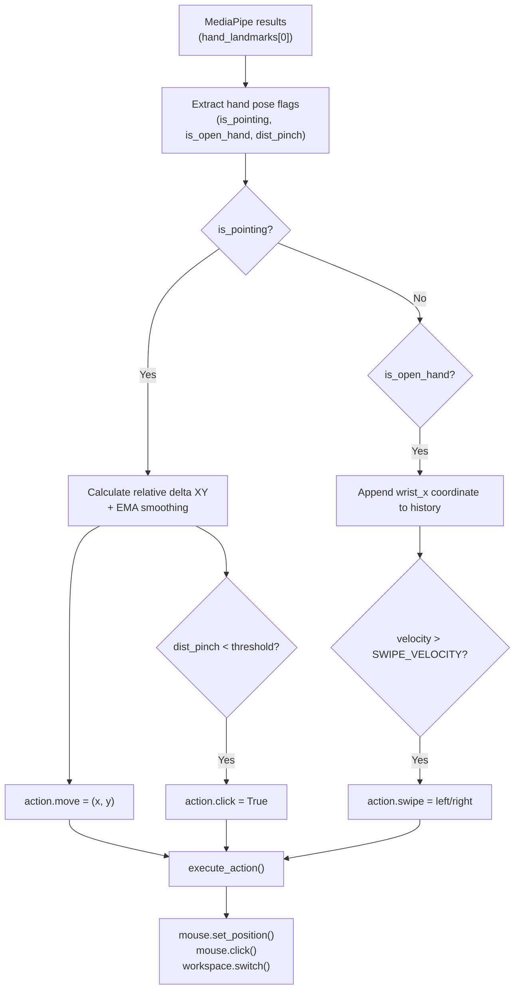
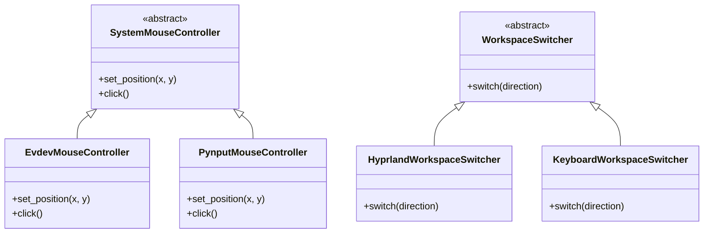

# Documentation: Step 08 — System Control (`paso_08_control.py`)

Pipeline for **operating system control using hand gestures**: translates landmark features and rule-based pose evaluations into actual OS actions — mouse cursor movement, left click, and virtual workspace switching — across Linux, Windows, and macOS.

To read about keypoint extraction and the foundational MediaPipe HandLandmarker stream feeding this step, refer to the common glossary in [REFERENCIA_COMUN.md](../../pasos/REFERENCIA_COMUN.md).

---

## Index

- [1. Step Objective](#1-step-objective)
- [2. Folder Files](#2-folder-files)
- [3. Pipeline Flow](#3-pipeline-flow)
- [4. Hand Pose Detection Rules](#4-hand-pose-detection-rules)
- [5. Cursor Movement (Two-Finger Pointing)](#5-cursor-movement-two-finger-pointing)
- [6. Pinch to Click](#6-pinch-to-click)
- [7. Workspace Switch (Open-Hand Swipe)](#7-workspace-switch-open-hand-swipe)
- [8. Cross-platform Strategy Architecture](#8-cross-platform-strategy-architecture)
- [9. Code Classes and Functions](#9-code-classes-and-functions)
- [10. Config Constants](#10-config-constants)
- [11. How to Run](#11-how-to-run)
- [12. Troubleshooting Common Errors](#12-troubleshooting-common-errors)
- [13. Next Steps](#13-next-steps)

---

## 1. Step Objective

**Objective:** close the complete loop of the pipeline — capture landmarks in real time, extract hand joint orientations, and dispatch input actions to the OS (moving cursor, triggering left mouse click, switching desktops).

| Included in this module | Not included |
|-------------------------|-------------|
| EMA-smoothed relative mouse movement | Training the LSTM model (Step 6) |
| Pinch gesture detection and left-click | Inference of custom dynamic gestures (Step 7) |
| Virtual desktop / workspace switching | GUI layout definitions (main.py) |
| Strategy pattern for cross-platform inputs | Scrolling or secondary clicks |
| Geometric rule-based pose estimation | — |

**Success Criteria:**
- Placing two fingers (index + middle open, others closed) smoothly moves the mouse cursor.
- Pinching the index finger and thumb triggers a single left mouse click.
- Swiping an open hand left or right switches workspaces.
- Seamless execution on Linux (Wayland-supported via evdev), Windows (pynput), and macOS (pynput).

---

## 2. Folder Files

| File | Purpose |
|------|---------|
| [paso_08_control.py](../../pasos/paso-08-control-sistema/paso_08_control.py) | Core mouse/keyboard controller mappings, gesture coordinate evaluations |
| [paso_08_doc.md](../../pasos/paso-08-control-sistema/paso_08_doc.md) | Spanish documentation file |
| [steps_system_control.md](../../pasos/paso-08-control-sistema/steps_system_control.md) | This English documentation file |

---

## 3. Pipeline Flow

```text
1. build_mouse_controller()     → virtual UInput device (Linux) or PynputMouseController
2. build_workspace_switcher()   → Hyprland or hotkey KeyboardWorkspaceSwitcher
3. Instantiate GestureController with system screen dimensions
4. On every camera frame:
5.   process_landmarks(results):
6.     Evaluate pose boolean conditions (pointing, open hand, pinch distance)
7.     If pointing:
8.       Calculate delta coordinates → apply EMA smoothing → action.move
9.       If thumb-to-index distance < PINCH_THRESHOLD → action.click
10.    If open hand:
11.      Append wrist coordinate to history buffer
12.      If swipe velocity > SWIPE_VELOCITY → action.swipe (left/right)
13.  execute_action(action):
14.    Set mouse positions, click buttons, or trigger workspace shortcuts
```



---

## 4. Hand Pose Detection Rules

To maximize cursor speed and clicking response, we use direct mathematical rules on MediaPipe landmarks instead of temporal LSTM models. Finger open/closed states are computed by comparing the `y` coordinate of a finger tip landmark with its corresponding middle joint landmark:

```python
# A finger is closed if its tip is lower than its PIP joint
# (in screen coords, y=0 is top, y=1 is bottom)
is_index_closed  = hand[8].y  > hand[6].y   # Index tip (8) vs joint (6)
is_middle_closed = hand[12].y > hand[10].y  # Middle tip (12) vs joint (10)
is_ring_closed   = hand[16].y > hand[14].y  # Ring tip (16) vs joint (14)
is_pinky_closed  = hand[20].y > hand[18].y  # Pinky tip (20) vs joint (18)
```

| State | Condition | Mapping Action |
|-------|-----------|----------------|
| **Two-finger pointing** | Index + Middle open, Ring + Pinky closed | Move mouse pointer |
| **Open hand** | All four fingers open | Detect swipe motion |
| **Pinch** | Thumb tip (4) to Index tip (8) distance < `PINCH_THRESHOLD` | Left-click trigger |

---

## 5. Cursor Movement (Two-Finger Pointing)

Cursor coordinates are computed **relatively** using the coordinate delta between frames. This prevents large cursor jumps when re-positioning hands:

```python
# Track midpoint between open index and middle tips
current_hand_x = (hand[8].x + hand[12].x) / 2
current_hand_y = (hand[8].y + hand[12].y) / 2

delta_x = current_hand_x - self.last_hand_x
delta_y = current_hand_y - self.last_hand_y

# Scale relative distance to pixel size and sensitivity
move_x = delta_x * self.screen_w * MOUSE_SENSITIVITY
move_y = delta_y * self.screen_h * MOUSE_SENSITIVITY

target_x = self.cursor_x + move_x
target_y = self.cursor_y + move_y

# Apply Exponential Moving Average (EMA) smoothing
alpha = CURSOR_SMOOTHING
self.cursor_x = alpha * target_x + (1 - alpha) * self.cursor_x
self.cursor_y = alpha * target_y + (1 - alpha) * self.cursor_y
```

An `alpha` of `0.4` gives a balanced response. Lowering it filters hand tremor but increases cursor lag.

---

## 6. Pinch to Click

We compute the Euclidean distance between thumb tip (4) and index tip (8):

```python
dist_pinch = math.sqrt(
    (hand[4].x - hand[8].x)**2 +
    (hand[4].y - hand[8].y)**2
)
current_pinching = dist_pinch < PINCH_THRESHOLD  # config value: 0.06
```

To prevent a continuous pinch from spamming clicks, a basic state debounce is implemented:

```python
if current_pinching:
    self.pinch_frames += 1
    if self.pinch_frames >= PINCH_MIN_FRAMES and not self.is_pinched:
        action.click = True  # trigger click once
        self.is_pinched = True
else:
    self.is_pinched = False
    self.pinch_frames = 0
```

---

## 7. Workspace Switch (Open-Hand Swipe)

We buffer the wrist (landmark 0) `x` coordinate across `SWIPE_FRAMES = 8`. Swiping speed is checked by comparing the first and last coordinates:

```python
wrist_x = hand[0].x
self.wrist_x_history.append(wrist_x)

if len(self.wrist_x_history) == SWIPE_FRAMES:
    delta_x = self.wrist_x_history[-1] - self.wrist_x_history[0]
    
    if delta_x > SWIPE_VELOCITY:
        action.swipe = "right"
    elif delta_x < -SWIPE_VELOCITY:
        action.swipe = "left"
```

A cooldown limit (`SWIPE_COOLDOWN = 1.5` seconds) prevents continuous workspace switching from a single gesture swipe.

---

## 8. Cross-platform Strategy Architecture

We decouple the input action computation from the operating system API using the **Strategy Pattern**:



| OS | Mouse Controller | Workspace Switcher |
|----|------------------|--------------------|
| **Linux (Wayland)** | `EvdevMouseController` (UInput virtual device) | `hyprctl dispatch workspace` command |
| **Windows** | `PynputMouseController` | `Ctrl + Win + Left/Right` keyboard hotkeys |
| **macOS** | `PynputMouseController` | `Ctrl + Left/Right` keyboard hotkeys |

---

## 9. Code Classes and Functions

- `SystemMouseController` (ABC): Defines the interface for mouse operations.
- `EvdevMouseController`: Interacts directly with `/dev/uinput` to create a virtual input kernel device.
- `PynputMouseController`: Standard cross-platform fallback mouse simulation class.
- `WorkspaceSwitcher` (ABC): Abstract class for workspace/virtual desktop navigation.
- `HyprlandWorkspaceSwitcher`: Workspace switching for Hyprland compositors via subprocess calls.
- `KeyboardWorkspaceSwitcher`: Virtual desktop switcher using keyboard shortcut emulation.
- `GestureController`: Main orchestrator containing coordinate smoothing, state tracking, and actions executor.

---

## 10. Config Constants

Constants are configured in [`config.py`](../../config.py):
- `PINCH_THRESHOLD` (`0.06`): Euclidean distance for pinch detection.
- `SWIPE_VELOCITY` (`0.035`): Speed threshold for swipe gestures.
- `CURSOR_SMOOTHING` (`0.4`): Alpha coefficient for EMA smoothing.
- `MOUSE_SENSITIVITY` (`6.0`): Speed multiplier factor.

---

## 11. How to Run

This module is imported and managed by the main application launcher. Run the full app:

```bash
python main.py
```
Switch to the **Control** mode on the CustomTkinter UI panel to start mapping hands movement to OS actions.

---

## 12. Troubleshooting Common Errors

- **`/dev/uinput` Permission Denied (Linux)**: Run `sudo chmod 666 /dev/uinput` or add your user account to the `input` user group.
- **Mouse not moving in Wayland**: Ensure `EvdevMouseController` has successfully initialized (see terminal stdout logs).
- **Accidental mouse clicks**: Lower `PINCH_THRESHOLD` to `0.04` or raise `PINCH_MIN_FRAMES` to `3` in `config.py`.

---

## 13. Next Steps

You have successfully mapped hand coordinates to OS operations. Consider experimenting with scrolling gestures or secondary click coordinates next.
